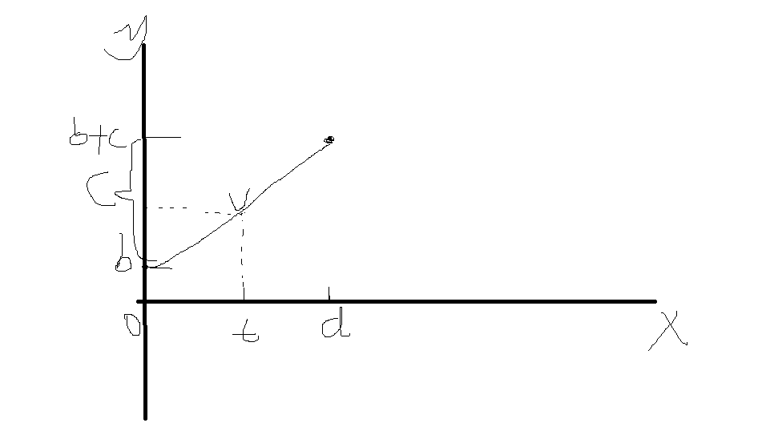

# 从零打造Echarts —— V3 动画
本文开始v3版本。
## 回顾v2
v2版本我们在v1的基础上添加了诸如属性更新、隐藏元素这样的功能。而其中的属性更新，就是v3版本要做的动画功能的基础。
## 目标
实现元素的动画功能。
## 开始
假设现在的需求是在1s内让圆的半径匀速地（**后面的示例除非特别说明，全部指匀速，即线性**）从原来的20变为40。很容易写出这样的代码。
```typescript
let targetR = 40
let currentR = 20
let deltaR = targetR - currentR
let time = 1000
let preUpdateTime = Date.now()
let update = () => {
  let now = Date.now()
  let r = currentR + (now - preUpdateTime) / time * deltaR
  // 以免超出
  if (r > targetR) {
    r = targetR
  }
  circle.attr({
    shape: {
      r
    }
  })
  if (r !== targetR) {
    requestAnimationFrame(update)
  }
}
requestAnimationFrame(update)
```
等等，好像有什么不对，这个动画怎么这么卡顿！第一反应是上面的代码存在帧率和计算的问题（关于帧率以后会涉及到），第二反应则是之前对于`render`的防抖出了问题。将对`render`的防抖间隔从`16ms`改为`14ms`后动画效果得到显著改善，暂且设置为`10ms`吧，以后有不流畅再另行调整。

这样的代码明显是不符合使用需求的，我们更想这样使用。
```typescript
circle.animateTo({
  shape: {
    r: 40
  }
}, 1000)
```
有了上面的代码做为启示，相信你对如何做到这一点已经有了一些思路。
- **动画原理** 从上面的代码可以看出，对于`xrender`的元素，动画的核心原理就是不断更新属性，不断重新绘制。我们要做的就是计算出过渡状态。
- **分离动画和元素** 容易想到的一点是，动画的实现过程是和元素无关的，可以单独作为一个模块——实际上这样的模块很多，如`Tween.js`，但是我们并不打算使用现成的库——不是为了实现功能而开发。然后再将动画和元素结合起来。

下面让我们一起把思路实现吧。
## Animation
创建`Animation.ts`文件。构造并导出一个`Animation`类。和其它动画库一样，我准备这样设(fu)计(zhi)，它应该实现如下的功能，且可以链式调用，命名方面和`zrender`保持一致。
- 接受一个对象做参数并返回一个实例。`new Animation({ x: 100 })`。
- `when`，设置关键帧，`animation.when(500, { x: 200 })`，意思是在`500ms`时变为`200`。
- `during`，设置每一帧更新时的回调，`animation.during(() => { console.log('我更新啦') })`，它将在每一帧更新都打印。
- `delay`，设置动画的延迟时间，`animation.delay(500)`，在`500ms`后才开始执行动画。
- `done`，设置动画完成后的回调。
- `start`，上面的函数调用完后并不会开始执行动画，需要显示调用`animation.start`来开始动画，如果设置了延迟，那么延迟相应时间后开始。
- `stop`，中途可以停止动画。
- `pause`，暂停动画。

如何做到上述功能？以
```typescript
new Animation({ x: 100 })
  .when(500, { x: 200 })
  .during(() => { console.log('我更新啦')})
  .start()
```
为例，可以这样思考
- `when`，在内部维护一个动画队列，每次调用`when`方法就解析传入的参数为标准格式，放入队列中,但它只保存了关键帧的数据，而没有计算出过度状态，因为过度状态是需要每一帧更新按时间来计算的，而不是事先计算好，每一帧更新时直接使用。就像这样。
``` typescript
queue = {
  x: [
    {
      time: 0, value: 100
    },
    {
      time: 500, value: 200
    }
  ]
}
```
**另外一点需要注意的是，为了简便，对于非数值的属性将会略过，颜色转换请自行探索。**
- `done`、`during`，同样维护对应回调队列，更新和结束时一一调用即可。
- `start`， 调用`requestAnimation`执行更新函数。如
- `update`， 遍历动画队列，计算差值。假设现在的时间是开始动画后第一帧，第`16ms`，`x`属性的队列`time`大于等于`16`且最近的是`{ time: 500, value: 200 } }`，小于等于`16`最近的是`{ time: 0, value: 100 }`，则`x`应该为`100 + 16 / (500 - 0) * (200 - 100)` 103.2。

大概流程就是如上所示，来开始编写代码吧。首先是`constructor`和`when`。
```typescript
/**
 * 关键帧队列格式
 */
export interface KeyFrameInQueue {
  /**
   * 时间
   */
  time: number
  /**
   * 值
   */
  value: number
}

class Animation {
  /**
   * 要动画的目标
   */
  _target: Object
  /**
   * 关键帧队列
   */
  _keyFrameQueue: {
    [prop: string]: KeyFrameInQueue[]
  } = {}
  /**
   * 动画持续的最久的时间，用来判定是否结束
   */
  _maxTime = 0
  constructor (target: Object) {
    // 克隆函数应该不必多说
    this._target = clone(target)
  }
  /**
   * 设置关键帧
   * @param time 关键帧时间
   * @param animateObj 要动画的对象
   */
  when (time = 1000, animateObj = {}) {
    if (!animateObj || !isObject(animateObj)) {
      return
    }
    let target = this._target
    for (let key in animateObj) {
      // 如果之前没有这个值，将其设为0
      if (!target[key]) {
        target[key] = 0
      }
      let keyQueue = this._keyFrameQueue[key]
      if (!keyQueue) {
        // 还没有的话初始化为最初的值
        keyQueue = this._keyFrameQueue[key] = [
          {
            time: 0,
            value: target[key]
          }
        ]
      }
      let keyFrame = {
        time,
        value: animateObj[key]
      }
      // 在此处插入排序
      for (let i = (keyQueue.length - 1); i >= 0; i -= 1) {
        if (keyQueue[i].time < time) {
          keyQueue.splice(i + 1, 0, keyFrame)
          break
        }
        // 如果两个关键帧时间相同，则替换掉
        if (keyQueue[i].time === time) {
          keyQueue.splice(i, 1, keyFrame)
          break
        }
        // 否则什么也不做
      }
    if (time > this._maxTime) {
      this._maxTime = time
    }

    return this
  }
}
```
然后是`during`、`done`和`delay`，很简单。
``` typescript
class Animation {
  /**
   * 持续触发的回调队列
   */
  _duringQueue: ((target: Object) => void)[] = []
  /**
   * 完成回调队列
   */
  _doneQueue: ((target: Object) => void)[] = []
  /**
   * 开始的延迟时间
   */
  _delay = 0
  /**
   * 设置每一帧的回调
   */
  during (callback: (target: Object) => void) {
    if (!isFunction(callback)) {
      return this
    }
    this._duringQueue.push(callback)

    return this
  }
  /**
   * 设置动画完成的回调
   */
  done (callback: (target: Object) => void) {
    if (!isFunction(callback)) {
      return this
    }
    this._doneQueue.push(callback)

    return this
  }
  /**
   * 设置动画开始的延迟
   */
  delay (delay: number) {
    this._delay = delay

    return this
  }
}
```
接着来编写`start`。
```typescript
class Animation {
  // ...
  /**
   * 动画开始的时间
   */
  startTime = 0
  /**
   * 开始动画
   */
  start () {
    let fn = () => {
      this.startTime = Date.now()
      requestAnimationFrame(this.update)
    }
    // 延迟执行
    if (this._delay > 0) {
      setTimeout(fn, this._delay)
    } else {
      fn()
    }

    return this
  }
}
```
流程已经启动了，最后再完善我们的`update`函数。
```typescript
class Animation {
  /**
   * 更新
   */
  update =  () => {
    let nowTime = Date.now()
    let deltaTime = nowTime - this.startTime
    // 遍历关键帧队列
    for (let key in this._keyFrameQueue) {
      let keyQueue = this._keyFrameQueue[key]
      this._target[key] = getCurrentValue(keyQueue, deltaTime)
    }
    // 更新时的回调
    this._duringQueue.forEach(fn => {
      fn(this._target)
    })
    // 完成时的回调
    if (deltaTime >= this._maxTime) {
      this._doneQueue.forEach(fn => {
        fn(this._target)
      })
      // TODO: 做一些重置操作，如把队列清空
    } else {
      requestAnimationFrame(this.update)
    }
  }
}
```
最关键的就是`getCurrentValue`函数，它根据队列和变化时间返回一个值，实际上它还应该接受一个参数，缓动函数。
### 缓动函数
实际使用我们往往需要更多的动画方式，而不是匀速进行，使用缓动函数是方法之一。关于缓动函数，详细的可以搜索了解，这里简单介绍。缓动函数定义如下：
```typescript
(t, b, c, d) => value
```
四个参数的分别是
- `t` 当前时间
- `b` 初始值
- `c` 要改变的差值
- `d` 持续时间
以线性匀速运动为例
```typescript
function linear (t, b, c, d) {
  // 以百分比计算
  return c * (t / d) + b
}
```
示意图如下(霍霍，我就是传说的灵魂画手)：



其它常见的缓动函数有
- `Quadratic` 二次方缓动。
- `Cubic` 三次方缓动。
- `Bounce` 指数衰减的反弹缓动。

等等。

每一种函数都有三种方式，分别是：
- `ease-in`，先快后慢。
- `ease-out`， 先快后慢。
- `ease-in-out` 前半段由慢到快，后半段由快到慢。

以`Bounce`为例。
```typescript
const Easing = {
  linear (t: number, b: number, c: number, d: number) {
    return c * (t / d) + b
  },
  'bounce-in' (t: number, b: number, c: number, d: number) {
    return c - Easing['bounce-out'](d - t, 0, c, d) + b
  },
  'bounce-out' (t: number, b: number, c: number, d: number) {
    if ((t /= d) < (1 / 2.75)) {
      return c * (7.5625 * t * t) + b
    } else if (t < (2 / 2.75)) {
      return c * (7.5625 * (t -= (1.5 / 2.75)) * t + 0.75) + b
    } else if (t < (2.5 / 2.75)) {
      return c * (7.5625 * (t -= (2.25 / 2.75)) * t + 0.9375) + b
    } else {
      return c * (7.5625 * (t -= (2.625 / 2.75)) * t + 0.984375) + b
    }
  },
  'bounce-in-out' (t: number, b: number, c: number, d: number) {
    if (t < d / 2) {
      return Easing['bounce-in'](t * 2, 0, c, d) * 0.5 + b
    } else {
      return Easing['bounce-out'](t * 2 - d, 0, c, d) * 0.5 + c * 0.5 + b
    }
  }
}
```
创建`Easing.ts`导出这些函数。更多函数以及具体过程请自行探索，也可据此写出自己想要的缓动函数。

### 回到`getCurrentValue`
```typescript
/**
 * 处理值可能存在嵌套的情况
 * 同时处理特殊值的情况
 * @param preValue 前一帧的值
 * @param nextValue 下一帧的值
 * @param currentTime 当前时间
 * @param duringTime 持续时间
 * @param easingFn 缓动函数
 */
function getNestedValue (
  preValue: any,
  nextValue: any,
  currentTime: number,
  duringTime: number,
  easingFn: EasingFn
) {
  let value
  // 假定前后两次值的类型相同
  if (isObject(nextValue)) {
    value = {}
    for (let key in nextValue) {
      value[key] = getNestedValue(preValue[key], nextValue[key], currentTime, duringTime, easingFn)
    }
  } else {
    value = easingFn(
      currentTime,
      preValue,
      nextValue - preValue,
      duringTime
    )
  }

  return value
}
/**
 * 获取当前值
 */
function getCurrentValue (
  queue: KeyFrameInQueue[],
  deltaTime: number,
  easingFn: EasingFn
) {
  let preFrame: KeyFrameInQueue
  let nextFram: KeyFrameInQueue
  for (let i = 0; i < queue.length; i += 1) {
    let frame = queue[i]
    // 已经是最后一帧了，还没有找到前一帧，说明时间已经超过最长关键帧的时间了
    // 假定最少有两个关键帧
    if (i === queue.length - 1) {
      preFrame = queue[i - 1]
      nextFram = frame
    } else if (frame.time < deltaTime && (queue[i + 1].time >= deltaTime)) {
      preFrame = frame
      nextFram = queue[i + 1]
      break
    }
  }
  let lastFram = queue[queue.length - 1]
  // 只有在最后的关键帧中进行时间截断，以免值超出范围
  // 也就是说，在回调中应当避免对关键帧设置的值做精确的比较
  // 应该有更优的方法，这里暂不讨论
  deltaTime = deltaTime > lastFram.time ? lastFram.time : deltaTime
  let value = getNestedValue(
    preFrame.value,
    nextFram.value,
    deltaTime - preFrame.time,
    nextFram.time - preFrame.time,
    easingFn
  )

  return value
}
class Animation {
  // ...
  update = () => {
    // 当然，缓动函数应该是可配置的，但是现在，我们先只传入这一个值
    this._target[key] = getCurrentValue(keyQueue, deltaTime, EasingFuns.linear)
  }
}

```
试一下。
```javascript
new Animation({ x: 100 })
  .during((e) => {
    console.log(e)
  })
  .when(1000, { x: 200 })
  .when(2000, {x: 100})
  .start()
```
可以看到控制台依次打印出了变化中的值。然后稍微改造本文最开始的代码。
```typescript
new Animation({ r: 20 })
  .during((shape) => {
    circle.attr({
      shape
    })
  })
  .when(1000, { r: 40 })
  .start()
```
可以看到效果和之前的一样。

最后再做一些收尾工作。
```typescript
class Animation {
  /**
   * 动画结束后做收尾工作
   */
  resetStatus () {
    // 重置开始时间
    this.startTime = 0
  }
}
```
虽然还有很多细节等待完善，但起码我们让它动起来了不是吗？

### 休息一下
如果你一口气看到这里，你可能需要休息一下再继续接下来的旅程。
### 继续
关于`Animation`，就说到这里，它当然还应该有更多功能，比如停止、暂停、循环、循环间隔以及指定缓动函数，这些加一些属性在`update`中判断即可，这里就不详细展开了，可以查看相关代码了解。
## 整合`XElement`
现在要做的就是将`Animation`和`XElement`联合起来。容易想到的方式是在创建`XElement`时为它的选项创建一个`Animation`，然后把`animateTo`方法关联到内部的`animation`上。来尝试一下这种方式。
``` typescript
class XElement {
  animation: Animation
  /**
   * 动画到某个状态
   */
  animateTo (target: Object, time: any, delay: any, easing: any, callback: any) {
    // 这一段复制的
    // animateTo(target, time, easing, callback)
    if (isString(delay)) {
      callback = easing
      easing = delay
      delay = 0
    // animateTo(target, time, delay, callback)
    } else if (isFunction(easing)) {
      callback = easing
      easing = 'linear'
      delay = 0
    // animateTo(target, time, callback)
    } else if (isFunction(delay)) {
      callback = delay
      delay = 0
    // animateTo(target, callback)
    } else if (isFunction(time)) {
      callback = time
      time = 500
    // animateTo(target)
    } else if (!time) {
      time = 500
    }
    // 先停止动画
    this.animation && this.animation.stop()
    this.animation = new Animation({
      shape: this.shape,
      style: this.style
    })


    return this.animation
      .during((target) => {
        this.attr(target)
      })
      .when(time, target)
      .done(callback)
      .delay(delay)
      .start(easing)
  }
}

```
运行本文最开始期望的代码
```typescript
circle.animateTo({
  shape: {
    r: 40
  }
}, 1000)
```
完全ok！

最后一步比想象中要轻松，也许是因为考虑的东西太简单，但是不管怎么说我们完成了预期的目标。

不过，好像还是少了点什么。让我想想，哦，对了，和`css`动画对比一下，现在的动画只能对形状和样式进行修改，少了很关键的`transform`变换，如平移、缩放。
## v4预览
[`transform`的实现以及其动画](./Version4.md)。