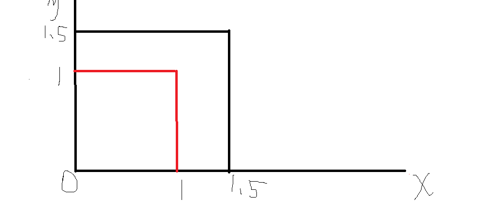
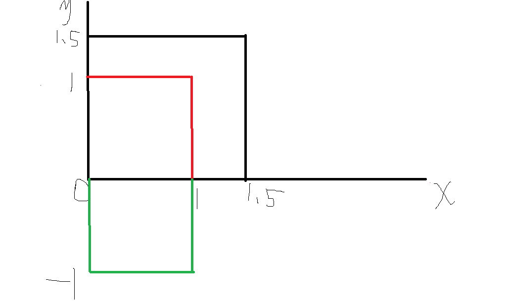
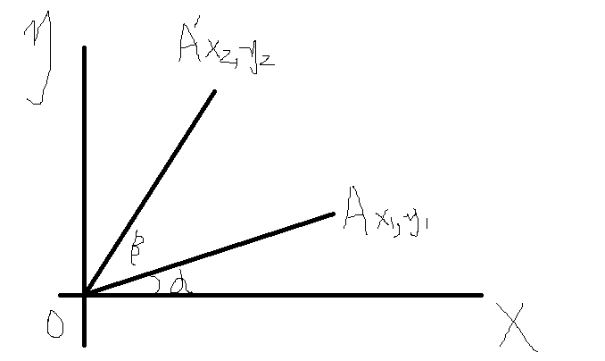

# 从零打造Echarts —— V4 平移、旋转和缩放
本文开始v4版本。
## 回顾v3
v3版本我们在v2的基础上添加了动画功能，可以实现对样式形状等的更新动画，但是最后发现少了很关键的`transform`动画，本版本就将为我们的`xrender`添加`transform`系统并同样实现它动画。
## 开始
### 什么是transform
就表现而言，是`translate（平移）`、`scale（缩放）`、`rotate（旋转）`、`skew(拉伸)`等效果，而其本质，则是相对坐标系的变换。平移和缩放很好理解，以矩形举例：

**前方灵魂画手上线，请注意躲避！**


对该矩形放大(scale)1.5倍，则将其所以点的坐标都乘以1.5，则可得到变换后的矩形（以原点为变换中心点（下面会讲到），下同）。平移同理，加减即可。

拉伸则取对应轴角度的`tan`值即可。

而旋转则稍微复杂一点，容易想象初始矩形顺时针旋转90度(π / 2)的样子。下图绿色部分。


点(0, 1)是如何变换到(1, 0)的？很容易看出来
- `x` =  `x * cos(π / 2) - y * sin(π / 2)`
- `y` = `y * sin(π / 2) + x * sin(π / 2)`


啊住手！！

旋转90度是为了好画，并不有利于证明，以最容易的角度考虑，将`A(x1, y1)`点逆时针旋转`β`度到`A'(x2, y2)`，都在第一象限内，其它情况也差不多。
。

$$ 显然OA = OA' $$
$$ 而OA = \frac{y_1}{sin(a)} = \frac{x_1}{cos(a)} $$
$$ 且OA' = \frac{y_2}{sin(a + b)} = \frac{x_2}{cos(a + b)}$$
$$ 令它们都等于r$$
$$则 y_2 = r * (sin(a) * cos(b) + cos(a) * sin(b)) = y_1 * cos(b) + x_1 * sin(b)$$
$$则 x_2 = r * (cos(a) * cos(b) - sina(a) * sin(b)) = x_1 * cos(b) - y_1 * sin(b)$$

上述所有变换用矩阵来表示就是
$$
        \begin{matrix}
        scaleX|cos(rotateZ) & tan(skewX)|-sin(rotateZ) & translateX \\
        tan(skewY)|sin(rotateZ) & scaleY|cos(rotateZ) &  translateY\\ 
        0 & 0 & 1 \\
        \end{matrix} 
        \,\,\,\, *\,\,\,
        \begin{matrix}
        x \\
        y \\ 
        1 \\
        \end{matrix} 
$$
上面的六个变量，就是`transform`的基础。和`css`中有`matrix`一样，`canvas`提供了这样的`api`——`setTransform`。

但是想实现变换却没有这么简单。
1. 首先我们使用时不可能直接用矩阵去设置，需要将对应的属性转换成矩阵，如`translateX: 20`，转换为`[1, 0, 0, 1, 20, 0]`。
> 不过`canvas`提供了`translate`等方法，我们可以直接使用。
2. 其次存在多个变换属性时，如同时偏移和旋转，需要将二者经过第一步转换后再叠加计算，而这又牵扯到顺序问题了，是先偏移再旋转还是先旋转再偏移？是提供一个约定的方式，还是提供可选择的配置？
> 同样`canvas`也提供了`transform`方法可以叠加变换。

那么上面说辣么多有什么用呢？后续会用到的。
### 属性设计
那么一个元素应该有这些`transform`属性。
- `rotation` 旋转角度，和`rotate`方法以示区分。
- `position` 位置，即偏移，一个数组，[`translateX`, `translateY`]。
- `scale` 缩放，同样是一个数组，[`scaleX`, `scaleY`]。
- `origin` 变换中心，缩放和旋转会用到，也是一个数组，[`originX`, `originY`]。

编辑`XElement.ts`。

首先声明一个`Transform`接口。
```typescript
interface Transform {
  /**
   * 位置，即偏移
   */
  position: [number, number]
  /**
   * 缩放
   */
  scale: [number, number]
  /**
   * 旋转
   */
  rotation: number
  /**
   * 变换中心
   */
  origin: [number, number]
}
```
然后让`XElement`实现它，并在`updateOptions`中应用传入的选项。
```typescript
class XElement implements Transform {
  // ...
  position: [number, number] = [0, 0]
  scale: [number, number] = [1, 1]
  // 默认以左上角为变换中心，因为无法用百分比————每个图形元素的形状都不相同
  origin: [number, number] = [0, 0]
  rotation = 0
  // ...
  updateOptions () {
    let opt = this.options
    // ...
    ['zLevel', 'origin', 'scale', 'position', 'rotation'].forEach(key => {
      if (opt[key]) {
        this[key] = opt[key]
      }
    })
  }
}
```
紧接着编写`setTransform`，它将应用变换到上下文中，然后在`beforeRender`中调用它。
```typescript
class XElement implements Transform {
  beforeRender (ctx: CanvasRenderingContext2D) {
    // ...
    this.setTransform(ctx)
    // ...
  }
  /**
   * 设置变换
   */
  setTransform (ctx: CanvasRenderingContext2D) {
    // 首先变换中心点
    ctx.translate(...this.origin)
    // 应用缩放
    ctx.scale(...this.scale)
    // 应用旋转
    ctx.rotate(this.rotation)
    // 恢复
    ctx.translate(-this.origin[0], -this.origin[1])
    // 平移
    ctx.translate(...this.position)
  }
}
```
尝试一下
```typescript
let rect = new xrender.Rect({
  shape: {
    x: 120,
    y: 120,
    width: 40,
    height: 40
  },
  style: {
    fill: 'transparent'
  },
  origin: [120, 120],
  rotation: 0.8
})
```
可以看到有效果了。
### 动画
那么动画呢？都不用尝试，就知道不行，因为之前的动画中没有对值为数组的情况进行处理。
```typescript
function getNestedValue (
  preValue: any,
  nextValue: any,
  currentTime: number,
  duringTime: number,
  easingFn: EasingFn
) {
  let value
  // 假定前后两次值的类型相同
  if (isObject(nextValue)) {
    value = {}
    for (let key in nextValue) {
      value[key] = getNestedValue(preValue[key], nextValue[key], currentTime, duringTime, easingFn)
    }
  // 数组类型
  } else if (Array.isArray(nextValue)) {
    value = []
    for (let i = 0; i < nextValue.length; i += 1) {
      value[i] = getNestedValue(preValue[i], nextValue[i], currentTime, duringTime, easingFn)
    }
  }
  //...
}
```
其次是之前为元素创建动画时也没有传入这些属性。
```typescript
class Animation {
  animateTo () {
    // ...
    let animateProps = [
      'shape',
      'style',
      'position',
      'scale',
      'origin',
      'rotation'
    ]
    let animteTarget = {}
    animateProps.forEach(prop => {
      animteTarget[prop] = this[prop]
    })
    this.animation = new Animation(animteTarget)
    // ...
  }
}
```
走你`animateTo({position: [20, 90]}, 400)`。可以看见已完全ok！
## 小结
本版本主要为元素应用了常见的`transform`变换，并完善了动画相关的细节。
## V5预览
[`Group（组）`和`Layer（分层）`](./Version5.md)。