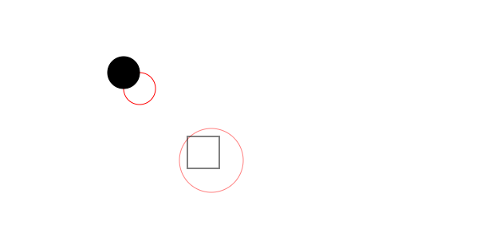
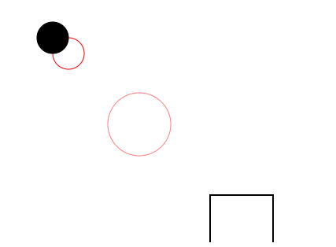
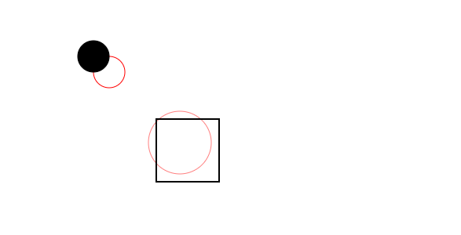

# 从零打造Echarts —— XRender 0.4
本文开始v4版本。
## 回顾v3
v3版本我们在v2的基础上添加了动画功能，可以实现对样式形状等的更新动画，但是最后发现少了很关键的`transform`动画，本版本就将为我们的`xrender`添加`transform`系统并同样实现它动画。
## 开始
### 什么是transform
就表现而言，是`translate（平移）`、`scale（缩放）`、`rotate（旋转）`、`skew(拉伸)`等效果，而其本质，则是相对坐标系的变换。平移和缩放很好理解，以矩形举例：

**前方灵魂画手上线，请注意躲避！**


对该矩形放大(scale)1.5倍，则将其所以点的坐标都乘以1.5，则可得到变换后的矩形（以原点为变换中心点（下面会讲到），下同）。平移同理，加减即可。

拉伸则取对应轴角度的`tan`值即可。

而旋转则稍微复杂一点，容易想象初始矩形顺时针旋转90度(π / 2)的样子。下图绿色部分。


点(0, 1)是如何变换到(1, 0)的？很容易看出来
- `x` =  `x * cos(π / 2) - y * sin(π / 2)`
- `y` = `y * sin(π / 2) + x * sin(π / 2)`


啊住手！！

旋转90度是为了好画，并不有利于证明，以最容易的角度考虑，将`A(x1, y1)`点逆时针旋转`β`度到`A'(x2, y2)`，都在第一象限内，其它情况也差不多。
。

$$ 显然OA = OA' $$
$$ 而OA = \frac{y_1}{sin(a)} = \frac{x_1}{cos(a)} $$
$$ 且OA' = \frac{y_2}{sin(a + b)} = \frac{x_2}{cos(a + b)}$$
$$ 令它们都等于r$$
$$则 y_2 = r * (sin(a) * cos(b) + cos(a) * sin(b)) = y_1 * cos(b) + x_1 * sin(b)$$
$$则 x_2 = r * (cos(a) * cos(b) - sina(a) * sin(b)) = x_1 * cos(b) - y_1 * sin(b)$$

上述所有变换用矩阵来表示就是
$$
        \begin{matrix}
        scaleX|cos(rotateZ) & tan(skewX)|-sin(rotateZ) & translateX \\
        tan(skewY)|sin(rotateZ) & scaleY|cos(rotateZ) &  translateY\\ 
        0 & 0 & 1 \\
        \end{matrix} 
        \,\,\,\, *\,\,\,
        \begin{matrix}
        x \\
        y \\ 
        1 \\
        \end{matrix} 
$$
上面的六个变量，就是`transform`的基础。和`css`中有`matrix`一样，`canvas`提供了这样的`api`——`setTransform`。

但是想实现变换却没有这么简单。
1. 首先我们使用时不可能直接用矩阵去设置，需要将对应的属性转换成矩阵，如`translateX: 20`，转换为`[1, 0, 0, 1, 20, 0]`。
> `canvas`不是提供了`translate`等方法吗，为什么不直接使用？在`Rect`中改写`beforeRender`方法来观察`transform`。

这是最开始的效果图。



现在我们想让唯一的矩形放大2倍，更改`Rect.beforeRender`来实现。
```typescript
beforeRender (ctx: CanvasRenderingContext2D) {
    super.beforeRender(ctx)
    // x y 同时放大2倍
    ctx.scale(2, 2)
  }
```
效果如下：




可以发现和我们想要的效果相差甚远（不管是基于左上角缩放还是中心点缩放）：



为什么会这样？因为`canvas`提供的变换是对**坐标轴**的变换，放大2倍之后绘制的所有数据都会放大2倍，包括这个矩形顶点的位置和宽高，而这显然（就我目前来看的话）是不符合需求的——虽然`zrender`中的设计也是如此，但是起码我现在觉得这样的效果不能让我满意。

如何解决这个问题？首先，先不管它，到后面再尝试解决；其次，这不是不用`canvas`提供的方法的主要原因。主要原因是，后面的功能需要计算出这个变换矩阵。

2. 其次存在多个变换属性时，如同时偏移和旋转，需要将二者经过第一步转换后再叠加计算，而这又牵扯到顺序问题了，是先偏移再旋转还是先旋转再偏移？是提供一个约定的方式，还是提供可选择的配置？