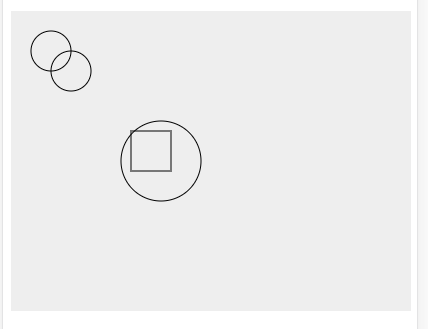
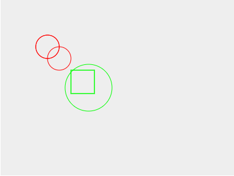
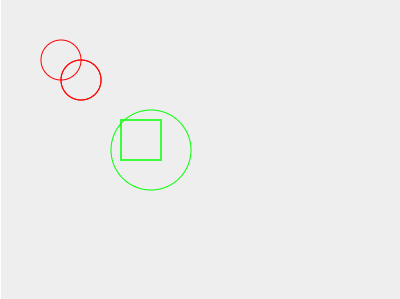
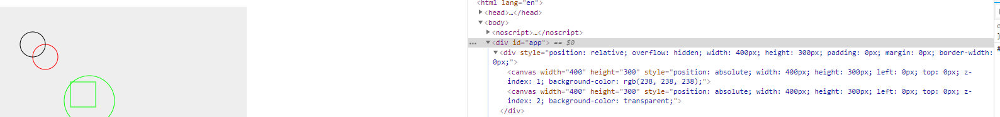
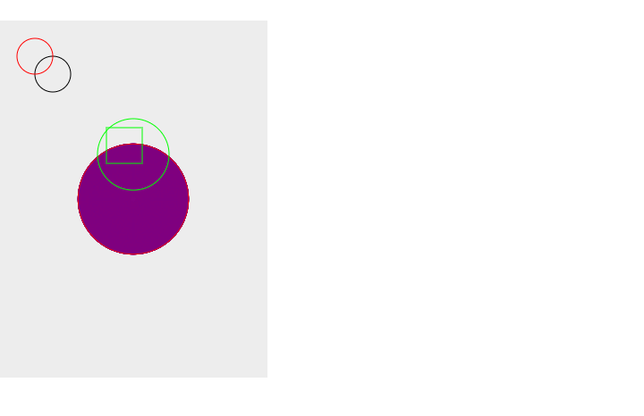

# 从零打造Echarts —— V5 分组、分层和逐帧绘制
本文开始v5版本。
## 回顾v4
在v4版本中我们为图形元素添加了`transform`功能，同样可以动画。
## Group
之前的代码中每个图形都是割裂开来的，无论什么操作只能一个图形一个图形地去设置，实际的使用中我们往往需要对同属于一部分的图形进行操作，比如左下角的图形都是蓝色描边，或者需要整体进行移动，这时候就需要用到分组了。

实际上很容易实现这一点——基于`XElement`创建`Group`类，为它添加一些管理子元素的方法——哦不对，为它创建一个`Stage`即可，然后在`render`中依次渲染子元素，而不是渲染自身，应该就能实现我们想要的效果了。

来试一下吧。
```typescript
// 这一块直接复制的Rect，暂时没有用
interface GroupShape extends XElementShape {
  /**
   * 左上角x
   */
  x?: number
  /**
   * 左上角y
   */
  y?: number
  width?: number
  height?: number
}
interface GroupOptions extends XElementOptions {
  shape?: GroupShape
}

class Group extends XElement {
  name ='group'
  shape: GroupShape = {
    x: 0,
    y: 0,
    width: 0,
    height: 0
  }
  stage: Stage
  constructor (opt: GroupOptions = {}) {
    super(opt)
    this.updateOptions()
    this.stage = new Stage()
  }
  render (ctx: CanvasRenderingContext2D) {
    let list = this.stage.getAll()
    list.forEach(xel => {
        xel.refresh(ctx)
    })
  }
  /**
   * 需要为子元素也设置xr
   * 同样在之前的`XElement.attr`中需要修改为判断`_xr`存在才调用`render`，这里就不贴代码了
   */
  setXr (xr: XRender) {
    super.setXr(xr)
    this.stage.getAll().forEach(xel => {
      xel.setXr(xr)
    })
  }
  /**
   * 添加元素
   */
  add (...xelements: XElement[]) {
    xelements.forEach(xel => {
      xel.setXr(this._xr)
    })
    this.stage.add(...xelements)
    this._xr && this._xr.render()
  }
  /**
   * 删除元素
   */
  delete (xel: XElement) {
    this.stage.delete(xel)
  }
}
```
将之前所有元素的`style`和`transform`相关属性都删掉。结果如图：


 - [ ] 呃，好像矩形的颜色有点不太对。

然后将左上角的两个圆分为一组，中间的圆和矩形为一组，分别设置样式。
```typescript
let group1 = new xrender.Group({
  style: {
    stroke: '#f00'
  }
})
let group2 = new xrender.Group({
  style: {
    stroke: '#0f0'
  }
})
group1.add(circle, circle1)
group2.add(circle2, rect)
xr.add(group1, group2)
```
然后看到



Bingo！尝试了动画和其它属性都没有问题。顺便修复一个问题，在`XElement.updateOptions`中：
```typescript
updateOptions () {
  if (opt.shape) {
    merge(this.shape, opt.shape)
  } else {
    opt.shape = {}
  }
  if (opt.style) {
    merge(this.style, opt.style)
  } else {
    opt.style = {}
  }
}
```
现在即使没有传入对应选项，更新属性时也不会报错了。
### 相对坐标
但有一个问题是，子元素在绘制时仍然是相对与整个画布来定位的（即世界坐标）—既然用了分组，想必是希望相对于父元素，即`Group`来定位。当然，有时也希望某一个元素仍然相对世界坐标来定位。

第一点很好解决，之前的代码就已经为`Group`指定了和`Rect`一样的`shape`属性，可以借此来达到目的。
```typescript
class Group {
  // ...
  /**
   * 对于组，进行额外的变换使子元素能相对它定位
   */
  setTransform (ctx: CanvasRenderingContext2D) {
    super.setTransform(ctx)
    ctx.translate(this.shape.x, this.shape.y)
  }
}
```
然后修改创建`group1`的代码
```typescript
let group1 = new xrender.Group({
  shape: {
    x: 40,
    y: 40,
    width: 0,
    height: 0
  },
  style: {
    stroke: '#f00'
  }
})
```
可以看到结果如期望的一样，`group1`内的图形都偏移了`(40, 40)`。

### 绝对坐标
那对于组内的某一个元素，想让临时相对于整个画布来定位，就像`fixed`一样；又或者对于嵌套的`Group`（显然是可以嵌套的），想让子元素相对于某一层级的`Group`定位，像`absolute`一样，应该如何去做呢？

可以这么考虑，给元素设定`relativeGroup`和`parent`属性（**如果这些属性是可以通过`attr`修改的，要在`updateOptions`方法中添加，以后不再说明**），在向`Group`添加元素时设定`Group`为这二者的值，元素`setTransorm`时对比两者是否相同，如果不同，调用父元素提供的重置变换的方法，将坐标系变换为父元素变换之前的坐标系，并一直向上取值，直到`parent.parent`为空为止。这并不难。
```typescript
class XElement {
  relativeGroup: Group
  parent: Group
  /**
   * 设置相对元素的变换
   */
  setRelativeTransform (ctx: CanvasRenderingContext2D) {
    let parent = this.parent
    // 如果不在一个组内，不需要做任何操作
    while (parent) {
      // 父元素和定位元素相同跳出循环
      if (parent === this.relativeGroup) {
        break
      }
      // 否则重置父元素
      parent.resumeTransform(ctx)
      parent = parent.parent
    }
  }
  /**
   * 为自身设置父元素,同时将父元素设为相对定位的元素
   * 然后将自身加入父元素的`stage`中
   */
  setParent (parent: Group) {
    this.parent = parent
    this.relativeGroup = parent
    // 父元素不再负责这一步
    parent.stage.add(this)
    this.setXr(parent._xr)
  }
}
class Group {
  /**
   * 添加元素
   */
  add (...xelements: XElement[]) {
    xelements.forEach(xel => {
      xel.setParent(this)
    })
    this._xr && this._xr.render()
  }
  /**
   * 重置变换，为`setTransform`的逆过程，通常由子孙元素调用
   * 暂时定位只有`Group`有这个方法
   */
  resumeTransform (ctx: CanvasRenderingContext2D) {
    ctx.translate(-this.shape.x, -this.shape.y)
    ctx.translate(-this.position[0], -this.position[1])
    ctx.translate(...this.origin)
    ctx.rotate(1 / this.rotation)
    ctx.scale(1 / this.scale[0], 1 / this.scale[1])
    ctx.translate(-this.origin[0], -this.origin[1])
  }
}
```
如果一切顺利，将`relativeGroup`设为`null`即可使用世界坐标系了。
```typescript
circle1.attr({
  relativeGroup: null
})
```


可以看到第二个圆已经挣脱父亲的怀抱了。
> 当然，这样来设置这个属性一点都不`cool`，也很不方便，不过以后再说。
## Layer
一个图形应用一般都会由好几部分构成，而会经常变化，或者变化比较复杂的又可能只是其中一部分，图形较少的时候没有任何问题，如果图形比较多，就需要做一些优化来避免不必要的重绘以免引起卡顿。分层，就是常用的手段之一。

原理也很简单，就是对不同分层的元素用不同的`canvas`去展现，然后将对应的`canvas`叠加在一起即可。

以之前的效果为基础，我们将创建一个背景层——随便找个什么图片绘制上去，然后让背景层不断移动，看起来就像这几个图形在往前走一样。
### 一些问题
1. 将不同层的元素绘制在不同的`canvas`上这很容易实现，但是根据之前的代码，任何元素的更新都会引起整个`Painter`的重绘——这样的话分层就没什么意义了。也就是说，我们需要对层进行标记，重绘时如果这个层不需要更新，那么这个层上的所有元素都不会更新。如何做到这一点呢？一个办法是将层和元素关联起来，然后在`XElement.attr`中将自身所属的层标记为需要更新。但是这将使二者联系得非常紧密，如果重新设置一个元素的层级，也需要重新关联。另一个办法则是标记元素本身需要更新，遍历元素，如果元素需要更新，则找到对应的层标记为需要更新。考虑到耦合度、`zrender`的设计、以及后续功能（`Layer`完毕后会开始）的需要，选择第二个办法。
### 开始
实现步骤：
1. 如同为元素设计`zLevel`一样，为元素添加一个`zIndex`属性，它用来标记元素在哪一层。
2. 在`Stage.getAll`中根据`zIndex`和`zLevel`来排序——显然，`zIndex`的优先级应该更高。
3. 遍历元素，如果元素需要更新，将对应的层标记为需要更新，同时将层和属于这一层的元素关联起来。
4. 遍历层，如果层需要更新，绘制该层上的所有元素，否则什么也不做。
为此，重新设计`XElement`。
```typescript
class XElement implements Transform {
  // ...
  zIndex = 1
  /**
   * 元素是否为脏，如果是，重绘时会更新元素所在层，脏检查，这是常用的名词，虽然我不太懂
   */
  _dirty = true
  /**
   * 标记元素为脏
   * 在使用完毕后会标记为false
   */
  dirty () {
    // 并不需要对父元素也进行标记
    this._dirty = true
    this._xr && this._xr.render()
  }
  attr (key: String | Object, value?: any) {
    // ...
    this.updateOptions()
    this.dirty()
  }
}
```
但一个问题是，如果一个组内的元素分不同的层怎么办？按之前的设计，一个组内的元素必然一起被重绘。但是我想还是可以解决这个问题——一是把父元素的样式绑定等内容移到子元素内进行，二是在`Stage.getAll`中将所有元素展开，也就是不再调用`Group.render`。下面来解决这个问题。
```typescript
class XElement {
  /**
   * 在渲染之前对父元素进行处理
   * 包括应用样式等
   */
  handleParentBeforeRender (ctx: CanvasRenderingContext2D) {
    if (this.parent) {
      this.parent.beforeRender(ctx)
    }
  }
  /**
   * 渲染之后对父元素进行处理
   * 主要是调用`restore`
   */
  handleParentAfterRender (ctx: CanvasRenderingContext2D) {
    if (this.parent) {
      this.parent.afterRender(ctx)
    }
  }\/**
   * 绘制之前进行样式的处理
   */
  beforeRender (ctx: CanvasRenderingContext2D) {
    this.handleParentBeforeRender(ctx)
    // ...
  }
  /**
   * 绘制之后进行还原
   */
  afterRender (ctx: CanvasRenderingContext2D) {
    //...
    this.handleParentAfterRender(ctx)
  }
}
// 然后覆盖`Group`的`afterRender`
class Group {
  afterRender (ctx: CanvasRenderingContext2D) {
    ctx.restore()
  }
}
```

重写`Stage.updateXElements`
```typescript
class Stage {
  /**
   * 获取所有元素
   */
  getAll () {
    let xelements = this.updateXElements()

    return xelements
  }
  updateXElements () {
    // zIndex高的在前
    // zLevel高的在后，其它按加入次序排列
    return this.expandXElements(callback).sort((a, b) => {
      let zIndex = b.zIndex - a.zIndex
      return  zIndex === 0 ? a.zLevel - b.zLevel : zIndex
    })
  }
  /**
   * 展开所有元素
   */
  expandXElements () {
    let list: XElement[] = []
    this.xelements.forEach(xel => {
      if (xel.stage) {
        list.push(...xel.stage.getAll())
      } else if (!xel.ignored) {
        list.push(xel)
      }
    })

    return list
  }
}
```
保存之后看下效果，之前的代码还是能正常运行，ok。

接下来创建`Layer`类，它负责创建`canvas`，所以创建`canvas`这些步骤从`Painter`内转移过来。另外一点是，因为存在一个或多个层的情况，为了方便处理，将之前可以传入容器或者`canvas`本身的设定改为只能传入容器。
```typescript
import { isString } from './util'

export interface LayerOptions {
  width?: number
  height?: number
  backgroundColor?: string
}
/**
 * 创建canvas
 */
function createCanvas (container: HTMLElement, opt: LayerOptions, zIndex: number) { 
  let canvas = document.createElement('canvas');
  container.appendChild(canvas)
  if(!opt.height) {
    opt.height = container.clientHeight
  }
  if (!opt.width) {
    opt.width = container.clientWidth
  }
  canvas.width = opt.width
  canvas.height = opt.height
  // 默认所有canvas都是透明的，这样才能叠加，只有最开始创建的层有背景色
  canvas.style.cssText = `
    position: absolute;
    width: ${opt.width}px;
    height: ${opt.height}px;
    left: 0;
    top: 0;
    z-index: ${zIndex};
    background-color: ${zIndex === 1 ? (opt.backgroundColor || 'transparent') : 'transparent'};
  `

  return canvas
}

class Layer {
  canvas: HTMLCanvasElement
  ctx: CanvasRenderingContext2D
  opt: LayerOptions
  /**
   * 同`XElement._dirty`
   */
  _dirty = false
  /**
   * 层所属元素在所有元素列表中的开始和结束索引
   * 如果遍历所有元素，结束索引仍为-1，则应该销毁这一层
   */
  startIndex = -1
  endIndex = -1
  constructor (container: HTMLElement, opt: LayerOptions = {}, zIndex = 1) {
    this.opt = opt
    let canvas = createCanvas(container, opt, zIndex)
    this.canvas = canvas
    this.ctx = canvas.getContext('2d')
  }
  /**
   * 绘制之前要清空画布
   */
  clear () {
    this.ctx.clearRect(0, 0, this.opt.width, this.opt.height)
  }
  /**
   * 当一个层不再有元素和它关联，应该销毁自身和cavnas，以节省空间
   * 对于`XElement`，后续也会提供`dispose`方法
   */
  dispose () {
    this.canvas.remove()
    this.canvas = null
    this.ctx = null
    this.opt = null
    
  }
}

export default Layer


```
**可以看到`Layer`类和之前的类最大的不同是它多了一个`dispose`方法——任何实例不再被需要时应该提供一个销毁自身的方法，后续我们会为所有类都添加这个方法。**

现在让我们回到`Painter`的构造函数
```typescript
/**
 * 有多个层级时创建一个容器，让canvas相对于它定位
 */
function createRoot (width: number, height: number) {
  let root = document.createElement('div')
  root.style.cssText = `
    position: relative;
    overflow: hidden;
    width: ${width}px;
    height: ${height}px;
    padding: 0;
    margin: 0;
    border-width: 0;
  `

  return root
}
class Painter {
  // ...
  root: HTMLElement
  layerContainer: HTMLElement
  /**
   * 带层索引的对象
   */
  layerListMap: { [prop: string]: Layer } = {}
  constructor (dom: string | HTMLElement, stage: Stage, opt: PainterOptions = {}) {
    this.opt = opt
    this.stage = stage
    let width = 0
    let height = 0
    if (isString(dom)) {
      dom = document.querySelector(dom as string) as HTMLElement
    }
    width = (<HTMLElement>dom).clientWidth
    height = (<HTMLElement>dom).clientHeight
    if (!opt.width) {
      opt.width = width
    }
    if (!opt.height) {
      opt.height = height
    }
    this.root = dom as HTMLElement
    let container = createRoot(opt.width, opt.height)
    this.layerContainer = container
    this.root.appendChild(container)
    /**
     * 默认的层
     */
    let mainLayer = new Layer(container, opt)
    this.layerListMap[1] = mainLayer
  }
}

```
接着是`render`函数，在进行渲染之前对所有元素进行遍历，将元素和对应的层关联起来，当然新添加的`zIndex`可能还没有对应的层，创建一个即可。如何关联？容易想到的形式是将层关联的元素以数组或者键值对存储。但是一来会占据比较多的空间且频繁创建和销毁，二来则增加了耦合度。
> 以上原因都是我瞎掰的。

`zrender`提供了一个在我看来是启发了我的思路——在`Stage.getAll`中，我们已经根据元素的`zIndex`排序了，也就是说`Painter`内获取的元素列表是这样的：
```typescript
// 数字代表元素和它的`zIndex`
[1, 1, 1, 2, 2, 2, 3, 4, 4]
```
为`Layer`添加开始索引`startIndex`和结束索引`endIndex`（`Layer`类的属性添加就不贴代码了），即可从元素列表中获取属于该层的元素，且它还有另外的功用。为此编写`updateLayerList`方法。
```typescript
class Painter {
  // ...
  /**
   * 更新层
   */
  updateLayerList (xelList: XElement[]) {
    let preLayer = null
    let layerList = this.layerListMap
    // 开始之前重置
    this.eachLayer((layer) => {
      layer.startIndex = -1
      layer.endIndex = -1
    })
    for (let i = 0; i < xelList.length; i += 1) {
      let xel = xelList[i]
      let layer = layerList[xel.zIndex] || this.createLayer(xel.zIndex)
      // 到下一个层级了
      if (preLayer !== layer) {
        layer.startIndex = i
      }
      // 在这里进行标记
      if (xel._dirty) {
        layer._dirty = true
      }
      layer.endIndex = i
      preLayer = layer
    }
    // 结束之后还有没有元素关联的层，销毁
    // 第一层除外
    this.eachLayer((layer, zIndex) => {
      if (layer.startIndex === -1 && (parseInt(zIndex, 10) !== 1)) {
        layer.dispose()
        delete layerList[zIndex]
      }
    })
  }
  /**
   * 创建新的层并加入列表中 
   */
  createLayer (zIndex: number) {
    let layer = new Layer(this.layerContainer, this.opt, zIndex)
    this.layerListMap[zIndex] = layer

    return layer
  }
  /**
   * 提供一个遍历层的方法
   */
  eachLayer (fn: (layer: Layer, zIndex: string) => void) {
    // 从高到低
    let keys = Object.keys(this.layerListMap).sort((a, b) => b - a)
    for (let i in keys) {
      let key = keys[i]
      // 返回为true则跳出此次遍历
      if (fn(this.layerListMap[key], key) as boolean) {
        break
      }
    }
  }
}
```
然后在`render`中调用，并重写这一部分。
```typescript
class Painter {
  render = debounce(() => {
    this.beforeRender()
    let xelements = this.stage.getAll()
    this.updateLayerList(xelements)
    this.eachLayer(layer => {
      if (!layer._dirty && parseInt(zIndex, 10) !== 1) {
        return
      }
      layer.clear()
      for (let i = layer.startIndex; i <= layer.endIndex; i += 1) {
        xelements[i].refresh(layer.ctx)
        xelements[i]._dirty = false
      }
      layer._dirty = false
    })
  }, 10)
}
```
还是在之前的试验代码中改动，将其`circle1`的`zIndex`设为2，可以看到创建了我们想要的分层。即使它的`zLevel`更低，它也仍然在最上层。
。

为了实现在本小节最开始描述的效果，我们首先需要创建`Image`类来展示图片。
```typescript
import XElement, { XElementShape, XElementOptions } from './XElement'
import { isString } from '../util'

interface ImageShape extends XElementShape {
  /**
   * 左上角x
   */
  x?: number
  /**
   * 左上角y
   */
  y?: number
  /**
   * 图片宽度
   */
  width?: number
  /**
   * 图片高度
   */
  height?: number
  /**
   * 图片地址
   */
  image?: string | CanvasImageSource
}
interface ImageOptions extends XElementOptions {
  shape?: ImageShape
}

class Image extends XElement {
  name ='rect'
  shape: ImageShape = {
    x: 0,
    y: 0,
    width: 0,
    height: 0
  }
  imgElement: CanvasImageSource
  constructor (opt: ImageOptions = {}) {
    super(opt)
    // 在创建实例时就尝试创建图片
    let image = opt.shape && opt.shape.image
    if (isString(image)) {
      image = document.createElement('img')
      image.src = opt.shape.image as string
      // 需要注意的是，如果传入的是一个字符串，要等图片载入之后再刷新一次
      image.onload = () => {
        this.dirty()
      }
    }
    this.imgElement = image as CanvasImageSource
    this.updateOptions()
  }
  render (ctx: CanvasRenderingContext2D) {
    let imgElement = this.imgElement
    if (imgElement instanceof HTMLImageElement) {
      if (!imgElement.complete) {
        return
      }
    }
    let shape = this.shape
    if (shape.sx !== undefined) {
      ctx.drawImage(imgElement, shape.sx, shape.sy, shape.sWidth, shape.sHeight, shape.x, shape.y, shape.width, shape.height)
    } else {
      ctx.drawImage(imgElement, shape.x, shape.y, shape.width, shape.height)
    }
  }
}

export default Image

```
创建一张图片，并将其它元素的`zIndex`设为2。
```typescript
let image = new xrender.Image({
  shape: {
    x: 0,
    y: 0,
    width: 1920,
    height: 300,
    sx: 0,
    sy: 120,
    sHeight: 1080 - 300,
    sWidth: 1920,
    image: 'http://img.netbian.com/file/20130224/fc9a4762b276e6bcfc508945e686e2b8.jpg'
  }
})
```


然后对`image`添加动画，并在`Circle`的`render`中添加打印语句，观察没有被更新的层是否调用了`render`。
```typescript
image.animateTo({
  position: [-1000, 0]
}, 2000)
```

可以看到动画成功了，且这个过程没有再渲染背景层之外的元素。

目标达成！
## 渲染优化
> 当然，本来目前还没到谈优化的时候，不过写到分层这里时想到了这个，也就顺便写下来了。

### 优化之前
**在这之前，把之前代码中的`forEach`改为`for`循环；绘制时如果没有设置`transform`，也不再进行多余的`transform`变换。**

--- 
尝试如下代码
```typescript
for (let i = 0; i < 20000; i += 1) {
  group1.add(new xrender.Circle({
    shape: {
      cx: 150,
      cy: 200,
      r: i / 100 * 1
    },
    style: {
      stroke: i % 2 === 0 ? '#f00' : '#00f'
    }
  }))
}
xr.add(group1, group2)
```
可以看见有明显的卡顿。将数量提高到20万卡顿更加明显。有时我们的数据量虽然很大，但是并不需要它绘制完毕后才展现出来，可以使用分批绘制。原理很简单，就是绘制的时候限定时间，超过此时间则把剩下的元素放到下一帧去绘制,即逐帧绘制。当然，这只能基于层。

如何判定是否需要逐帧绘制呢？首先肯定是为`Layer`添加`renderByFrame`属性——同样在重置`layer`状态时设为`false`。因为需要把剩下的留到下一帧，所以要将绘制这一部分抽离为一个函数`paintList`，同时添加`drawIndex`属性，记录上一次绘制到哪儿了，如下：
```typescript
class Painter {
  // ...
  /**
   * 正在绘制的id，调用`paintList`时，如果传入的id和最新的id不一样，则直接返回
   * 把元素留到下一帧绘制时，中途render被调用，则取消原来的绘制，重新绘制
   */
  drawId: number
  this.beforeRender()
    let xelements = this.stage.getAll()
    this.updateLayerList(xelements)
    this.drawId = Math.random()
    this.painList(xelements, this.drawId)
  }
  painList (xelements: XElement[], drawId: number) {
    if (drawId !== this.drawId) {
      return
    }
    this.eachLayer(layer => {
      if (!layer._dirty && parseInt(zIndex, 10) !== 1) {
        return
      }
      /**
       * 是否逐帧绘制
       */
      let userTimer = false
      let userTimer = layer.renderByFrame
      let startTime = Date.now()
      let startIndex = layer.drawIndex > -1 ? layer.drawIndex : layer.startIndex
      if (layer.drawIndex === -1) {
        layer.clear()
      }
      if (startIndex === -1) {
        return
      }
      for (let i = startIndex; i <= layer.endIndex; i += 1) {
        xelements[i].refresh(layer.ctx)
        xelements[i]._dirty = false
        // 多余的部分留到下一帧绘制
        if (Date.now() - startTime > 16 && userTimer) {
          layer.drawIndex = i
          requestAnimationFrame(() => {
            this.painList(xelements, drawId)
          })
          return true
        }
      }
      layer._dirty = false
    })
  }
}
```
关键什么时候来设置它呢？可以暴露一个设置层属性的方法——但是这样一来重置这个状态就变得麻烦了。可以和`_drity`一样，通过元素的`renderByFrame`属性来设置层的`renderByFrame`。即这个元素需要逐帧绘制，则该层所有元素都需要逐帧绘制——很显然的。
```typescript
class XElement {
  /**
   * 是否需要逐帧绘制
   */
  renderByFrame = false
}
class Painter {
 // ...
 /**
   * 更新层
   */
  updateLayerList (xelList: XElement[]) {
    let preLayer = null
    let layerList = this.layerListMap
    // 开始之前重置
    this.eachLayer((layer) => {
      // ...
      layer.renderByFrame = false
    })
    for (let i = 0; i < xelList.length; i += 1) {
      let xel = xelList[i]
      let layer = layerList[xel.zIndex] || this.createLayer(xel.zIndex)
      // ...
      if (xel.renderByFrame) {
        layer.renderByFrame = true
      }
      // ...
    }
  }
}
```
修改添加大量元素的代码如下:
```typescript
for (let i = 0; i < 200000; i += 1) {
  group1.add(new xrender.Circle({
    shape: {
      cx: 150,
      cy: 200,
      r: i / 100 * 1
    },
    style: {
      stroke: i % 2 === 0 ? '#f00' : '#00f'
    },
    renderByFrame: true
  }))
}
```

## 小结
本版本为元素添加了分组和分层的功能，做了一点小小优化，同时实现了数据量太大时能够逐帧绘制的功能。至此，我们的`xrender`的框架已搭建的差不多了，只剩下最后一个功能即可宣告收工。
## V6预览
[事件处理](./Version6.md)。