# 从零打造Echarts —— V6.5 描边、填充包含以及拖曳

## 精确检测
有了包围盒的初步检测，接下来就可以着手精确检测部分的代码了。

如何精确检测？首先我们要明确的是，精确检测分为两个部分，即填充检测和描边检测(需要考虑线宽)，即有描边才检测描边，有填充才检测填充。描边检测很容易理解，对于每一段路径，计算待检测点是否在当前路径上即可。填充检测则稍微复杂一些，简单来说需要对所有路径综合考量。和构建包围盒一样，我们可以利用已经保存的路径数据来进行检测。为此创建`contain.ts`。
```typescript
import { PathData, PathType } from './Path'

/**
 * 路径包含检测
 * @param pathData 绘制的路径数据
 * @param lineWidth 线宽
 * @param isStroke 是否描边检测
 * @param x 待检测点横坐标
 * @param y 待监测点纵坐标
 */
function pathContain (data: PathData[], lineWidth: number, isStroke: boolean, x: number, y: number) {
    // 当前元素路径起始点，用于closePath，第一个命令和moveTo会改变它
  let start = [0, 0]
  // 上一个命令的终点
  let prePathFinal = [0, 0]
  // 当前命令的起点，用来和prePathFinal一起计算包围盒
  let pathStartPoint = [0, 0]
  let params: any[]
  let pathData: PathData
  // 非零规则的值
  let nozero = 0
  function windingPreToStart() {
    if (!isStroke) {
      nozero += windingLine(
        prePathFinal[0],
        prePathFinal[1],
        pathStartPoint[0],
        pathStartPoint[1],
        x,
        y
      )
    }
  }
  // 遍历绘制过程，分别求取包围盒
  for (let i = 0; i < data.length; i += 1) {
    pathData = data[i]
    params = pathData.params
    pathStartPoint[0] = params[0]
    pathStartPoint[1] = params[1]
    // 对于第一个命令不是moveto的情况更新绘制起点和最开始的起点
    // 对于arc会在后续处理
    if (i === 0) {
      start[0] = pathStartPoint[0]
      start[1] = pathStartPoint[1]
      prePathFinal[0] = pathStartPoint[0] // x
      prePathFinal[1] = pathStartPoint[1]
    }
    // 根据绘制方法的不同用不同的计算方式
    switch (pathData.type) {
      case PathType.arc:
        } else {
        }
        pathStartPoint[0] = Math.cos(params[3]) * params[2] + params[0]
        pathStartPoint[1] = Math.sin(params[3]) * params[2] + params[1]
        prePathFinal[0] = Math.cos(params[4]) * params[2] + params[0]
        prePathFinal[1] = Math.sin(params[4]) * params[2] + params[1]
        if (i === 0) {
          start[0] = pathStartPoint[0]
          start[1] = pathStartPoint[1]
        }
        break
      case PathType.arcTo:
        if (isStroke) {

        } else {

        }
        break
      case PathType.bezierCurveTo:
        if (isStroke) {
        } else {
        }
        prePathFinal[0] = params[4]
        prePathFinal[1] = params[5]
        break
      case PathType.lineTo:
        if (isStroke) {
        } else {
        }
        prePathFinal[0] = params[0]
        prePathFinal[1] = params[1]
        break
      case PathType.moveTo:
        start[0] = params[0] // x
        start[1] = params[1] // y
        prePathFinal[0] = params[0] // x
        prePathFinal[1] = params[1] // y
        break
      case PathType.quadraticCurveTo:
        if (isStroke) {
        } else {
        }
        prePathFinal[0] = params[2]
        prePathFinal[1] = params[3]
        break
      case PathType.rect:
        let x0 = params[0]
        let y0 = params[1]
        let x1 = x0 + params[2]
        let y1 = y0 + params[3]
        if (isStroke) {
        } else {
        }
        prePathFinal[0] = params[0]
        prePathFinal[1] = params[1]
        break
      case PathType.drawImage:
        // 同rect，但是没有描边
        break
      case PathType.closePath:
        if (isStroke) {
        } else {
        }
        prePathFinal[0] = start[0]
        prePathFinal[1] = start[1]
      default:
        break
    }
  }
}
/**
 * 描边检测
 * @param pathData 绘制的路径数据
 * @param lineWidth 线宽
 * @param x 待检测点横坐标
 * @param y 待监测点纵坐标
 */
export function containStroke (pathDatas: PathData[], lineWidth: number, x: number, y: number) {
  return pathContain(pathDatas, lineWidth, true, x, y)
}
/**
 * 填充检测
 * @param pathData 绘制的路径数据
 * @param x 待检测点横坐标
 * @param y 待监测点纵坐标
 */
export function contain (pathDatas: PathData[], x: number, y: number) {
  return pathContain(pathDatas, 0, false, x, y)
}
```
然后在`XElement.contain`中应用：
```typescript
class XElement {
  /**
   * 是否包含某个点
   */
  contain (x: number, y: number) {
    let local = this.getLocalCord(x, y)
    x = local[0]
    y = local[1]

    if (this.getBoundingRect().contain(x, y)) {
      if (this.hasStroke()) {
        if (containStroke(this.path.data, this.style.lineWidth, x, y)) {
          return true
        }
      }
      if (this.hasFill()) {
        return contain(this.path.data, x, y)
      }
    }
}
```
### 描边检测
目前为止，绘制的路径都是有一个方程的，只需要检测点是否为方程的解，就可得出结果。

让我们从最简单的线段描边检测开始。
#### Line
对于线段而言，检测是否包含是很简单的，代入待检测点横纵标求出线段的纵坐标范围，再检测纵坐标是否在范围内即可。

> $$假设两点为(x_0, y_0)，(x_1, y_1)，目标点为(x, y)，线宽为l$$
> $$令a = \frac{y_0 - y_1}{x_0 - x_1}，b = y_0 - ax_0$$
> $$则线段函数为Y(x) = ax + b$$
> $$代入x可得检测点和函数原始点的距离t = |ax + b - y|$$
> $$而y轴和线段所在直线的交叉长度s = \sqrt{(a^2 + 1)l^2}$$
> $$显然，如果t <= \frac{s}{2}，则可判定包含$$
> $$即，t^2 <= \frac{s^2}{4}$$
```typescript
// contain.ts
/**
 * 线段描边包含
 */
function lineContainStroke (x0: number, y0: number, x1: number, y1: number, lineWidth: number, x: number, y: number) {
  /**
   * 斜率
   */
  let a = 0
  let b = x0
  let halfLineWidth = lineWidth / 2
  // 虽然使用时点在包围盒内，但是函数内却不能如此假设
  if (
    (y > y0 + lineWidth && y > y1 + lineWidth)
    || (y < y0 - lineWidth && y < y1 - lineWidth)
    || (x > x0 + lineWidth && x > x1 + lineWidth)
    || (x < x0 - lineWidth && x < x1 - lineWidth)
  ) {
    return false
  }
  // 如果不是平行于y轴
  if (x0 !== x1) {
    a = (y0 - y1) / (x0 - x1)
    b = y0 - a * x0
  } else {
    // 垂直方向上的线只需要考虑是否超出宽度边界
    return Math.abs(x - x0) <= halfLineWidth
  }
  // y轴在此线段所在直线的横截跨度的平方
  let tSquare = (a * a + 1) * (lineWidth * lineWidth)
  // 理想的坐标点
  let temp = a * x - y + b

  return temp * temp <= tSquare / 4
}
// 接着应用它
function containPath () {
  // ...
      switch (pathData.type) {
        case PathType.lineTo:
          if (isStroke) {
            if (lineContainStroke(
              start[0],
              start[1],
              params[0],
              params[1],
              lineWidth,
              x,
              y
            )) {
              return true
            }
          }
}
```
创建一个线段试试吧。可以发现能够准确检测了。欧耶！
#### closePath
遇到`closePath`时则处理方式和`line`差不多，只是需要额外的点来记住起始点。
```typescript
  // ...
        case PathType.closePath:
          if (isStroke) {
            if (lineContainStroke(start[0], start[1], outset[0], outset[1], lineWidth, x, y)) {
              return true
            }
          } 
```
#### rect
而对于矩形，事情就简单了很多，只需要对四条边分别进行检测即可。
```typescript
        // ...
        case PathType.rect:
          let x0 = params[0]
          let y0 = params[1]
          let x1 = x0 + params[2]
          let y1 = y0 + params[3]
          if (isStroke) {
            if (
              lineContainStroke(x0, y0, x1, y0, lineWidth, x, y) ||
              lineContainStroke(x0, y0, x0, y1, lineWidth, x, y) ||
              lineContainStroke(x0, y1, x1, y1, lineWidth, x, y) ||
              lineContainStroke(x1, y0, x1, y1, lineWidth, x, y)
            ) {
              return true
            }
          }
```
创建一个矩形，可以发现检测成功了。
#### arc
接下来是对圆弧的检测。由下图，容易想到这样的步骤：
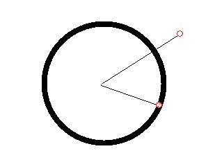

1. 到圆心的距离是否在圆周上。如果在，进入第二步。
2. 如果圆弧的角度接近一个圆，则认为包含，否则进入第三步。
3. 计算待检测点所在半径角度是否在圆弧的角度范围内。
```typescript
// contain.ts
const PI2 = Math.PI * 2
/**
 * 将弧度转换为0到2PI内
 */
function normalizeRadian(angle: number) {
  angle %= PI2
  if (angle < 0) {
    angle += PI2
  }

  return angle
}
/**
 * 圆弧描边包含
 */
function arcContainStroke (
  cx: number, cy: number, r: number, startAngle: number, endAngle: number, anticlockwise: boolean,
  lineWidth: number, x: number, y: number
) {
  x -= cx
  y -= cy
  // 到圆心的距离
  let d = Math.sqrt(x * x + y * y)
  let halfLineWidth = lineWidth / 2
  // 不在圆周上
  if ((d - r) > halfLineWidth || (d - r) < -halfLineWidth) {
    return false
  }
  // 近似一个圆时不再判断
  if (Math.abs(startAngle - endAngle) % PI2 < 1e-4) {
    return true
  }
  if (anticlockwise) {
    let temp = startAngle
    startAngle = normalizeRadian(endAngle)
    endAngle = normalizeRadian(temp)
  } else {
    startAngle = normalizeRadian(startAngle)
    endAngle = normalizeRadian(endAngle)
  }
  if (startAngle > endAngle) {
    endAngle += PI2
  }
  // 求出点所在半径的角度
  let angle = Math.atan2(y, x)
  if (angle < 0) {
    angle += PI2
  }
  // 需要注意角度超过一周的情况
  return (angle >= startAngle && angle <= endAngle) ||
         (angle + PI2 >= startAngle && angle + PI2 <= endAngle)
}
function pathContain () {
  // ...
        case PathType.arc:
          if (isStroke) {
            if (arcContainStroke(
              params[0],
              params[1],
              params[2],
              params[3],
              params[4],
              params[5],
              lineWidth,
              x,
              y
            )) {
              return true
            }
          } 
}
```
不过一个容易发现的问题是，考虑如下代码（此时将`XElement.afterRender`中描边和填充的顺序调换一下）：
```typescript
ctx.moveTo(10, 10)
ctx.arc(shape.cx, shape.cy, shape.r * 2, shape.startAngle, shape.endAngle, !shape.clockwise)
ctx.arc(shape.cx, shape.cy, shape.r, shape.startAngle, shape.endAngle, !shape.clockwise)
```
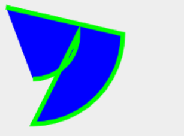

可以看到有两条不属于我们绘制的路径，但是仍然被绘制出来了，这是因为没有调用`moveTo`，但是画笔仍然移动了，且这个过程留下了路径。所以，应该添加如下的处理代码。
```typescript
// contain.ts
function pathContain () {
  for () {
    // ...
    // 对于非moveto的造成的移动，圆弧在后面处理
    if (
      isStroke
      && (pathData.type !== PathType.arc)
      && (pathData.type !== PathType.moveTo)
      && (pathData.type !== PathType.closePath)
    ) {
      if (lineContainStroke(prePathFinal[0], prePathFinal[1], pathStartPoint[0], pathStartPoint[1], lineWidth, x, y)) {
        return true
      }
    }
      case PathType.arc:
        // ...
        pathStartPoint[0] = Math.cos(params[3]) * params[2] + params[0]
        pathStartPoint[1] = Math.sin(params[3]) * params[2] + params[1]
        if (
          isStroke
        ) {
          if (lineContainStroke(prePathFinal[0], prePathFinal[1], pathStartPoint[0], pathStartPoint[1], lineWidth, x, y)) {
            return true
          }
        }
  }
}
```
#### quadraticCurve
从二次贝塞尔曲线开始。
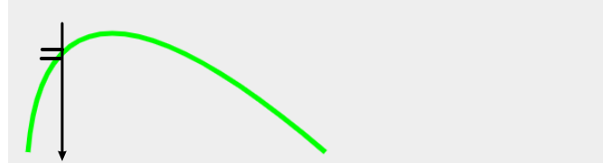

很容易想到，就像对于线段的判断那样来判断贝塞尔曲线，只不过对于对于线宽的处理略有不同，但是只要求出曲线上当前点的切线斜率即可。关键是另一个问题，对于起始点(x0, y0), 终点(x2, y2)间的点(x, y)，对于曲线方程
$$
B(t) = (1 - t)^2P_0 + 2t(1 - t)P_1 + t^2P_2, t \in [0, 1]
$$
此处的t，并不等于
$$ \frac{x - x_0}{x1 - x0}$$
需要先求出t才能进行下一步。而求解二次方程是非常简单的，此处不再多说。

而切线斜率呢，从之前的图（可以回去翻一下）可以看出很容易求出。

在`util/curve.ts`中写如下函数：
```typescript
/**
 * 计算二次贝塞尔曲线在某一点的切线的斜率
 */
export function quadraticTangentSlope (
  x0: number, y0: number, x1: number, y1: number, x2: number, y2: number, t: number
) {
  let q0x = x0 + (x1 - x0) * t
  let q0y = y0 + (y1 - y0) * t
  let q1x = x1 + (x2 - x1) * t
  let q1y = y1 + (y2 - y1) * t

  return (q0y - q1y) / (q0x - q1x)
}
/**
 * 计算二次方贝塞尔方程根
 */
export function quadraticRootAt(p0: number, p1: number, p2: number, val: number, roots: any[], lineWidth?: number) {
  // 如果在有线宽的情况下，不考虑线宽就会出现没有解的情况
  // 这里暂时是指求解x时
  if (lineWidth) {
    if (val < p0 && (p0 - val) <= lineWidth / 2) {
      val = p0
    } else if (val > p1 && (val - p1) <= lineWidth / 2) {
      val = p1
    }
  }
  let a = p0 - 2 * p1 + p2
  let b = 2 * (p1 - p0)
  let c = p0 - val

  let n = 0
  if (isAroundZero(a)) {
    if (isNotAroundZero(b)) {
      let t1 = -c / b
      if (t1 >= 0 && t1 <= 1) {
        roots[n++] = t1
      }
    }
  }
  else {
    let disc = b * b - 4 * a * c
    if (isAroundZero(disc)) {
      let t1 = -b / (2 * a)
      if (t1 >= 0 && t1 <= 1) {
        roots[n++] = t1;
      }
    }
    else if (disc > 0) {
      let discSqrt = Math.sqrt(disc);
      let t1 = (-b + discSqrt) / (2 * a)
      let t2 = (-b - discSqrt) / (2 * a)
      if (t1 >= 0 && t1 <= 1) {
        roots[n++] = t1
      }
      if (t2 >= 0 && t2 <= 1) {
        roots[n++] = t2
      }
    }
  }
  return n
}
```
如此计算它的包含就变得简单了：
```typescript
/**
 * 二次贝塞尔曲线描边包含
 */
function quadraticContainStroke (
  x0: number, y0: number, x1: number, y1: number, x2: number, y2: number,
  lineWidth: number, x: number, y: number
) {
  // 有一个大概的范围判断
  if (
    (y > y0 + lineWidth && y > y1 + lineWidth && y > y2 + lineWidth) ||
    (y < y0 - lineWidth && y < y1 - lineWidth && y < y2 - lineWidth) ||
    (x > x0 + lineWidth && x > x1 + lineWidth && x > x2 + lineWidth) ||
    (x < x0 - lineWidth && x < x1 - lineWidth && x < x2 - lineWidth)
  ) {
    return false
  }
  let roots = []
  // 求出当前t值
  let n = quadraticRootAt(x0, x1, x2, x, roots, lineWidth)
  // 对于x来说，只有一个解
  if (n !== 1) {
    return
  }
  let t = roots[0]
  // 和原始点的差值
  let d = quadraticAt(y0, y1, y2, t) - y
  // 斜率
  let k = quadraticTangentSlope(
    x0, y0, x1, y1, x2, y2, t
  )
  // 当前点所在垂直线截取的曲线的长度的平方
  let sSquare = (k * k + 1) * (lineWidth * lineWidth)

  return d * d <= sSquare / 4
}
function pathContain () {
  // ...
        case PathType.quadraticCurveTo:
          if (isStroke) {
            if (quadraticContainStroke(
              start[0],
              start[1],
              params[0],
              params[1],
              params[2],
              params[3],
              lineWidth,
              x,
              y
            )) {
              return true
            }
          } 
}
```
经过测试呢，发现在某些边缘存在一点点的瑕疵，但基本能够满足需求。
#### cubicCurve
三次贝塞尔曲线和二次差不多，就不解释了。当然了，解三次方程和二次方程的难度不是一个级别的。

> 考虑这样一个问题，虽然三次方程的解比较麻烦，但是仍能求解。如果是更高阶的贝塞尔曲线，很难通过公式来求解时，又该如何去解决这个问题呢？就我能想到的思路是对曲线进行降阶拆分，不过我是一个数学渣渣，就不验证了。
```typescript
// curve.ts
/**
 * 计算三次贝塞尔曲线在某一点的切线的斜率
 */
export function cubicTangentSlope (
  x0: number, y0: number, x1: number, y1: number,
  x2: number, y2: number, x3: number, y3: number, t: number
) {
  let q0x = x0 + (x1 - x0) * t
  let q0y = y0 + (y1 - y0) * t
  let q1x = x1 + (x2 - x1) * t
  let q1y = y1 + (y2 - y1) * t
  let q2x = x2 + (x3 - x2) * t
  let q2y = y2 + (y3 - y2) * t

  let r0x = q0x + (q1x - q0x) * t
  let r0y = q0y + (q1y - q0y) * t
  let r1x = q1x + (q2x - q1x) * t
  let r1y = q1y + (q2y - q1y) * t

  return (r0y - r1y) / (r0x - r1x)
}
/**
 * 用于开方
 */
function mathPow (x: number, y: number) {
  if (x < 0) {
    return -Math.pow(-x, y)
  }

  return Math.pow(x, y)
}
/**
 * 计算三次贝塞尔方程根，使用盛金公式
 */
export function cubicRootAt(
  p0: number, p1: number, p2: number, p3: number, val: number,
  roots: any[], lineWidth: number
) {
  // 如果在有线宽的情况下，不考虑线宽就会出现没有解的情况
  // 这里暂时是指求解x时
  if (lineWidth) {
    if (val < p0 && (p0 - val) <= lineWidth / 2) {
      val = p0
    } else if (val > p3 && (val - p3) <= lineWidth / 2) {
      val = p3
    }
  }
  // 系数
  let a = p3 + 3 * (p1 - p2) - p0
  let b = 3 * (p2 - p1 * 2 + p0)
  let c = 3 * (p1 - p0)
  let d = p0 - val
  // 重根判别式
  let A = b * b - 3 * a *c
  let B = b * c - 9 * a * d
  let C = c * c - 3 * b * d

  let n = 0
  let t1
  let t2
  let t3
  //  A=B=0时，三根相同
  if (isAroundZero(A) && isAroundZero(B)) {
    if (isAroundZero(b)) {
      roots[0] = 0
      n += 1
    } else {
      // 盛金公式1
      t1 = -c / b
      if (t1 >= 0 && t1 <= 1) {
        roots[n++] = t1
      }
    }
  } else {
    // 总判别式
    let delta = B * B - 4 * A * C
    if (isAroundZero(delta)) {
      // 盛金公式3
      let K = B / A
      t1 = -b / a + K
      t2 = -K / 2
      if (t1 >= 0 && t1 <= 1) {
        roots[n++] = t1
      }
      if (t2 >= 0 && t2 <= 1) {
        roots[n++] = t2
      }
    } else if (delta > 0) {
      // 盛金公式2
      let deltaSqrt = Math.sqrt(delta)
      let Y1 = A * b + 1.5 * a * (-B + deltaSqrt)
      let Y2 = A * b + 1.5 * a * (-B - deltaSqrt)
      Y1 = mathPow(Y1, 1 / 3)
      Y2 = mathPow(Y2, 1 / 3)
      t1 = (-b - (Y1 + Y2)) / (3 * a)
      // 复数根不包括在内
      if (t1 >= 0 && t1 <= 1) {
        roots[n++] = t1
      }
    } else {
      // 盛金公式4
      let T = (2 * A * b - 3 * a * B) / (2 * A * Math.sqrt(A))
      let theta = Math.acos(T) / 3 // theta / 3
      let ASqrt = Math.sqrt(A)
      let temp = Math.cos(theta)
      let THREE_SQRT = Math.sqrt(3)
      t1 = (-b - 2 * ASqrt * temp) / (3 * a)
      t2 = (-b + ASqrt * (temp + THREE_SQRT * Math.sin(theta))) / (3 * a)
      t3 = (-b + ASqrt * (temp - THREE_SQRT * Math.sin(theta))) / (3 * a)
      if (t1 >= 0 && t1 <= 1) {
        roots[n++] = t1;
      }
      if (t2 >= 0 && t2 <= 1) {
        roots[n++] = t2;
      }
      if (t3 >= 0 && t3 <= 1) {
        roots[n++] = t3;
      }
    }
  }

  return n
}
// contain.ts
/**
 * 三次贝塞尔曲线描边包含
 */
function cubicContainStroke (
  x0: number, y0: number, x1: number, y1: number,
  x2: number, y2: number, x3: number, y3: number,
  lineWidth: number, x: number, y: number
) {
  // 有一个大概的范围判断
  if (
    (y > y0 + lineWidth && y > y1 + lineWidth && y > y2 + lineWidth && y > y3 + lineWidth) ||
    (y < y0 - lineWidth && y < y1 - lineWidth && y < y2 - lineWidth && y < y3 - lineWidth) ||
    (x > x0 + lineWidth && x > x1 + lineWidth && x > x2 + lineWidth && x > x3 + lineWidth) ||
    (x < x0 - lineWidth && x < x1 - lineWidth && x < x2 - lineWidth && x < x3 - lineWidth)
  ) {
    return false
  }
  let roots = []
  // 求出当前t值
  let n = cubicRootAt(x0, x1, x2, x3, x, roots, lineWidth)
  // 对于x来说，只有一个解
  if (n !== 1) {
    return
  }
  let t = roots[0]
  // 和原始点的差值
  let d = cubicAt(y0, y1, y2, y3, t) - y
  // 斜率
  let k = cubicTangentSlope(
    x0, y0, x1, y1, x2, y2, x3, y3, t
  )
  // 当前点所在垂直线截取的曲线的长度的平方
  let sSquare = (k * k + 1) * (lineWidth * lineWidth)

  return d * d <= sSquare / 4
}
function pathContain () {
  // ...
        case PathType.bezierCurveTo:
          if (isStroke) {
            if (cubicContainStroke(
              start[0],
              start[1],
              params[0],
              params[1],
              params[2],
              params[3],
              params[4],
              params[5],
              lineWidth,
              x,
              y
            )) {
              return true
            }
          }
}
```
验证，bingo！
## 填充检测
如何进行填充检测？其实可以参考我们在使用`ctx.fill`时，它是如何着色的——内部点才回着色，外部点则不会。而恰好`ctx.fill`是可以选择填充规则的，通过这个规则我们可以摸索出究竟该如何判定。

查看`api`可以发现默认的规则为`nozero`，即非零规则，而它的表现符合我们的需求，所以可以选定此规则来进行下一步。

### 非零规则
什么是非零规则？
> 以下引用部分图文来自[张鑫旭](https://www.zhangxinxu.com/wordpress/2018/10/nonzero-evenodd-fill-mode-rule/)。

> 我们要判断某一个区域是路径内还是路径外，很简单，在这个区域内任意找一个点，然后以这个点为起点，发射一条无限长的射线，然后——

> 对于nonzero规则：起始值为0，射线会和路径相交，如果路径方向和射线方向形成的是顺时针方向则+1，如果是逆时针方向则-1，最后如果数值为0，则是路径的外部；如果不是0，则是路径的内部，因此被称为“非0规则”。
一图胜千言：

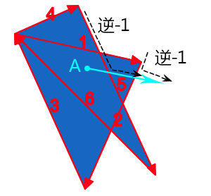

> 非零规则计数示意

> 例如上图点A，我们随便发出一条射线，结果经过了路径5和路径2，我们顺着路径前进方向和射线前进方向，可以看到，合并后的运动方向都是逆时针，逆时针方向-1，因此，最后计算值是-2，不是0，因此，是内部，fill时候可以被填充。

> 再看外部的例子，一图胜千言+1：

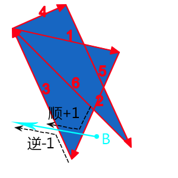

> 非零规则路径外示意

> 点B再发出一条射线，经过两条路径片段，为路径2和路径3，我们顺着路径前进方向和射线前进方向，可以看到，合并后的运动方向一个是逆时针，-1，一个是顺时针，+1，因此，最后的计算值是0，是外部，因此，不被填充。

明白了以上内容之后，又该怎么应用它来检测呢？容易想到的是，从待检测点出发，作一条延某个方向水平或者垂直的线，检测这条线和每一段路径的交叉方向，顺时针`+1`，逆时针`-1`（同`zrender`），没有交点则`+0`， 在路径上则为无穷大。

如果水平线路过路径的端点，那么结果除以2。这是因为点如果在路径交点处，需要被重复计算。如下图：

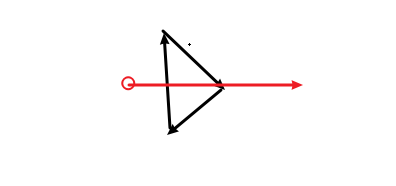

如果不添加这条规则，那么图示红点的结果非零，但是却在外部。添加此规则之后，则又能正确计算了。与之对比的是非端点处的交点。

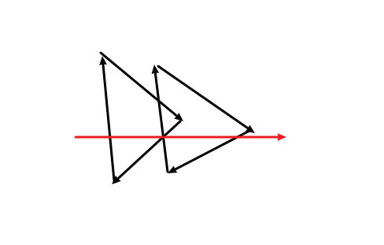

~~弧没有这个规则，原因可以画图自行领会。~~
完毕之后的结果非零，则包含，否则不包含。代码结构如下：
```typescript
// contain.ts
/**
 * 对有向线段非零规则检测
 */
function windingLine () {
  return 0
}
/**
 * 对三次贝塞尔曲线非零规则检测
 */
function windingCubic () {
  return 0
}
/**
 * 对二次贝塞尔曲线非零规则检测
 */
function windingQuadratic () {
  return 0
}
/**
 * 对弧非零规则检测
 */
function windingArc () {
  return 0
}
function pathContain () {
    // 非零规则的值
    let nozero = 0
    // 遍历绘制过程，分别求取包围盒
    for (let i = 0; i < data.length; i += 1) {
      // ...
      switch (pathData.type) {
        case PathType.arc:
          if (isStroke) {
          } else {
            nozero += windingArc()
          }
          break
        case PathType.arcTo:
          if (isStroke) {

          } else {
            
          }
          break
        case PathType.bezierCurveTo:
          if (isStroke) {
          } else {
            nozero += windingCubic()
          }5]
          break
        case PathType.lineTo:
          if (isStroke) {
          } else {
            nozero += windingLine()
          }
          break
        case PathType.moveTo:
          break
        case PathType.quadraticCurveTo:
          if (isStroke) {
          } else {
            nozero += windingQuadratic()
          }
          break
        case PathType.rect:
          if (isStroke) {
          } else {
            // 对于矩形，检测左右两点线段即可
            nozero += windingLine()
            nozero += windingLine()
          }
          start[0] = params[0]
          start[1] = params[1]
          break
        case PathType.drawImage:
          // 同rect，但是没有描边
          nozero += windingLine()
          nozero += windingLine()
          break
        case PathType.closePath:
          if (isStroke) {
          } else {
            nozero += windingLine()
          }
        default:
          break
      }
    }

    return nozero !== 0
}
```
让我们开始吧。
### line
从最简单的线段开始，当然这里的线段是有向线段。
> 以下所有推导均已省略了大致的判断。
> 
> 选择做水平向右的线。

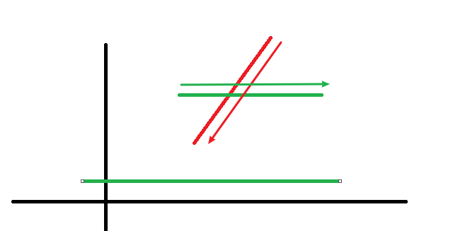
> $$假设线段从(x_0, y_0)到(x_1, y_1)，待检测点为(x, y)$$
> $$如果线段水平，即y_1 = y_0，并且y != y_1，那么不用再检测，返回0即可$$
> $$首先得出线段的方程为X(y) = \frac{x_0 - x_1}{y_0 - y_1}(y - y_0) + x_0$$
> $$那么水平线和线段的交点x' = X(y)$$
> $$如果x = x'，可知此点就在线段上，返回无穷大$$
> $$如果x < x'，可知线段待检测点的左侧，即没有交点，返回0$$
> $$如果x > x'，如果y_1 < y_0(在canvas坐标系中y_1 > y_0)，就像图中所示一样，为逆时针，返回-1，反之返回1$$
> $$以上面为基础，如果y_0 = y或者y = y_1，返回结果除以2$$
可以写出如下代码。
```typescript
/**
 * 对有向线段非零规则检测
 */
function windingLine (x0: number, y0: number, x1: number, y1: number, x: number, y: number) {
  if ((y > y0 && y > y1) || (y < y0 && y < y1)) {
    return 0
  }
  // 忽略水平线段
  if (y1 === y0 && (y !== y0)) {
    return 0
  }
  let dir = y1 < y0 ? 1 : -1
  // 对于会路过路径交点的情况
  if (y === y0 || y === y1) {
    dir = dir / 2
  }
  // 和线段的交点
  let x_ = (x0 - x1) / (y0 - y1) * (y - y0) + x0

  return x_ === x ?
         Infinity :
         x_ > x ? dir : 0
}
```
对于`lineTo`、`rect`、`drawImage`和`closePath`，传入对应参数即可。至此，我们的矩形元素，已经可以检测是否包含了。离成功不远啦！给我冲！
### arc
圆弧则稍微复杂一些。但大体思路都相似，具体的判断则类似于弧的描边判断。
首先考虑圆或者近似圆的情况。

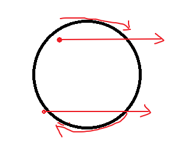

> $$如果点在圆外，那么水平线必然穿过两边，最后返回0（如果水平线与圆相切，同样可以认为是0）$$
> $$如果点在圆内或圆上，考虑右半边弧的方向即可，顺时针返回-1，逆时针返回1$$
然后是弧。

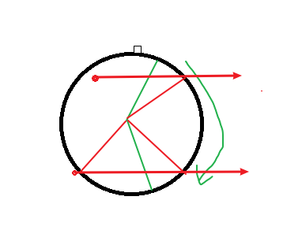
> $$设弧的圆心在(x_0, y_0)，半径为r，角度为\alpha到\beta，待检测点坐标为(x, y)$$
> $$则可求出直线y=y与圆（不是弧）的交点(x', y), (x_1', y)$$
> $$取二者横坐标大于x的点（可能两个点都满足，下面假设只有一个），求出交点所在半径的角度\theta$$
> $$如果\theta在\alpha到\beta之间，则根据\theta的范围和圆弧是顺时针还是逆时针来决定返回1或-1，否则返回0$$

代码如下：
```typescript
// contain.ts
let roots = []
/**
 * 对弧非零规则检测
 */
function windingArc (
  cx: number, cy: number, r: number, startAngle: number, endAngle: number,
  anticlockwise: number, x: number, y: number
) {
  y -= cy
  if (y > r || y < -r) {
    return 0
  }
  let tmp = Math.sqrt(r * r - y * y)

  roots[0] = -tmp
  roots[1] = tmp

  let diff = Math.abs(startAngle - endAngle);
  if (diff < 1e-4) {
    return 0
  }
  if (diff % PI2 < 1e-4) {
    // 圆
    startAngle = 0
    endAngle = PI2
    let dir = anticlockwise ? 1 : -1
    if (tmp === r) {
      // 圆上
      return Infinity
    } else if (x > roots[0] + cx && x < roots[1] + cx) {
      return dir
    }
    else {
      return 0
    }
  }
  // 起始点和终点的纵坐标，判定水平线是否路过端点
  let startY = Math.sin(startAngle) * r + cy
  let endY = Math.sin(endAngle) * r + cy
  if (anticlockwise) {
    let tmp = startAngle
    startAngle = normalizeRadian(endAngle)
    endAngle = normalizeRadian(tmp)
  }
  else {
    startAngle = normalizeRadian(startAngle)
    endAngle = normalizeRadian(endAngle)
  }
  if (startAngle > endAngle) {
    endAngle += PI2
  }

  let w = 0
  for (let i = 0; i < 2; i++) {
    let x_ = roots[i]
    if (x_ + cx > x) {
      let angle = Math.atan2(y, x_)
      let dir = anticlockwise ? 1 : -1
      if (angle < 0) {
        angle = PI2 + angle
      }
      if (
        (angle >= startAngle && angle <= endAngle)
        || (angle + PI2 >= startAngle && angle + PI2 <= endAngle)
      ) {
        // 弧上
        if (tmp === r) {
          return Infinity
        }
        // 端点处
        if ((y + cy) === startY || (y + cy) === endY) {
          dir /= 2
        }
        // 左半边方向反转
        if (angle > Math.PI / 2 && angle < Math.PI * 1.5) {
          dir = -dir
        }
        w += dir
      }
    }
  }
  return w;
}
```
不过在应用上和线段则开始不同，原因和之前所说圆弧的包围盒判断的原因相同，简单来说就是需要考虑上一段路径终点和闭合路径的情况。
```typescript
// ...
  function windingPreToStart() {
    if (!isStroke) {
      nozero += windingLine(
        prePathFinal[0],
        prePathFinal[1],
        pathStartPoint[0],
        pathStartPoint[1],
        x,
        y
      )
    }
  }
        case PathType.arc:
          if (isStroke) {
          } else {
            nozero += windingArc(
              params[0],
              params[1],
              params[2],
              params[3],
              params[4],
              params[5],
              x,
              y
            )
          }
          pathStartPoint[0] = Math.cos(params[3]) * params[2] + params[0]
          pathStartPoint[1] = Math.sin(params[3]) * params[2] + params[1]
          windingPreToStart()
          prePathFinal[0] = Math.cos(params[4]) * params[2] + params[0]
          prePathFinal[1] = Math.sin(params[4]) * params[2] + params[1]
          break
      //...省略其它也要加windingPreToStart的代码 
  //...
  // 填充判定需要认为已经闭合路径了
  if (!isStroke) {
    nozero += windingLine(
      prePathFinal[0],
      prePathFinal[1],
      start[0],
      start[1],
      x,
      y
    )
  }
```
### quadratic
二次贝塞尔曲线和圆弧也差不多。回顾之前的图可以发现：

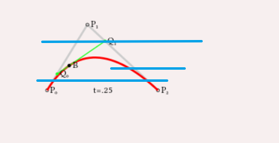
> $$对于待检测点(x, y)，可以求出其水平线和曲线的交点(x', y')，对于x' > x的交点，可以进行进一步检测$$
> $$如果曲线的极值不在范围内，则此曲线是单调的，根据起点和终点的纵坐标比较，则可得出结果$$
> $$否则根据极值的位置进行两段比较$$
> $$同样的，对于经过曲线端点的情况将结果除以2，对于曲线上的点返回无穷大$$
```typescript
// contain.ts
/**
 * 对二次贝塞尔曲线非零规则检测
 */
function windingQuadratic(
  x0: number, y0: number, x1: number, y1: number, x2: number, y2: number, x: number, y: number
) {
  if (
    (y > y0 && y > y1 && y > y2)
    || (y < y0 && y < y1 && y < y2)
  ) {
    return 0
  }
  let nRoots = quadraticRootAt(y0, y1, y2, y, roots)
  // 没有交点
  if (nRoots === 0) {
    return 0
  }
  else {
    let t = quadraticExtremum(y0, y1, y2)
    // 极值在范围内，两种单调性
    if (t >= 0 && t <= 1) {
      let w = 0
      let y_ = quadraticAt(y0, y1, y2, t)
      for (let i = 0; i < nRoots; i++) {
        // 端点
        let unit = (roots[i] === 0 || roots[i] === 1) ? 0.5 : 1

        let x_ = quadraticAt(x0, x1, x2, roots[i])
        if (x_ < x) {
          continue
        }
        // 曲线上
        if (x_ === x) {
          return Infinity
        }
        if (roots[i] < t) {
          w += y_ < y0 ? unit : -unit
        }
        else {
          w += y2 < y_ ? unit : -unit
        }
      }
      return w
    }
    // 极值在范围外，只有一种单调性
    else {
      // 端点
      let unit = (roots[0] === 0 || roots[0] === 1) ? 0.5 : 1

      let x_ = quadraticAt(x0, x1, x2, roots[0])
      // 曲线上
      if (x_ === x) {
        return Infinity
      }
      if (x_ < x) {
        return 0
      }
      return y2 < y0 ? unit : -unit
    }
  }
}
```
### cubic
三次贝塞尔曲线同理，不再多说。
```typescript
// contain.ts
function swapExtrema () {
  let tmp = extrema[0]
  extrema[0] = extrema[1]
  extrema[1] = tmp
}
/**
 * 对三次贝塞尔曲线非零规则检测
 */
function windingCubic (
  x0: number, y0: number, x1: number, y1: number,
  x2: number, y2: number, x3: number, y3: number,
  x: number, y: number
) {
  // Quick reject
  if (
    (y > y0 && y > y1 && y > y2 && y > y3)
    || (y < y0 && y < y1 && y < y2 && y < y3)
  ) {
    return 0
  }
  let nRoots = cubicRootAt(y0, y1, y2, y3, y, roots)
  // 不经过
  if (nRoots === 0) {
    return 0
  }
  else {
    let w = 0
    let nExtrema = -1
    let y0_
    let y1_
    for (let i = 0; i < nRoots; i++) {
      let t = roots[i]
      // 路过端点
      let unit = (t === 0 || t === 1) ? 0.5 : 1

      let x_ = cubicAt(x0, x1, x2, x3, t)
      if (x_ < x) {
        continue
      }
      // 曲线上
      if (x_ === x) {
        return Infinity
      }
      if (nExtrema < 0) {
        nExtrema = cubicExtrema(y0, y1, y2, y3, extrema);
        if (extrema[1] < extrema[0] && nExtrema > 1) {
          swapExtrema()
        }
        y0_ = cubicAt(y0, y1, y2, y3, extrema[0]);
        if (nExtrema > 1) {
          y1_ = cubicAt(y0, y1, y2, y3, extrema[1])
        }
      }
      if (nExtrema === 2) {
        // 分成三段单调函数
        if (t < extrema[0]) {
          w += y0_ < y0 ? unit : -unit
        }
        else if (t < extrema[1]) {
          w += y1_ < y0_ ? unit : -unit
        }
        else {
          w += y3 < y1_ ? unit : -unit
        }
      }
      else {
        // 分成两段单调函数
        if (t < extrema[0]) {
          w += y0_ < y0 ? unit : -unit
        }
        else {
          w += y3 < y0_ ? unit : -unit
        }
      }
    }
    return w
  }
}
```
### 关于arcTo和椭圆
一方面这些功能已经足够使用，另一方面写这些已经很累了，我就不写了，有需要的童鞋请自行补充。
### 一些bug
这一块对我来说还是有点复杂，因此可能出现没有注意到或思虑不全的`bug`。还有就是前面也说了，本文和代码是同步进行的，这一部分删删改改过于反复，可能会有文中代码和实际代码不符的情况，请以实际代码为准。
> 为什么不仔细校对？已经大概校对过了。剩下的即使有错误，也不影响理解。
## 事件
有了以上基础，就可以完善我们的事件系统了。主要是对`mouseleave`和`mouseenter`事件做特殊处理。
```typescript
//domHandler.ts
/**
 * 处理函数
 */
const handlers = {
  // ...
  mousemove (e: XrEvent, xel: XElement, isContain: boolean) {
    // 鼠标已离开元素
    if (xel.hover && !isContain) {
      xel.dispatch('mouseleave', normalizeEvent(e, 'mouseleave', xel))
    // 继续移动
    } else if (xel.hover && isContain) {
      xel.dispatch('mousemove', normalizeEvent(e, 'mousemove', xel))
    // 初次进入
    } else if (!xel.hover && isContain) {
      xel.dispatch('mouseenter', normalizeEvent(e, 'mouseenter', xel))
    }
  }
}
export default function createDomHandler (dom: HTMLElement, stage: Stage) {
  mouseEvents.forEach(eventName => {
    let handler = momuseEventHandlers[eventName] = (e: MouseEvent) => {
      // ...
      for (; i >= 0; i -= 1) {
        xel = xelements[i]
        let isContain = xel.contain(xrEvent.x, xrEvent.y)
        if (isContain) {
          // 对于剩下的元素，可以直接设置hover为false来重置，不必再判断
          // 并且mouseleave要在mouseenter前触发
          for (i -= 1; i >= 0; i -= 1) {
            if (eventName === 'mousemove') {
              handlers[eventName](xrEvent, xelements[i], false)
            }
            xelements[i].hover = false
          }
        }
        if (isContain || (xel.hover && eventName === 'mousemove')) {
          handlers[eventName](xrEvent, xel, isContain)
        }
        // 为元素添加此属性以便做`mouseleave`等判断
        xel.hover = isContain
      }
    }
  })
}
```
更多事件和移动端事件请自行摸索。
## 性能
还记得最开始不用官方`api`来检测的原因吗？运行同样的测试，可以发现时间在`5ms`以内，如果鼠标上有元素，一般在`1ms`以内，基本满足需求。
## 应用
如何应用呢？
### 小小应用——悬浮指针
现在考虑这样一个需求，要求鼠标在元素上时指针变为可点击形态，即`pointer`，参考`zrender`，我们将它设计为所有元素都默认如此，在`XElement.style`中添加`cursor`属性。很容易想到在每个元素创建时为其添加相关的事件处理。但同时也能想到的另一个模式就是冒泡，让总代理来处理这些重复触发多次的事。为此重写`XElement.dispatch`，并将`dispatch`加入继承的排除属性列表中。然后让`XRender`继承`Eventful`。可以发现这样的话鼠标不在元素上`xr`就无法获取到事件了，所幸修改起来并不难。
```typescript
class XElement implements Transform, Eventful {
  // ...
  dispatch(event: string, params: any): void {
    Eventful.prototype.dispatch.call(this, event, params)
    if (this.parent && (this.parent.parent || this.parent._xr)) {
      this.parent.dispatch(event, params)
    } else {
      this._xr && this._xr.dispatch(event, params)
    }
  }
}
inherit(XElement, Eventful, ['dispatch'])

// domHandlers.ts
export class DomHandler extends Eventful {
}
function createDomHandler (dom: HTMLElement, stage: Stage) {
  const mouseEventsHandlers = {}
  const domHandler = new DomHandler(mouseEventsHandlers, dom)
  mouseEvents.forEach(eventName => {
    let handler = mouseEventsHandlers[eventName] = (e: MouseEvent) => {
      // ...
      for (; i >= 0; i -= 1) {
        // ...
      }
      if (!xrEvent.target) {
        domHandler.dispatch(eventName, xrEvent)
      }
    }
    dom.addEventListener(eventName, handler)
  })
}
// Xrender.ts
class XRender {
  constructor (dom: string | HTMLElement, opt: XRenderOptions = {}) {
    extendsClass(this, Eventful)
    // ...
    this.initEventHandler()
  }
  initDomHandler () {
    const domHandler = this.domHandler = createDomHandler(this.painter.layerContainer, this.stage)
    let domEventHandlers = this.domHandler.domEventsHandlers
    for (let eventName in domEventHandlers) {
      domHandler.on(eventName, e => {
        this.dispatch(eventName, e)
      })
    }
  }
  /**
   * 对一些事件进行初始化，比如鼠标样式的变化
   */
  initEventHandler () {
    this.on('mouseenter', () => {
      this.setCursor(e.target.style.cursor)
    })
    this.on('mouseleave', () => {
      this.setCursor('default')
    })
  }
  /**
   * 设置鼠标样式
   */
  setCursor (cursor = 'pointer') {
    this.painter.layerContainer.style.cursor = cursor
  }
}
```
移动鼠标，可以发现鼠标样式的变化。

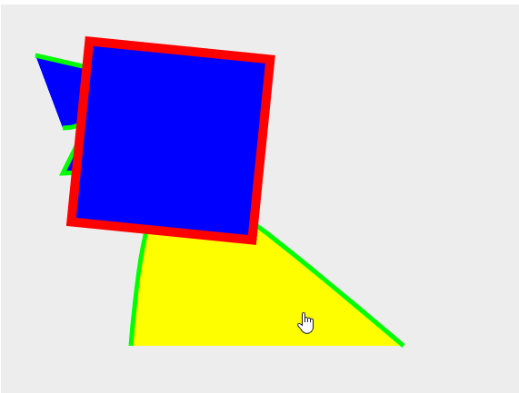

> 可以看到在`domHandler`中可以直接触发`xr`所监听的事件，即让`xr`的`on`等方法代理到`domHandler`上。不这么做而多此一举的原因是想让事件触发更符合冒泡。

### 小小应用——拖曳
另一个常用的应用是拖曳，很容易实现它。
```typescript
class XElement {
  /**
   * 是否开启可拖曳
   */
  dragable = false
  constructor () {
    this.initEventHandler()
  }
  initEventHandler () {
    this.initDragEvent()
  }
  initDragEvent () {
    let lastX = 0
    let lastY = 0
    let draging = false
    this.on('mousedown', e => {
      if (!this.dragable) {
        return
      }
      draging = true
      lastX = e.x
      lastY = e.y
      this._xr.setCursor('move')
    })
    this.on('mousemove', e => {
      if (!draging || !this.dragable) {
        return
      }
      let xDiff = e.x - lastX
      let yDiff = e.y - lastY
      let xel = e.target
      xel.attr({
        position: [xel.position[0] += xDiff, xel.position[1] += yDiff]
      })
      lastX = e.x
      lastY = e.y
      this._xr.setCursor(this.style.cursor)
    })
    this.on('mouseup', e => {
      if (!this.dragable) {
        return
      }
      draging = false
    })
    this.on('mouseleave', e => {
      if (!this.dragable) {
        return
      }
      draging = false
      this._xr.setCursor('default')
    })
  }
}
```
可以发现已经实现拖曳了（`move`样式是后面加的，就不重新截图了）。
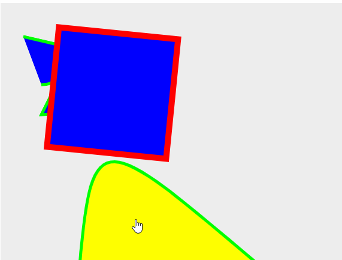

#### 变换顺序
虽然看起来一切正常，但是如果调整元素的旋转角度，再进行拖曳的话，就会发现移动的轨迹很奇怪。这是因为之前是先旋转再平移的，因为拖曳的功能，我们需要调整变换的顺序，**先平移，再旋转**，要修改`XElment.setTransform`，`Group.resumeTransform`，`getTransformCord`，调整过程这里就不写了，相信大家可以很轻松地搞定。
#### Group的拖曳
另一个常见的需求是对一个组内所有元素进行拖曳。要做到这一点，首先要明确的是，一个`Group`是矩形的，并且它的形状和大小就是组内元素包围盒的并集——如果子元素相对定位元素不是自身，那么不计入。但是需要注意的是，计算组的包围盒时，子元素如果有`transform`，那么它的包围盒同样需要进行`transform`变换，最后才能获取到子元素准确的包围盒。
> 对于旋转，不是元素本身旋转，包围盒就需要旋转，比如圆绕自身圆心旋转。但是如果考虑到这一点的话，事情会变得非常复杂，也很难去计算。因此这里就忽略这些差异性了（当然我不会说因为`zrender`没做所以我也不做）。

如何求包围盒变换后形成的新包围盒？对矩形的四个点分别应用变换，再求取四个点的包围盒即可。创建`util/boundingRect.ts`
```typescript
import { Transform } from '../xElements/XElement'
import BoundingRect from '../BoundingRect'
/**
 * 对包围盒应用变换
 * 思路是对每一个点应用变换，然后重新求包围盒
 */
export function rectTransform (rect: BoundingRect,transform: Transform) {
  let x0 = rect.x
  let y0 = rect.y
  let x1 = rect.x + rect.width
  let y1 = rect.y + rect.height
  let point1 = [x0, y0]
  let point2 = [x1, y0]
  let point3 = [x1, y1]
  let point4 = [x0, y1]
  pointTransform(point1, transform)
  pointTransform(point2, transform)
  pointTransform(point3, transform)
  pointTransform(point4, transform)
  let min = [0, 0]
  let max = [0, 0]
  minPoints(min, point1, point2, point3, point4)
  maxPoints(max, point1, point2, point3, point4)

  return new BoundingRect(
    min[0],
    min[1],
    max[0] - min[0],
    max[1] - min[1]
  )
}
function pointTransform (point: number[], transform: Transform) {
  let x = point[0]
  let y = point[1]
  // 所有距离都要乘以缩放系数
  let scaleX = transform.scale[0]
  let scaleY = transform.scale[1]
  // 绕中心点缩放
  x = x * scaleX
  y = y * scaleY
  // 平移
  x += transform.position[0]
  y += transform.position[1]
  // 得出它绕中心点旋转对应角度后的坐标
  // 证明过程参考前文
  let sinRotation = Math.sin(transform.rotation)
  let cosRotation = Math.cos(transform.rotation)
  let x2ox = x - transform.origin[0]
  let y2oy = y - transform.origin[1]
  x = x2ox * cosRotation - y2oy * sinRotation + transform.origin[0]
  y = x2ox * sinRotation + y2oy * cosRotation + transform.origin[1]
  

  point[0] = x
  point[1] = y
}
function minPoints (min: number[], ...points: number[][]) {
  min[0] = Math.min(...points.map(point => point[0]))
  min[1] = Math.min(...points.map(point => point[1]))
}
function maxPoints (max: number[], ...points: number[][]) {
  max[0] = Math.max(...points.map(point => point[0]))
  max[1] = Math.max(...points.map(point => point[1]))
}
```
将它挂载到`BoudingRect`上。
```typescript
class BoudingRect {
  applyTransform (transform: Transform) {
    return rectTransform(this, transform)
  }
}
```
在之前的代码中我们是获取不到`Group`类元素的，为了能够让它对事件作出一些响应，需要改变这部分代码，同时让它排在最前面——没有具体的元素响应事件才考虑让`Group`来响应。
```typescript
class Stage {
  updateXElements (callback?: (xel: XElement) => void) {
    // zIndex高的在后
    // zLevel高的在后，其它按加入次序排列
    // 即，最上层的就在最后面，方便事件检测时能倒序遍历
    // 将group排在最前面
    return this.expandXElements(callback).sort((a, b) => {
      let isGroup = a.name === 'group'
      let zIndex = a.zIndex - b.zIndex
      return !isGroup
             ? zIndex === 0 ? a.zLevel - b.zLevel : zIndex
             : -1 
    })
  }
  /**
   * 展开所有元素
   * 有一个副作用，目前用来设置xr
   */
  expandXElements (callback?: (xel: XElement) => void) {
    for (let childIndex = 0; childIndex < xElements.length; childIndex += 1) {
      if (xel.stage) {
        //...
        // 将自身也加入，为了能够触发事件
        children.push(xel)
      } else {
      }
    }

    return list
  }
}
```
接着将`Group`的默认样式设为`default`。并且在从父元素获取的选项中去掉`dragable`。在拖曳相关事件中判断`this`和`e.target`是否相同（事件会冒泡）。

尝试开启`Group.dragable`，测试可以发现能够正常拖曳单个元素和整个组的元素。
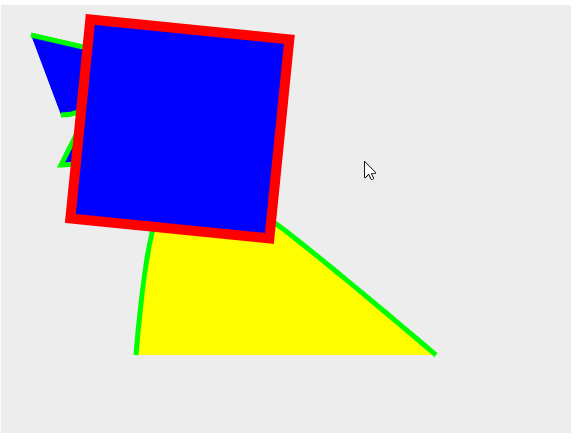。

至此，我们的事件处理就差不多完成了，虽然可能还有许多瑕疵，但是应该说了讲清了大概的原理和实现过程。
## 小结
这个版本中做了许多事，但最后总结起来就是添加了事件处理系统。

## V7预览
[文字](./Version7.md)。
