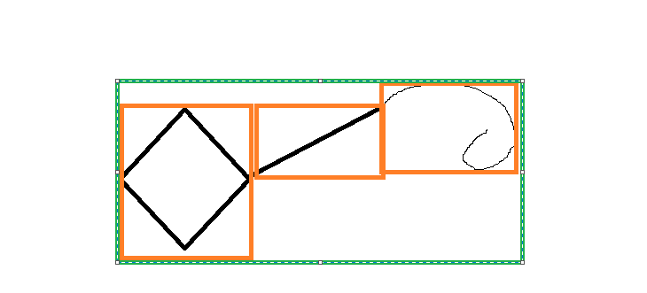
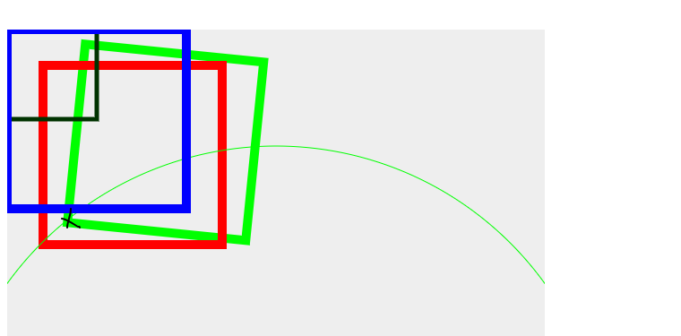
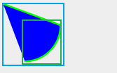
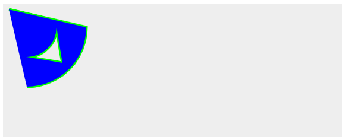
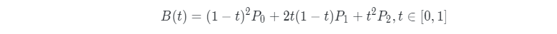
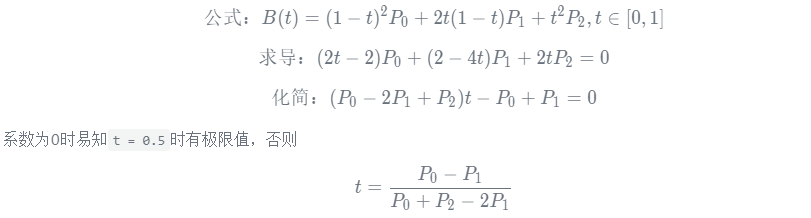
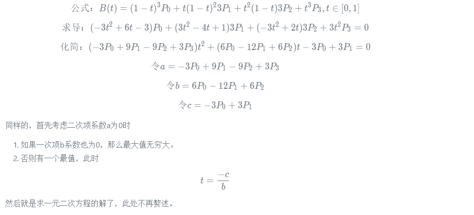

# 从零打造Echarts —— V6 事件绑定和包围盒
本文开始v6版本。
## 回顾v5
在v5版本中我们添加了分组、分层以及逐帧绘制的功能。
## 开始
经过前5个版本的打造，现在的`xrender`已经具有一个`canvas`库的雏形了，已经可以利用它（或者补充它之后）做到很多。但是这些功能都只能在代码里写死，无法根据动作来做出响应，如点击图形后放大。而这，恰恰是一个`canvas`库，非常重要，也是不可或缺的一部分。
### 思路
首先我们要知道，对于`canvas`内的任何事件，都只发生在`canvas`元素上——浏览器感知不到我们的图形，所以要想实现对图形做到像`dom`元素的事件监听，只能自己来实现。很容易想象出这个流程，以`click`事件为例：
1. 监听我们创建的`dom`容器的`click`事件，触发后获取鼠标的坐标，然后转换为`canvas`内部的坐标，一般以左上角为原点。
2. 遍历所有图形元素，检测该图形是否包含这一点，如果包含，触发元素的`click`事件，调用所有`click`回调。

咦，是我遗漏了什么吗，怎么只有两步？当然，很容易看出最难的就是如何检测图形是否包含该点。先略过它，我们完善其它的步骤。

### 事件管理 `Eventful`
一个常见的事件处理模型，此处不再赘述，只贴代码。如果有不懂的地方，可能需要加强一下基础。

创建`Eventful.ts`文件
```typescript
type Handler<T> = (e?: T) => void

// 不考虑`handler`不是函数的情况
class Eventful<EventType = string, Params = any> {
  /**
   * 事件回调
   */
  _handlers: {
    [prop: string]: Handler<Params>[]
  } = {}
  /**
   * 监听事件
   */
  on (event: EventType, handler: Handler<Params>) {
    // 绕过类型检查
    if (typeof event !== 'string') {
      return
    }
    let handlers = this._handlers
    if (!handlers[event]) {
      handlers[event] = [handler]
    } else {
      if (handlers[event].indexOf(handler) > -1) {
        return
      }
      handlers[event].push(handler)
    }
    
  }
  /**
   * 取消监听
   */
  off (event?: EventType, handler?: Handler<Params>) {
    // 绕过类型检查
    if (typeof event !== 'string') {
      return
    }
    if (!event) {
      this._handlers = {}
      return
    }
    let handlers = this._handlers[event]
    if (!handlers) {
      return
    }
    if (!handler) {
      this._handlers[event] = []
    } else {
      let index = handlers.indexOf(handler)
      if (index > -1) {
        handlers.splice(index, 1)
      }
    }
  }
  /**
   * 触发回调
   */
  dispatch (event: EventType, params?: Params) {
    // 绕过类型检查
    if (typeof event !== 'string') {
      return
    }
    let handlers = this._handlers[event]
    if (!handlers) {
      return
    }
    for (let i = 0; i < handlers.length; i += 1) {
      handlers[i](params)
    }
  }
}

export default Eventful
```
为了让元素能够直接使用`xel.on()`，一种方法是为元素添加这些方法，映射到创建的`eventful`上，另一种方法则是，让`XElement`继承它。我觉得第二种方法要方便一点。但是`ts`和`es6`都只能继承一个类，以后要继承更多的类怎么办？为此添加一下工具方法，来实现多个类的继承——属于非父子继承，只是扩展功能。
```typescript
/**
 * 只是用来继承原型的
 * @example
 * // 两个函数结合起来用
 * class A {
 *   super() {
 *     extendsClass(this, B)
 *   }
 * }
 * inherit(A, [B])
 */
export function inherit (child: Function, parents: Function | Function[], excludeProps: string[] = []) {
  if (!Array.isArray(parents)) {
    parents = [parents]
  }
  let props: string[]
  let prop: string
  let prototype = child.prototype as Object
  let parentPrototype: Object
  for (let parentIndex = 0; parentIndex < parents.length; parentIndex += 1) {
    parentPrototype = parents[parentIndex].prototype
    props = Object.getOwnPropertyNames(parentPrototype)
    for (let propIndex = 0; propIndex < props.length; propIndex += 1) {
      prop = props[propIndex]
      // 使用本方法来继承一般是混合继承，而不是子类继承父类，一般不会有同名属性
      // 另一方面因为ts的验证，需要提前设置属性做好站位，所以即使有同名属性，也需要进行覆盖
      if (prop !== 'constructor' && excludeProps.indexOf(prop) === -1) {
        prototype[prop] = clone(parentPrototype[prop])
      }
    }
  }

  return child
}
/**
 * 为类创建一个实例，然后将实例的属性复制给传入的上下文
 * 以实现多继承
 * 原型的继承则交给inherit
 * @param context 上下文，当前类
 * @param Parent 父类
 * @param args 父类的参数
 */
export function extendsClass (context, Parents, args = []) {
  if (!Array.isArray(Parents)) {
    Parents = [Parents]
  }
  Parents.forEach(Parent => {
    let instance = new Parent(...args)
    for (let key in instance) {
      if (instance.hasOwnProperty(key)) {
        context[key] = instance[key]
      }
    }
  })
}
```
> 关于多继承，没有搜到太好的办法。使用类的话无法在构造函数中调用`Class.call()`这样的方法来实现`extendsCalss`的功能；如果采用混入继承则没有找到很好的类型推论的办法，所以自己随便写了一个。当然也许有更好的办法，欢迎提出。

然后使用让`XElement`继承`Eventful`。
```typescript
// 为了告诉编译器可以使用`Eventful`的属性
class XElement implements EventFul {
  // ... 这里有一段编辑器自动添加的实现`Eventful`的代码，就不贴了
  // 后期会添加事件类型和参数，也就不贴了
  constructor (opt: XElementOptions = {}) {
    extendsClass(this, Eventful)
    this.options = opt
  }
}
inherit(XElement, Eventful)
// 尝试一下
let xel = new XElement()
xel.on('s', (info) => {
  console.log(info)
})
xel.dispatch('s', 'fd')
// 如期工作了
```
### 坐标映射
接下来监听容器的事件。转换坐标后判断所有元素是否包含这个点。

但是考虑这样一种情况，多个元素重叠在一起，应该如何判定？目前暂定为只对最上层的事件做响应，一是这样符合实际，二是这样可以提升性能，减少不必要的检测。为此需要改变`Stage.getAll`的排序规则。
```typescript
class Stage {
  // ...
  updateXElements (callback?: (xel: XElement) => void) {
    // zIndex高的在后
    // zLevel高的在后，其它按加入次序排列
    // 即，最上层的就在最后面，方便事件检测时能倒序遍历
    return this.expandXElements(callback).sort((a, b) => {
      let zIndex = a.zIndex - b.zIndex
      return  zIndex === 0 ? a.zLevel - b.zLevel : zIndex
    })
  }
}
```
创建`domHandler.ts`
```typescript
import Stage from './Stage'
import XElement from './xElements/XElement'
/**
 * 定义事件的格式
 */
export interface XrEvent {
  /**
   * 原始的事件信息
   */
  rawEvent?: Event
  /**
   * x坐标
   */
  x?: number
  /**
   * y坐标
   */
  y?: number
  /**
   * 触发事件的元素
   */
  target?: XElement
  /**
   * 事件类型
   */
  type?: XrEventType
}
export type XrEventType = 'click' | 'mousedown' | 'mouseup' | 'mousemove' | 'mouseleave' | 'mouseenter'
/**
 * 鼠标事件名称
 * 目前也只考虑鼠标事件
 * 大部分事件不需要做特殊处理
 */
const mouseEvents: XrEventType[] = [
  'click',
  'mousedown',
  'mouseup',
  // 对于mouseleave等事件，只能通过mousemove来判断
  'mousemove'
  // ..等等
]
/**
 * 处理函数
 */
const handlers = {
  click (e: XrEvent, xel: XElement) {
    xel.dispatch('click', normalizeEvent(e, 'click', xel))
  },
  mousemove (e: XrEvent, xel: XElement, isContain: boolean) {
  },
  mousedown (e: XrEvent, xel: XElement) {
    xel.dispatch('mousedown', normalizeEvent(e, 'mousedown', xel))
  },
  mouseup (e: XrEvent, xel: XElement) {
    xel.dispatch('mouseup', normalizeEvent(e, 'mouseup', xel))
  }
}
/**
 * 将事件转换为内部的事件
 */
function normalizeEvent (e: XrEvent,  type: XrEventType, xel: XElement) {
  e.target = xel
  e.type = type

  return e
}
/**
 * 进行坐标转换
 */
function convertCoordinates (e: MouseEvent, dom: HTMLElement) {
  let rect = dom.getBoundingClientRect()
  let xrEvent: XrEvent
  xrEvent = {
    x: e.clientX - rect.left,
    y: e.clientY - rect.top,
    rawEvent: e
  }

  return xrEvent
}
export class DomHandler extends Eventful<XrEventType, XrEvent> {
  domEventsHandlers: {
    [prop: string]: Function
  } = {}
  dom: HTMLElement
  constructor (handlers: {
    [prop: string]: Function
  }, dom: HTMLElement) {
    super()
    this.domEventsHandlers = handlers
    this.dom = dom
  }
  // 最后肯定是需要移除事件监听的
  dispose () {
    let handlers = this.domEventsHandlers
    for (let eventName in handlers) {
      this.dom.removeEventListener(eventName, handlers[eventName] as EventListenerOrEventListenerObject)
    }
  }
}
/**
 * 创建dom的事件处理
 */
export default function createDomHandler (dom: HTMLElement, stage: Stage) {
  const mouseEventsHandlers = {}
  const domHandler = new DomHandler(mouseEventsHandlers, dom)
  mouseEvents.forEach(eventName => {
    let handler = momuseEventHandlers[eventName] = (e: MouseEvent) => {
      let xrEvent = convertCoordinates(e, dom)
      let xelements = stage.getAll()
      let xel: XElement
      let i = xelements.length - 1
      // 并不是说被是包含才调用对应的处理函数
      // 如`mouseleave`事件，虽然鼠标离开的坐标不在元素内，但元素仍然需要触发事件
      for (; i >= 0; i -= 1) {
        xel = xelements[i]
        let isContain = xel.contain(xrEvent.x, xrEvent.y)
        if (isContain || (xel.hover && eventName === 'mousemove')) {
          handlers[eventName](xrEvent, xel, isContain)
        }
        // 为元素添加此属性以便做`mouseleave`等判断
        xel.hover = isContain
        if (isContain) {
          break
        }
      }
      // 对于剩下的元素，可以直接设置hover为false来重置，不必再判断
      for (i -= 1; i >= 0; i -= 1) {
        xelements[i].hover = false
      }
    }
    dom.addEventListener(eventName, handler)
  }
}

```


然后在`XRender`中添加对应代码。
```typescript
class Xrender {
  consturctor () {
    // ...
    this.painter = new Painter(dom, stage, opt)
    this.initDomHandler()
  }
  /**
   * 初始化事件
   */
  initDomHandler () {
    this.domHandler = createDomHandler(this.painter.layerContainer, this.stage)
  }
}
```
查看是否成功：
```typescript
circle1.on('mousedown', e => {
  console.log(e)
})
```
在`canvas`上按下鼠标可以看到控制台打印出了事件信息。

事件处理的骨架已经完成，接下来就是重头戏了。
### 路径包含
如何检测一个点是否被图形包含？也就是被路径包含？官方提供了这样的方法:
- `isPointInPath`
- `isPointInStroke`

那么它能不能满足我们的需要呢？经过测试，是可以的。而且它的兼容性也还可以，虽然在ie上存在一些问题，不过我想那无关紧要。改造`XElement`，在绘制的时候构建一个路径，填充和描边时直接使用这个路径，之后就能用来检测了。

不过虽然它能检测一个点是否在路径内，或者在描边上，但还是存在一些问题。这个问题就和`Path2D`有关了。

考虑以下代码：
```typescript
ctx.translate(20, 20)
ctx.rect(0, 0, 20, 20)
ctx.stroke()
let path = new Path2D()
path.rect(0, 0, 20, 20)
ctx.isPointInPath(path, 1, 2)
```
结果会是`true`还是`false`？可以说开发这个`api`(或者设计这个标准)的人还是比较贴心的，结果是`false`，`ctx.isPointInPath(path, 20, 20)`的结果则是`true`。其实原因也不难想到，这个接口其实相当于将传入`path`绘制一遍再进行检测，自然这个时候是保留了坐标系的。

也就是说在我们检测之前需要对坐标进行一次变换——这似乎很容易，但是一个很容易想到的问题就是——回想前面说的事件处理的过程，一个事件触发时对所有图形进行包含检测，决定是否触发对应事件。如果照这么处理，以鼠标移动为例，每一次`mousemove`事件触发后，检测所有图形是否包含该坐标，就相当于对所有图形进行重绘，而且在这之前还要进行坐标系的变换，这样会有性能问题吗？

做个小小的测试。
```typescript
let pathArr = []
for (let i = 0; i < 20000; i += 1) {
  path = new Path2D()
  path.rect(0, 0, i, i)
  path.moveTo(0, i)
  path.lineTo(2 * i, 20  * 2)
  path.bezierCurveTo(i, i + 2, i + 3, i + 4, i + 5, i + 6)
  pathArr.push(path)
}
console.time('path')
for (let i = 0; i < 20000; i += 1) {
  ctx.translate(i, 2 + i)
  ctx.scale(i / i + 6, i / i + 6)
  ctx.isPointInPath(pathArr[i], i, i + 2)
}
console.timeEnd('path')
```
20000次检测在`i5`4代笔记本u上花费的时间在90ms左右，应该说是可以接受，才怪呢。去掉变换矩阵的语句则大约花费`20ms`。这显然是不能接受的。更直观地对比，`zrender`检测时间为`5ms`左右。

简而言之，用这两个`api`来检测似乎已经行不通了——没有研究过它的原理，我也不知道为什么这么慢，猜测可能真的是重绘过。那么怎么办呢？如同`dom`慢，虚拟`dom`快一样，我们可以构造虚拟`canvas`。
> 不然也不会说这是重头戏了。
### 路径代理

我们的判断是以元素为基准的，我们必须知道这个元素绘制了怎样的路径，才能进行下一步的处理。但问题是，每个元素绘制的路径都不一样，如何知道它绘制了什么样的路径呢？其实上面的`Path2D`已经给了我们启示——在绘制的时候，用有`context`绘制方法的一个代理对象代替`context`，就可获取该元素是如何绘制路径的，再经过一些处理，就能还原此路径。

那么思路其实就比较明确了，创建一个类似`Path2D`的代理对象，它保存着绘制路径的过程，并可以还原这个路径，同时，它还提供了类似`isPointInPath`这样的方法，来判断某点是否被路径，即元素包含，至于如何判断我们稍后再说。

创建`Path.ts`文件，如下：
```typescript
/**
 * 路径代理
 * 实现了context绘制路径的方法并
 * 保存元素绘制的路径
 * 并判断是否包含某个点
 */
class Path {
  /**
   * 保存着路径数据，格式先不管
   */
  data = []
  /**
   * 真正绘制的上下文
   */
  _ctx: CanvasRenderingContext2D
  constructor (ctx?: CanvasRenderingContext2D) {
    // 可以使用beginPath重置
    this._ctx = ctx
  }
  /**
   * 传入ctx，并开始路径绘制，做一些重置操作
   */
  start (ctx?: CanvasRenderingContext2D) {
    if (ctx) [
      this._ctx = ctx
    ]
    // 重置数据
  }
  /**
   * 添加数据
   */
  addData () {

  }
  // 以下方法调用ctx对应方法即可
  // 约定ctx已经存在
  arc(x: number, y: number, radius: number, startAngle: number, endAngle: number, anticlockwise?: boolean): void {
    this.addData()
    this._ctx.arc(x, y, radius, startAngle, endAngle, anticlockwise)
  }
  arcTo(x1: number, y1: number, x2: number, y2: number, radius: number): void {
    this.addData()
    this._ctx.arcTo(x1, y1, x2, y2, radius)
  }
  bezierCurveTo(cp1x: number, cp1y: number, cp2x: number, cp2y: number, x: number, y: number): void {
    this.addData()
    this._ctx.bezierCurveTo(cp1x, cp1y, cp2x, cp2y, x, y)
  }
  closePath(): void {
    this.addData()
    this._ctx.closePath()
  }
  ellipse(x: number, y: number, radiusX: number, radiusY: number, rotation: number, startAngle: number, endAngle: number, anticlockwise?: boolean): void {
    this.addData()
    this._ctx.ellipse(x, y, radiusX, radiusY, rotation, startAngle, endAngle, anticlockwise)
  }
  lineTo(x: number, y: number): void {
    this.addData()
    this._ctx.lineTo(x, y)
  }
  moveTo(x: number, y: number): void {
    this.addData()
    this._ctx.moveTo(x, y)
  }
  quadraticCurveTo(cpx: number, cpy: number, x: number, y: number): void {
    this.addData()
    this._ctx.quadraticCurveTo(cpx, cpy, x, y)
  }
  rect(x: number, y: number, w: number, h: number): void {
    this.addData()
    this._ctx.rect(x, y, w, h)
  }
  drawImage(img: CanvasImageSource, dx: number, dy: number, dw?: number, dh?: number, sx?: number, sy?: number, sw?: number, sh?: number) {
    this.addData()
    if (!sx) {
      this._ctx.drawImage(img, dx, dy, dw, dh)
    } else {
      // 参数名称有错
      this._ctx.drawImage(img, dx, dy, dw, dh, sx, sy, sw, sh)
    }
  }
  /**
   * 当前路径是否包含某个点
   */
  contain (x: number, y: number) {
    return true
  }
}


export default Path

```
然后为`XElement`添加一个`path`，并将其传入`render`中。
```typescript
class XElement {
  // ...
  path: Path
  constructor (opt: XElementOptions = {}) {
    // ...
    this.path = new Path()
  }
  // ...
  /**
   * 是否包含某个点
   */
  contain (x: number, y: number) {
    // 触发事件时可能还没有调用refresh
    if (!this.path._ctx) {
      return
    }
    return this.path.contain(x, y)
  }
  refresh (ctx: CanvasRenderingContext2D) {
    this.beforeRender(ctx)
    this.path.start(ctx)
    this.render(this.path)
    this.afterRender(ctx)
  }
}
```
保存，之前的代码还是能正常运转，说明没有问题。

### 路径代理——数据结构
接下来设计`data`的数据结构。

保存数据的目的是为了能够还原路径，所以需要`data`告诉我们，调用了哪些函数（下文中有时也称为命令）来绘制路径，还需要知道调用函数的参数。

很容易想到可以这么做。
```typescript
const pathData = {
  type: 'rect',
  params: [0, 0, 20, 20]
}
```
这段数据的意思是当前元素调用过`rect`方法，参数是(0, 0, 20, 20)。当然，也可以这样。
```typescript
const pathData = {
  type: 'rect',
  params: {
    x: 0,
    y: 0,
    w: 20,
    h: 20
  }
}
// 或者
const pathData = ['rect', 0, 0, 20, 20]
// 甚至，调用多个方法时
data = ['rect', 0, 0, 20, 20, 'moveTo', 10, 10]
```
采用哪一种？暂时决定采用最开始的结构——它并不是最简便的，也不是最容易理解的，但是居于二者之间。

在数据上我们就可以写出如下代码：
```typescript
/**
 * 路径类型，即函数名称
 */
enum PathType  {
  arc = 1,
  arcTo,
  bezierCurveTo,
  closePath,
  ellipse,
  lineTo,
  moveTo,
  quadraticCurveTo,
  rect,
  drawImage
}
interface PathData  {
  type: PathType
  params: any[]
}

class Path {
  start () {
    //...
    // 重置数据
    this.data = []
  }
  // 以它为例
  drawImage(img: CanvasImageSource, dx: number, dy: number, dw?: number, dh?: number, sx?: number, sy?: number, sw?: number, sh?: number) {
    if (!sx) {
      this._ctx.drawImage(img, dx, dy, dw, dh)
      this.addData(PathType.drawImage, dx, dy, dw, dh)
    } else {
      // 参数名称有错
      this._ctx.drawImage(img, dx, dy, dw, dh, sx, sy, sw, sh)
      this.addData(PathType.drawImage, sx, sy, sw, sh)
    }
  }
}
```
### 包围盒
在判断路径是否包含某个点时，我们可以先进行粗略地判断，粗略地判断通过了再进行详细地判断，图形较多时可以很好地减少比较时间，提高性能。

这个粗略的判断就是包围盒。简单来说就是可以用一个矩形来包裹住元素，如果待判断的点在矩形内，则认为有可能被路径包含，再进行详细地判断。否则认为不被包含。而判断一个点是否在矩形内，是非常简单的。

为此我们创建`BoundingRect.ts`来构造包围盒。

它需要的参数和绘制矩形的参数相同。

```typescript
/**
 * 构造包围盒
 */
class BoundingRect {
  x = 0
  y = 0
  width = 0
  height = 0
  constructor (x: number, y: number, width: number, height: number) {
    // 宽高可以为负数
    if (width < 0) {
      x += width
      width = -width
    }
    if (height < 0) {
      y += height
      height = -height
    }
    this.x = x
    this.y = y
    this.width = width
    this.height = height
  }
  /**
   * 判定点是否在包围盒内
   */
  contain (x: number, y: number) {
    return x >= this.x
      && x <= this.x + this.width
      && y >= this.y
      && y <= this.y + this.height
  }
}

export default BoundingRect

```
问题是如何获取元素的包围盒？可以看到一个元素是由一个或多个绘制方法绘制而成，而每一个绘制过程都已经保存在`data`中了。可以对每一个绘制过程分别求包围盒，然后求出它们的并集，此并集是该元素的包围盒。示意图如下：


> 后面进行包含判断也同理。

为`BoundingRect`添加`union`方法求并集。
```typescript
class BoundingRect {
  /**
   * 求和另一个包围盒的交集
   * 此包围盒不需要是`BoundingRect`的实例，有几个属性即可
   * 同时，直接修改当前包围盒，而不是新建一个
   */
  union (rect: {x : number, y: number, width: number, height: number}) {
    if (rect.width < 0) {
      rect.x += rect.width
      rect.width = -rect.width
    }
    if (rect.height < 0) {
      rect.y += rect.height
      rect.height = -rect.height
    }
    //  对于初始宽高为0的情况直接设置
    if (this.width <= 0 || this.height <= 0) {
      this.x = rect.x
      this.y = rect.y
      this.width = rect.width
      this.height = rect.height
      return
    }
    let x = Math.min(rect.x, this.x)
    let y = Math.min(rect.y, this.y)
    
    this.width = Math.max(
      this.x + this.width,
      rect.x + rect.width
    ) - x
    this.height = Math.max(
      this.y + this.height,
      rect.y + rect.height
    ) - y
    this.x = x
    this.y = y
  }
}
```
### 求取包围盒
接下来为`Path`添加`rect`属性和`getBoundingRect`方法，来求取包围盒。
```typescript
class Path {
  _rect: BoundingRect
  /**
   * 求取包围盒
   */
  getBoundingRect () {
    /**
     * 分别保存着xy的最小和最大值
     */
    let min = [0, 0]
    let max = [0, 0]
    // 重置包围盒
    let rect: BoundingRect
    let data = this.data
    let pathData: PathData
    let params: any[]
    // 遍历绘制过程，分别求取包围盒
    for (let i = 0; i < data.length; i += 1) {
      pathData = data[i]
      params = pathData.params
      // 根据绘制方法的不同用不同的计算方式
      switch (pathData.type) {
        case PathType.arc:
          break
        case PathType.arcTo:
          break
        case PathType.bezierCurveTo:
          break
        case PathType.lineTo:
          break
        case PathType.moveTo:
          break
        case PathType.quadraticCurveTo:
          break
        case PathType.rect:
          break
        case PathType.drawImage:
          break
        default:
          break
      }
      if (rect) {
        rect.union({
          x: min[0],
          y: min[1],
          width: max[0] - min[0],
          height: max[1] - min[1]
        })
      } else {
        rect = new BoundingRect(
          min[0],
          min[1],
          max[0] - min[0],
          max[1] - min[1])
      }
    }

    return rect
  }
}

```
如何求每一段绘制过程的包围盒？找到这个过程中`x` `y`的最大最小值即可。有了记录的数据，很容易做到这一点。以矩形为第一例(图片同理，不再单独说明)：
```typescript
case PathType.rect:
  min[0] = params[0] // x
  min[1] = params[1] // y
  max[0] = params[0] + params[2] // w
  max[1] = params[1] + params[3] // h
  break
```
就矩形而言的话，到此就可以判断了。尝试一下。首先更改`Path.contain`：
```typescript
/**
   * 当前路径是否包含某个点
   */
  contain (x: number, y: number) {
    if (!this._rect) {
      this._rect = this.getBoundingRect()
    }
    if (this._rect.contain(x, y)) {
      return true
    }
  }
```
然后在矩形上监听事件
```typescript
rect.on('mousedown', e => {
  console.log(e)
})
```
然后点击画布其它地方，发现没有打印语句，点击矩形区域，出现了打印语句——才怪呢。这个图形是添加了`transform`的，实际所在区域已经不是包围盒形成的区域了。删掉其它元素，只保留矩形，并且不添加`transform`相关属性。再点击矩形区域，发现打印出了事件信息，证明确实如此。

**成功一小步啦！**

这是第一个问题。

第二个问题是描边和填充。在之前的代码中，为了方便，对所有图形都进行了填充和描边。而实际使用时则不太会是这样。而描边和填充与否，以及描边时的线宽，都会影响包含的判断。

让我们先解决第二个问题。
#### 合并父元素的选项

遍历元素及父元素的`style`即可得到是否有描边或填充，但有时又需要对某个子元素单独设置无填充或无描边，为此引入`none`属性作补充。
```typescript
class XElement {
  hasStroke () {
    if (this.style.stroke === 'none') {
      return false
    }
    if (this.style.stroke && this.style.lineWidth > 0) {
      return true
    }
    if (!this.style.stroke) {
      let parent = this.parent
      if (parent && parent.hasStroke()) {
        return true
      }
    }

    return false
  }
  hasFill () {
    if (this.style.fill === 'none') {
      return false
    }
    if (this.style.fill) {
      return true
    }
    if (!this.style.fill) {
      let parent = this.parent
      if (parent && parent.hasFill()) {
        return true
      }
    }

    return false
  }
  /**
   * 绘制之后进行还原
   */
  afterRender (ctx: CanvasRenderingContext2D) {
    if (this.hasStroke()) {
      ctx.stroke()
    }
    if (this.hasFill()) {
      ctx.fill()
    }
    ctx.restore()
    this.handleParentAfterRender(ctx)
  }
}
```
这个过程我发现了一个问题，那就是虽然子元素在绘制出来后能拥有父元素的样式，但是自身需要获取到这些样式时，则获取到的数据和表现的不一致。也许应该修改一下。
```typescript
class XElement {
  updateOptions (opt?: XElementOptions) {
    if (!opt) {
      this.updateOptionsFromParent()
      opt = this.options
    }
    ['origin', 'scale', 'position', 'rotation'].forEach(key => {
      if (opt[key] !== undefined) {
        this[key] = opt[key]
        // 之前顺序放错了，这里修正一下
        this.selfNeedTransform = true
      }
    });
    // ...
  }
  /**
   * 合并自身和父元素的配置
   */
  getOptions () {
    let opt = clone(this.options);
    // 不包括变换相关的属性
    ['position','scale', 'origin', 'rotation'].forEach(key => {
      delete opt[key]
    })
    if (!this.parent) {
      return opt
    }

    return merge(opt, this.parent.getOptions())
  }
  /**
   * 先从父元素更新配置
   */
  updateOptionsFromParent () {
    if (!this.parent) {
      return
    }
    this.updateOptions(this.parent.getOptions())
  }
  setParent () {
    //...
    this.updateOptions()
  }
}
```
把`Group`的`handleParentBeforeRender`改为只设置变换。
再修改一下描边和填充的判定。
```typescript
class XElement {
  hasStroke () {
    if (this.style.stroke === 'none') {
      return false
    }
    // 认为图片没有描边
    if (this.style.stroke && this.style.lineWidth > 0 && this.name !== 'image') {
      return true
    }

    return false
  }
  hasFill () {
    if (this.style.fill === 'none') {
      return false
    }
    if (this.style.fill) {
      return true
    }

    return false
  }
}
```
现在ok了。
接着是描边宽度的问题，为了保持`Path`的独立性，我们将描边处理移到`XElement`中。
```typescript
class XElement {
  /**
   * 是否包含某个点
   */
  contain (x: number, y: number) {
    // 触发事件时可能还没有调用refresh
    if (!this.path._ctx) {
      return
    }
    return this.getBoundingRect().contain(x, y)
  }
  getBoundingRect () {
    // 第一次和需要更新时才重新获取包围盒
    // 为此需要在更新时将_rect置为null
    // 尽管不是所有属性更新都会引起包围盒变化，暂时先不管
    if (!this._rect) {
      this._rect = this.path.getBoundingRect()
      let rect = this._rect
      let lineWidth = this.style.lineWidth
      if (this.hasStroke()) {
        // 因为描边是两边都描
        rect.x -= lineWidth / 2
        rect.y -= lineWidth / 2
        rect.width += lineWidth
        rect.height += lineWidth
      }
    }
    return this._rect
  }
}
```
为矩形添加5的线宽，发现仍然能够捕捉到，ok！

然后再来解决第一个问题。
#### 坐标变换
解决这个问题，可以变换点的坐标。同样在之后的精确检测中也会需要变换点的坐标。


如图，将点进行元素的逆变换即可。如果存在父元素，那么先进行父元素上的逆变换。
> 发现了一个`bug`，添加`Layer`的功能时导致设置`group`的值现在不能触发刷新了。修复一下。
```typescript
class Group {
  dirty () {
    let children = this.stage.xelements
    for (let i = 0; i < children.length; i += 1) {
      children[i].dirty()
    }
  }
}
```
以`position: [20, 20], scale: [2, 2], origin: [300, 500], rotation: 0.1`为例，对点黑色标记的交叉点进行逆变换。如图：


逆变换之后交叉点应该在原始矩形，也就是黑色包围盒的左下角。

从图中很容易看出它的逆变换过程应该为：
1. 得出它绕中心点旋转对应角度后的坐标。
2. 用缩放后的平移距离来逆平移。
3. 绕中心点缩放回原来的大小。

> **修复之前setTransform**的错误，缩放旋转后重置偏移时应该算上缩放。同时应该说我们并不希望偏移也被放大，也做对应修改。
```typescript
class XElement {
  setTransform (ctx: CanvasRenderingContext2D) {
    // ...
    ctx.translate(-this.origin[0] / this.scale[0], -this.origin[1] / this.scale[1])
    // 平移
    // 平移
    ctx.translate(this.position[0] / this.scale[0], this.position[1] / this.scale[1])
  }
}
```
根据这个过程可以写出如下函数：
```typescript
function getTransformCord(x, y, transform: Transform) {
  // 所有距离都要乘以缩放系数
  let scaleX = transform.scale[0]
  let scaleY = transform.scale[1]
  
  
  // 得出它绕中心点旋转相反角度后的坐标
  // 证明过程参考前文
  let sinRotation = Math.sin(-transform.rotation)
  let cosRotation = Math.cos(-transform.rotation)
  let x2ox = x - transform.origin[0]
  let y2oy = y - transform.origin[1]
  x = x2ox * cosRotation - y2oy * sinRotation + transform.origin[0]
  y = x2ox * sinRotation + y2oy * cosRotation + transform.origin[1]

  // 平移
  x -= (transform.position[0] + transform.origin[0])
  y -= (transform.position[1] + transform.origin[1])
  // 绕中心点缩放
  x = (x + transform.origin[0]) / scaleX
  y = (y + transform.origin[1]) / scaleY

  return [x, y]
}
```
接着应用它即可
```typescript
class XElement {
  /**
   * 将坐标重置为本地坐标
   */
  getLocalCord (x: number, y: number) {
    // 计算的时候取相对定位的组，而不是父元素
    if (this.relativeGroup) {
      let inParentCord = this.relativeGroup.getLocalCord(x, y)
    }
    if (this.selfNeedTransform) {
      let transformCord = getTransformCord(x, y, {
        scale: this.scale,
        origin: this.origin,
        position: this.position,
        rotation: this.rotation
      })
      x = transformCord[0]
      y = transformCord[1]
    }


    return [x, y]
    
  }
  /**
   * 是否包含某个点
   */
  contain (x: number, y: number) {
    let local = this.getLocalCord(x, y)
    x = local[0]
    y = local[1]

    return this.getBoundingRect().contain(x, y)
  }
}
```
再去尝试可以发现变换后的元素仍然能正确检测包围盒是否包含。
### 其它绘制方法的包围盒
下面让我们补充其它方法的包围盒。考虑都有些方法的包围盒求取比较复杂，为此创建`bbox.ts`导出这些求取方法。
#### arc的包围盒
求圆弧的包围盒，虽然要考虑的情况比较多，但是容易看出在0到90度这个区间内，包围盒即是起始点和终点为对角线构成的矩形，90度到180度内也是如此。而前面说过对路径可以分别求包围盒然后求并集。同样一段圆弧我们也可以拆分成多段圆弧分别求包围盒，然后求并集。如此一来，事情就变得简单了。
```typescript
import BoundingRect from './BoundingRect'

/**
 * 从圆弧绘制中求取包围盒
 * 写入min max中
 */
export function fromArc (
  cx: number,
  cy: number,
  r: number,
  startAngle: number,
  endAngle: number,
  anticlockwise: boolean | number,
  min: any[],
  max: any[]
) {
  // 思路是将圆弧分为好几段子圆弧，分别求包围盒
  // 首先如果这是一个圆，那么就不用进行后续计算，但是需要考虑的是，接近一个圆也可以认为是一个圆
  let delta = Math.abs(endAngle - startAngle)
  let PI2 = Math.PI * 2
  if (delta >= PI2 ||  Math.abs(delta - PI2) < 1e-3) {
    min[0] = cx - r
    min[1] = cy - r
    max[0] = cx + r
    max[1] = cy + r

    return
  }
  // 求出起点和终点的坐标
  let start = [Math.cos(startAngle) * r + cx, Math.sin(startAngle) * r + cy]
  let end = [Math.cos(endAngle) * r + cx, Math.sin(endAngle) * r + cy]
  // 得出初始包围盒
  fromLine(start, end, min, max)
  let rect = new BoundingRect(min[0], min[1], max[0] - min[0], max[1] - min[1])
  // 让起始角度和结束角度都大于0
  startAngle = startAngle % PI2
  if (startAngle < 0) {
    startAngle += PI2
  }
  endAngle = endAngle % PI2
  if (endAngle < 0) [
    endAngle += PI2
  ]
  // 如果是逆时针，将二者对调
  if (anticlockwise) {
    let temp = endAngle
    endAngle = startAngle
    startAngle = temp
  }
  // 求出起始点和终点之间所有最值，从0开始每次循环加90度
  let point = []
  for (let angle = 0; angle < endAngle; angle += (Math.PI / 2)) {
    if (angle > startAngle) {
      point[0] = Math.cos(angle) * r + cx
      point[1] = Math.sin(angle) * r + cy

      fromLine(min, point, min, [])
      fromLine(max, point, [], max)

      rect.union({
        x: min[0],
        y: min[1],
        width: max[0] - min[0],
        height: max[1] - min[1]
      })
    }
  }

  // 重新写入
  min[0] = rect.x
  min[1] = rect.y
  max[0] = rect.x + rect.width
  max[1] = rect.y + rect.height
}
/**
 * 从两点之间求出包围盒，并写入min max中
 */
export function fromLine (point1: number[], point2: number[], min: any[], max: any[]) {
  min[0] = Math.min(point1[0], point2[0])
  min[1] = Math.min(point1[1], point2[1])
  max[0] = Math.max(point1[0], point2[0])
  max[1] = Math.max(point1[1], point2[1])
}
// Path.ts
class Path {
  getBoundingRect() {
    //...
        case PathType.arc:
          fromArc(
            params[0],
            params[1],
            params[2],
            params[3],
            params[4],
            params[5],
            min,
            max
          )
          break
  }
}
```
创建`Arc`类元素来验证是否正确。
```typescript
import XElement, { XElementShape, XElementOptions } from './XElement'

interface ArcShape extends XElementShape {
  /**
   * 圆心x坐标
   */
  cx: number
  /**
   * 圆心y坐标
   */
  cy: number
  /**
   * 半径
   */
  r: number
  /**
   * 开始角度
   */
  startAngle: number
  /**
   * 结束角度
   */
  endAngle: number
  /**
   * 是否顺时针，默认为true
   */
  clockwise?: boolean
}
interface ArcOptions extends XElementOptions {
  shape?: ArcShape
}

class Arc extends XElement {
  name = 'arc'
  shape: ArcShape = {
    cx: 0,
    cy: 0,
    r: 100,
    startAngle: 0,
    endAngle: 0,
    clockwise: true
  }
  constructor (opt: ArcOptions = {}) {
    super(opt)
    this.updateOptions()
  }
  render (ctx: CanvasRenderingContext2D) {
    let shape = this.shape
    ctx.arc(shape.cx, shape.cy, shape.r, shape.startAngle, shape.endAngle, !shape.clockwise)
  }
}

export default Arc

```
经过测试，发现一个问题，在使用`arc`之前如果有其它的命令，如`moveTo`，最后求出的包围盒不符合需求。如图：



说明还需要考虑到绘制起点——即画笔所在点，它可以由`moveTo`等命令来改变，以及`beginPath`后所移动的第一个点，即路径开始点。为此创建以下三个变量，并在命令中更新。
```typescript
class Path {
  getBoundingRect () {
    // ...
    // 当前元素路径起始点，用于closePath，第一个命令和moveTo会改变它
    let start = [0, 0]
    // 上一个命令的终点
    let prePathFinal = [0, 0]
    // 当前命令的起点，用来和prePathFinal一起计算包围盒
    let pathStartPoint = [0, 0]
    // 遍历绘制过程，分别求取包围盒
    for (let i = 0; i < data.length; i += 1) {
      // ...
      pathStartPoint[0] = params[0]
      pathStartPoint[1] = params[1]
      // 对于第一个命令不是moveto的情况设置绘制起点和当前元素路径起始点
      // 对于arc会在后续处理
      if (i === 0) {
        start[0] = pathStartPoint[0]
        start[1] = pathStartPoint[1]
        prePathFinal[0] = pathStartPoint[0] // x
        prePathFinal[1] = pathStartPoint[1]
      }
      switch () {
        case PathType.arc:
          // ...
          pathStartPoint[0] = Math.cos(params[3]) * params[2] + params[0]
          pathStartPoint[1] = Math.sin(params[3]) * params[2] + params[1]
          prePathFinal[0] = Math.cos(params[4]) * params[2] + params[0]
          prePathFinal[1] = Math.sin(params[4]) * params[2] + params[1]
          if (i === 0) {
            start[0] = pathStartPoint[0]
            start[1] = pathStartPoint[1]
          }
          break
        case PathType.bezierCurveTo:
          prePathFinal[0] = params[4]
          prePathFinal[1] = params[5]
          break
        case PathType.lineTo:
          prePathFinal[0] = params[0]
          prePathFinal[1] = params[1]
          break
        case PathType.moveTo:
          start[0] = params[0] // x
          start[1] = params[1] // y
          prePathFinal[0] = params[0] // x
          prePathFinal[1] = params[1] // y
          break
        case PathType.quadraticCurveTo:
          prePathFinal[0] = params[2]
          prePathFinal[1] = params[3]
          break
        case PathType.rect:
          prePathFinal[0] = params[0]
          prePathFinal[1] = params[1]
          break
        case PathType.closePath:
          prePathFinal[0] = start[0]
          prePathFinal[1] = start[1]
        default:
          break
      }
    }
}
```
它们有什么用呢？可以计算当前路径和上一段路径终点的包围盒，也可以计算最后`closePath`时和起始点的包围盒（即使不调用`closePath`，也要这样计算）。为此改变之前的代码。
```typescript
class Path {
  getBoundingRect () {
    // ...
    function union () {
      if (rect) {
        rect.union({
          x: min[0],
          y: min[1],
          width: max[0] - min[0],
          height: max[1] - min[1]
        })
      } else {
        rect = new BoundingRect(
          min[0],
          min[1],
          max[0] - min[0],
          max[1] - min[1]
        )
      }
    }
    for (let i = 0; i < data.length; i += 1) {
      // ...
      switch (pathData.type) {
        case PathType.arc:
          pathStartPoint[0] = Math.cos(params[3]) * params[2] + params[0]
          pathStartPoint[1] = Math.sin(params[3]) * params[2] + params[1]
          // 从上一个命令的绘制终点到当前路径的起点构建包围盒
          fromLine(prePathFinal, pathStartPoint, min, max)
          union()
          fromArc(
            params[0],
            params[1],
            params[2],
            params[3],
            params[4],
            params[5],
            min,
            max
          )
          prePathFinal[0] = Math.cos(params[4]) * params[2] + params[0]
          prePathFinal[1] = Math.sin(params[4]) * params[2] + params[1]
          //...
      }
     // 和当前路径的包围盒相交
      union()
      // 每个命令结束后都要用当前路径终点和当前元素所有路径的起始点来构建包围盒
      fromLine(prePathFinal, start, min, max)
      union()
  }
}
```
注意到有这么一句话**每个命令结束后都要用当前路径终点和当前元素所有路径的起始点来构建包围盒**，这一段代码每一个命令结束都会执行一次，而不是所有命令结束后只执行一次，这是因为，考虑如下代码和结果：
```typescript
ctx.moveTo(10, 10)
ctx.arc(shape.cx, shape.cy, shape.r * 2, shape.startAngle, shape.endAngle, !shape.clockwise)
ctx.moveTo(100, 100)
ctx.arc(shape.cx, shape.cy, shape.r, shape.startAngle, shape.endAngle, !shape.clockwise)
```


可以看到第一段弧上和(10, 10)形成闭合的，而不是和点(100, 100)形成闭合。

再次验证它的包围盒，ok！
### lineto的包围盒
line则比较简单。
```typescript
class Path {
  getBoundingRect () {
      switch (pathData.type) {
        case PathType.lineTo:
          fromLine(start, params, min, max)
          start[0] = params[0]
          start[1] = params[1]
      }
    }
  }
}
```
创建`Line`类元素来验证。
```typescript
import XElement, { XElementShape, XElementOptions } from './XElement'

interface LineShape extends XElementShape {
  /**
   * 起点横坐标
   */
  x1: number
  /**
   * 起点纵坐标
   */
  y1: number
  /**
   * 终点横坐标
   */
  x2: number
  /**
   * 终点纵坐标
   */
  y2: number
}
interface LineOptions extends XElementOptions {
  shape?: LineShape
}

class Line extends XElement {
  name ='line'
  shape: LineShape = {
    x1: 0,
    y1: 0,
    x2: 0,
    y2: 0
  }
  constructor (opt: LineOptions = {}) {
    super(opt)
    this.updateOptions()
  }
  render (ctx: CanvasRenderingContext2D) {
    let shape = this.shape
    ctx.moveTo(shape.x1, shape.y1)
    ctx.lineTo(shape.x2, shape.y2)
  }
}

export default Line

```
测试没有发现问题。
### percent 进度动画
此外有一个常见的需求是，绘制图表时往往需要一些进度动画，如柱状图从零到应有的高度、饼图从零到应有的弧度，这些图形的动画指定对应属性即可。而对于线性元素，如线段和贝塞尔曲线，则无法这么做——除了指定属性，还需要复杂的计算。所以这一步应该由`xrender`来完成，为此添加`percent`属性，绘制时根据进度计算出要绘制的点。如此一来动画就变得简单了。
```typescript
class Line {
  render () {
    //...
    let x2 = shape.x2
    let y2 = shape.y2
    if (shape.percent < 1) {
      x2 =  shape.x1 + (x2 - shape.x1) * shape.percent
      x2 =  shape.y1 + (y2 - shape.y1) * shape.percent
    }
  }
}
```
回到我们的包围盒计算。
### 贝塞尔曲线
关于贝塞尔曲线，相信大家都有所了解，只是了解的程度可能有所不同，以二次贝塞尔曲线为例，简单说一下它的计算公式和来源。
#### 公式和来源
二次贝塞尔曲线由三个点P0,P1,P2来确定，这些点也被称作控制点。曲线的方程为（横纵坐标计算方式相同）：



这个公式怎么来的呢？这需要知道贝塞尔曲线究竟是如何绘制的。对于二次贝塞尔曲线来说，绘制过程如下。
1. 选定`0 - 1`之间任意一个值`t`，以`0.5`为例。
2. 连线`P0`和`P1`，找出线段的中点`Q0`（因为`t = 0.5`，下同）。
3. 连线`P1`和`P2`，找出线段的中点`Q1`。
4. 连线`Q0`和`Q1`，线段的中点`B`即是`t = 0.5`时曲线上的点。

让`t`从0到1就可计算出整条曲线。知道线段端点的坐标和目标点所占的百分比，求目标点坐标这很简单，就不写出来了。三次贝塞尔曲线同理。

（图片来源：[hujiulong](https://www.imooc.com/article/22628)）

#### 进度动画
虽然这一块不属于包围盒的内容，但是都说到这儿了。

前面说过为了让这些线性元素能够动画，需要我们计算出指定百分比时线上点的坐标，贝塞尔曲线上的点虽然能够计算出来，但是并不能直接用于绘制。因为`canvas`绘制贝塞尔曲线时只能指定起点终点和控制点。观察上图可以发现，`P0`到`B`这一段曲线，同样是一段贝塞尔曲线，只不过它以`P0`为起点，`B`为终点，`Q0`为控制点，而这些点都是可以计算的。那么贝塞尔曲线的进度动画也有了解决之道了。

考虑到后面还有很多这方面的函数，在`util`文件夹下创建`curve.ts`。第一个函数如下：
```typescript
/**
 * 细分二次贝塞尔曲线，对于横纵坐标分别传入计算
 * @param p0 起点坐标
 * @param p1 控制点坐标
 * @param p2 终点坐标
 * @param t 进度
 * @param out 保存结果的数组
 */
export function quadraticSubdivide(p0: number, p1: number, p2: number, t: number, out: any[] = []) {
  let q0 = (p1 - p0) * t + p0
  let q1 = (p2 - p1) * t + p1
  let b = (q1 - q0) * t + q0

  out[0] = p0
  out[1] = q0
  out[2] = b
}
```
#### 包围盒
求贝塞尔曲线的包围盒，即是求极限值，准确地说，是求纵坐标的极限值。对公式求导，很容易得出极限值出现时`t`的值（t从0到1，超出此范围的值则舍弃），然后求出极限值。
##### 二次

##### 三次


**以下部分代码copy自zrender相关部分**
```typescript
// curve.ts
/**
 * 细分三次贝塞尔曲线，参数同上
 */
export function cubicSubdivide(p0: number, p1: number, p2: number, p3: number, t: number, out: any[]) {
  let q0 = (p1 - p0) * t + p0
  let q1 = (p2 - p1) * t + p1
  let q2 = (p3 - p2) * t + p2

  let r0 = (q1 - q0) * t + q0
  let r1 = (q2 - q1) * t + q1

  let b = (r1 - r0) * t + r0

  out[0] = p0
  out[1] = q0
  out[2] = r0
  out[3] = b

}
let xDim = []
let yDim = []
/**
 * 从三阶贝塞尔曲线(p0, p1, p2, p3)中计算出最小包围盒，写入`min`和`max`中
 */
export function fromCubic(
    x0: number, y0: number, x1: number, y1: number, x2: number, y2: number, x3: number, y3: number, min: any[], max: any[]
) {
    let cubicExtrema = curve.cubicExtrema
    let cubicAt = curve.cubicAt
    let i
    let n = cubicExtrema(x0, x1, x2, x3, xDim)
    min[0] = Infinity
    min[1] = Infinity
    max[0] = -Infinity
    max[1] = -Infinity

    for (i = 0; i < n; i++) {
        let x = cubicAt(x0, x1, x2, x3, xDim[i])
        min[0] = Math.min(x, min[0])
        max[0] = Math.max(x, max[0])
    }
    n = cubicExtrema(y0, y1, y2, y3, yDim)
    for (i = 0; i < n; i++) {
        let y = cubicAt(y0, y1, y2, y3, yDim[i])
        min[1] = Math.min(y, min[1])
        max[1] = Math.max(y, max[1])
    }

    min[0] = Math.min(x0, min[0])
    max[0] = Math.max(x0, max[0])
    min[0] = Math.min(x3, min[0])
    max[0] = Math.max(x3, max[0])

    min[1] = Math.min(y0, min[1])
    max[1] = Math.max(y0, max[1])
    min[1] = Math.min(y3, min[1])
    max[1] = Math.max(y3, max[1])
}

/**
 * 从二阶贝塞尔曲线(p0, p1, p2)中计算出最小包围盒，写入`min`和`max`中
 */
export function fromQuadratic(x0: number, y0: number, x1: number, y1: number, x2: number, y2: number, min: any[], max: any[]) {
    let quadraticExtremum = curve.quadraticExtremum
    let quadraticAt = curve.quadraticAt
    let tx =
        Math.max(
            Math.min(quadraticExtremum(x0, x1, x2), 1), 0
        )
    let ty =
        Math.max(
            Math.min(quadraticExtremum(y0, y1, y2), 1), 0
        )

    let x = quadraticAt(x0, x1, x2, tx)
    let y = quadraticAt(y0, y1, y2, ty)

    min[0] = Math.min(x0, x2, x)
    min[1] = Math.min(y0, y2, y)
    max[0] = Math.max(x0, x2, x)
    max[1] = Math.max(y0, y2, y)
}
// curve.ts
let EPSILON = 1e-8

function isAroundZero(val) {
    return val > -EPSILON && val < EPSILON
}
function isNotAroundZero(val) {
    return val > EPSILON || val < -EPSILON
}
/**
 * 计算三次贝塞尔方程极限值的位置
 */
export function cubicExtrema(p0: number, p1: number, p2: number, p3: number, extrema: any[]) {
  let b = 6 * p2 - 12 * p1 + 6 * p0
  let a = 9 * p1 + 3 * p3 - 3 * p0 - 9 * p2
  let c = 3 * p1 - 3 * p0

  let n = 0
  // 这里遵循zrender的设计，考虑到计算精度和近似值的原因
  if (isAroundZero(a)) {
      if (isNotAroundZero(b)) {
          let t1 = -c / b
          if (t1 >= 0 && t1 <= 1) {
              extrema[n++] = t1
          }
      }
  }
  else {
      let disc = b * b - 4 * a * c
      if (isAroundZero(disc)) {
          extrema[0] = -b / (2 * a)
      }
      else if (disc > 0) {
          let discSqrt = Math.sqrt(disc)
          let t1 = (-b + discSqrt) / (2 * a)
          let t2 = (-b - discSqrt) / (2 * a)
          if (t1 >= 0 && t1 <= 1) {
              extrema[n++] = t1
          }
          if (t2 >= 0 && t2 <= 1) {
              extrema[n++] = t2
          }
      }
  }
  return n
}
/**
 * 计算二次贝塞尔方程极限值
 * @memberOf module:zrender/core/curve
 * @param  {number} p0
 * @param  {number} p1
 * @param  {number} p2
 * @return {number}
 */
export function quadraticExtremum(p0: number, p1: number, p2: number) {
  let divider = p0 + p2 - 2 * p1
  if (divider === 0) {
      return 0.5
  }
  else {
      return (p0 - p1) / divider
  }
}
/**
 * 计算二次方贝塞尔值
 */
export function quadraticAt(p0: number, p1: number, p2: number, t: number) {
  let onet = 1 - t
  return onet * (onet * p0 + 2 * t * p1) + t * t * p2
}
/**
 * 计算三次贝塞尔值
 */
export function cubicAt(p0: number, p1: number, p2: number, p3: number, t: number) {
  let onet = 1 - t
  return onet * onet * (onet * p0 + 3 * t * p1)
          + t * t * (t * p3 + 3 * onet * p2)
}
```
同样的，创建`BezierCurve`类元素来验证。
```typescript
import XElement, { XElementShape, XElementOptions } from './XElement'
import {
  quadraticSubdivide,
  quadraticAt,
  cubicAt,
  cubicSubdivide
} from '../util/curve'

interface BezierCurveShape extends XElementShape {
  /**
   * 起点横坐标
   */
  x1: number
  /**
   * 起点纵坐标
   */
  y1: number
  /**
   * 终点横坐标
   */
  x2: number
  /**
   * 终点纵坐标
   */
  y2: number
  /**
   * 控制点1横坐标
   */
  cpx1: number
  /**
   * 控制点1纵坐标
   */
  cpy1: number
  /**
   * 控制点2横坐标，三次曲线
   */
  cpx2?: number
  /**
   * 控制点2纵坐标，三次曲线
   */
  cpy2?: number
  /**
   * 进度
   */
  percent?: number
}
interface BezierCurveOptions extends XElementOptions {
  shape?: BezierCurveShape
}

class BezierCurve extends XElement {
  name = 'beziercurve'
  shape: BezierCurveShape = {
    x1: 0,
    y1: 0,
    x2: 0,
    y2: 0,
    cpx1: 0,
    cpy1: 0,
    percent: 1
  }
  constructor (opt: BezierCurveOptions = {}) {
    super(opt)
    this.updateOptions()
  }
  render (ctx: CanvasRenderingContext2D) {
    let shape = this.shape
    let x1 = shape.x1
    let y1 = shape.y1
    let x2 = shape.x2
    let y2 = shape.y2
    let cpx1 = shape.cpx1
    let cpy1 = shape.cpy1
    let cpx2 = shape.cpx2
    let cpy2 = shape.cpy2
    let percent = shape.percent
    if (percent === 0) {
        return
    }
    let out = []
    ctx.moveTo(x1, y1)
    if (cpx2 === undefined || cpy2 == undefined) {
      if (percent < 1) {
          quadraticSubdivide(
              x1, cpx1, x2, percent, out
          )
          cpx1 = out[1]
          x2 = out[2]
          quadraticSubdivide(
              y1, cpy1, y2, percent, out
          )
          cpy1 = out[1]
          y2 = out[2]
      }
      ctx.quadraticCurveTo(cpx1, cpy1,x2, y2)
    }
    else {
      if (percent < 1) {
        cubicSubdivide(x1, cpx1, cpx2, x2, percent, out)
        cpx1 = out[1]
        cpx2 = out[2]
        x2 = out[3]
        cubicSubdivide(y1, cpy1, cpy2, y2, percent, out)
        cpy1 = out[1]
        cpy2 = out[2]
        y2 = out[3]
      }
      ctx.bezierCurveTo(cpx1, cpy1, cpx2, cpy2, x2, y2)
    }
  }
}

export default BezierCurve

```
测试之后没有发现问题。

### 其它
其它的包围盒计算就请自行探索了，写的我都头大了。


如果你一口气看到这里，那么你应该休息会了。

下半篇，[精确检测和其应用](./Version6.1.md)。
