# 从零打造Echarts —— V7 文本和完结
本文开始v7版本。
## 回顾v6
在v6版本中我们添加了事件处理的功能。
## Text
一个图表应用，文本显然是必不可少的内容，而`canvas`中的文本，并没有想象中那么简单。本版本中将完成大功能的最后一项——文本，，完成之后`XRender`即可暂时收工了。

根据之前的经验，很容易创建`Text`元素。
```typescript
import XElement, { XElementShape, XElementOptions } from './XElement'

interface TextShape extends XElementShape {
  x?: number
  y?: number
  /**
   * 要绘制的文本
   */
  text?: string
}
interface TextOptions extends XElementOptions {
  shape?: TextShape
}

class Text extends XElement {
  name = 'text'
  shape: TextShape = {
    text: '',
    x: 0,
    y: 0
  }
  constructor (opt: TextOptions = {}) {
    super(opt)
    this.updateOptions()
  }
  render (ctx: CanvasRenderingContext2D) {
    let shape = this.shape
    if (this.hasFill()) {
      ctx.fillText(shape.text, shape.x, shape.y)
    }
    if (this.hasStroke()) {
      ctx.strokeText(shape.text, shape.x, shape.y)
    }
  }
}

export default Text
// App.vue
let text = new xrender.Text({
  shape: {
    text: '这是一个文字',
    x: 0,
    y: 0
  },
  style: {
    lineWidth: 5,
    fill: '#0f0',
    font: '24px serif'
  }
})
xr.add(text)
```
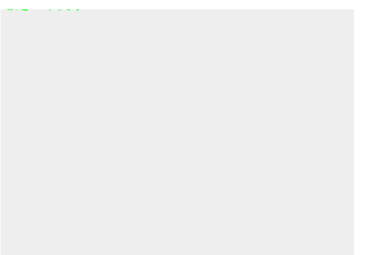

应用之后却发现画布上什么都没有——哦不对，仔细观察可以发现左上角有一撮阴影。这是因为`canvas`绘制文本时会依据坐标和基线来绘制的。也就是`textBaseline`和`textAlign`。除了这两个样式，文本专属的样式还有`font`，为了使用方便，将其拆分为`fontSize`和`fontFamily`。修改`bindStyle`和添加默认`style`。
```typescript
// XElement.ts
function bindStyle () {
  //...
  let font = `${style.fontSize}px ${style.fontFamily}`
  ctx.font = font;
  ['lineWidth', 'shadowBlur', 'shadowColor', 'shadowOffsetX', 'shadowOffsetY', 'textBaseline', 'textAlign'].forEach(prop => {
    if (style[prop] !== ctx[prop]) {
      ctx[prop] = style[prop]
    }
  })
}
class XElement {
  style: XElementStyle = {
    // ...
    fontSize: 12,
    fontFamily: 'serif',
    textAlign: 'left',
    textBaseline: 'top'
  }
}
```
再看看结果：
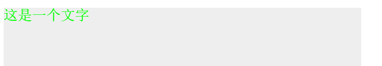

### 超出隐藏、换行和超出显示省略
标题所示的三个功能都是很常见的功能，然而`canvas`对文本排版的支持非常弱，是无法实现自动换行的。但是用手动来检测的话也很简单，计算文本宽度，找出要换行时的位置，对文本分批绘制即可。而省略与此相同。

超出隐藏则无法这么简单地实现。为了实现超出隐藏，我们需要引入新的概念——`clip`，裁剪。要想实现我们的目的，只需要在绘制之前，绘制一遍裁剪路径（文本超出隐藏需要的裁剪路径为矩形），然后调用`ctx.clip`（不熟悉`api`的请自行查阅）即可。而因为之前的苦工，我们可以将元素用于裁剪路径。

为`XElement`添加如下参数。
```typescript
class XElement {
  /**
   * 用于裁剪的元素，只能通过`setClip`设置
   */
  clip: XElement
  /**
   * 是否被用于裁剪，如果是的话，不会进行描边和填充
   */
  isClip: boolean
  /**
   * 绘制之前进行样式的处理
   */
  beforeRender (ctx: CanvasRenderingContext2D) {
    ctx.save()
    // 需要注意的是，裁剪路径有自己的`transform`体系，为了让裁剪路径和元素本身有相同的相对变换，需要在`setClip`中设置parent
    this.setCtxClip(ctx)
    this.handleParentBeforeRender(ctx)
    ctx.save()
    bindStyle(ctx, this.style)
    this.setTransform(ctx)
    ctx.beginPath()
  }
  /**
   * 绘制之后进行还原
   */
  afterRender (ctx: CanvasRenderingContext2D) {
    if (this.hasFill() && !this.isClip) {
      ctx.fill()
    }
    if (this.hasStroke() && !this.isClip) {
      ctx.stroke()
    }
    // ...
    // 在最后，重置裁剪
    ctx.restore()
  }
  setParent (parent: Group) {
    //...
    // 更新裁剪路径的父元素
    if (this.clip) {
      this.setClip(this.clip)
    }
  }
  /**
   * 设置裁剪路径
   */
  setClip (xel: XElement) {
    this.clip = xel
    // 为了能应用变换
    if (this.parent) {
      // 但又不被`getAll`所获取
      xel.ignored = true
      xel.setParent(this.parent)
      xel.options.relativeGroup = this.relativeGroup
      // 否则会不断循环
      xel._xr = null
    }
    this.dirty()
  }
  /**
   * 移除裁剪路径
   */
  removeClip () {
    this.clip.ignored = false
    this.clip = null
    this.dirty()
  }
  /**
   * 为上下文设定裁剪路径
   */
  setCtxClip (ctx: CanvasRenderingContext2D) {
    if (this.clip) {
      this.clip.isClip = true
      this.clip.refresh(ctx)
      this.clip.isClip = false
      ctx.clip()
    }
  }
  updateOptions (opt?: XElementOptions) {
    //...
    ['zLevel', 'relativeGroup', 'zIndex', 'renderByFrame'].forEach(key => {
      if (opt[key] !== undefined) {
        this[key] = opt[key]
        // 设置`clip`的相对定位元素
        if (key === 'relativeGroup') {
          this.clip && this.clip.attr({
            relativeGroup: opt[key]
          })
        }
      }
    })
  }
  /**
   * 是否包含某个点
   */
  contain (x: number, y: number) {
    // 首先要被裁剪路径包含
    if (this.clip) {
      if (!this.clip.contain(x, y)) {
        return
      }
    }
    //...
  }
}
```
应用
```typescript
group1.add(rect)
rect.setClip(curve)
xr.add(group1)
```
结果如图：

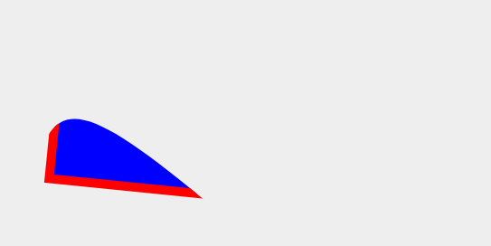

简单测试了一下其它方面也没有出问题。

现在我们回到`Text`。有了以上的裁剪基础，就可以实现最开始想要的功能了。

添加参数如下
```typescript
interface TextShape extends XElementShape {
  /**
   * 此`maxWidth`不同于`canvas`绘制时的`maxWidth`，用来控制换行和省略的
   */
  maxWidth?: number
  maxHeight?: number
  /**
   * 是否允许换行，默认不换行
   */
  wrap?: boolean
  /**
   * 超出部分如何显示
   */
  overflow?: 'hidden' | 'visible' | 'ellipsis'
}
```
为指定的宽高创建裁剪路径
```typescript
class Text {
  updateOptions(opt?) {
    super.updateOptions(opt)
    this.updateClipRect()
  }
  updateClipRect () {
    if (this.shape.overflow === 'visible') {
      return
    }
    let shape = this.shape
    let opt = {
      scale: clone(this.scale),
      rotation: this.rotation,
      position: clone(this.position),
      origin: clone(this.origin),
      shape: {
        x: shape.x,
        y: shape.y,
        width: shape.maxWidth ? shape.maxWidth : 100000000000000,
        // 应该是文本的高度，暂时忽略
        height: shape.maxHeight ? shape.maxHeight : 100000000000000
      }
    }
    let rect = this.clip
    if (!rect) {
      rect = new Rect(opt)
      this.setClip(rect)
    } else {
      rect.attr(opt)
    }
  }
}
```
效果如图：

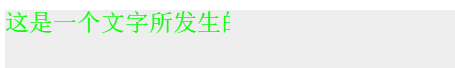

接下来就可以准备换行和省略号的事宜了，开始之前想一想，对于文本超出给定高度的情况如何处理？是超出隐藏，还是多行省略（可能会有很多不必要的空白），或者可以滚动(做肯定是可以做，但是多半走远了)？暂时选择前两者吧。
#### 超出显示省略号
`canvas`提供了`mesureText`方法来检测给定文本的宽度，而且结果非常精准。因此，对于超出显示省略号的功能，可以先计算出省略号的宽度，然后用给定的最大宽度减去省略号宽度去找出文本换行的分界线。

准备一些辅助方法，创建`util/text.ts`：
```typescript
// 按行绘制
export interface LineText {
  x: number
  y: number
  text: string
  width: number
}
function createLineText (x, y, text, width) {
  return {
    x,
    y,
    text,
    width
  }
}
const ellipsis = '...'
/**
 * 获取换行后的文本
 */
export function getWrapText(
  startX: number, startY: number, ctx: CanvasRenderingContext2D,
  text: string, shape: TextShape, style: XElementStyle
): LineText[] {
  // 没有指定宽度的话直接返回即可，没有指定宽度的话指定了高度也没用
  if (!shape.maxWidth) {
    return [createLineText(startX, startY, text)]
  }
  let result = []
  let len = text.length
  let maxWidth = shape.maxWidth
  // 省略号的长度
  let ellipsisLength = ctx.measureText(ellipsis).width
  // 首先，不换行
  if (!shape.wrap || (lineHeight * 2 > maxHeight)) {
    switch (shape.overflow) {
      // 可见和隐藏不需要做更多
      case 'visible':
      case 'hidden':
        result = [createLineText(startX, startY, text, 0)]
      // 省略号算出长度即可
      case 'ellipsis':
      let { index, width } = findTextIndex(ctx, text, maxWidth)
        // 如果当前宽度不能满足需要，则添加省略号
        if (index < len - 1) {
          let indexData = findTextIndex(ctx, text, maxWidth - ellipsisLength)
          text = indexData.text + ellipsis
          width = indexData.width + ellipsisLength
        }
        result = [createLineText(startX, startY, text, width)]
    }
  } else {
    // ...
  }
}

interface TextIndex {
  /**
   * 索引
   */
  index: number
  /**
   * 文本片段
   */
  text: string
  /**
   * 文本片段的宽度
   */
  width: number
}

/**
 * 根据最大宽度找到索引
 */
function findTextIndex (ctx: CanvasRenderingContext2D, text: string, maxWidth: number): TextIndex {
  if (!text) {
    return null
  }
  let measureText = text => ctx.measureText(text)
  let len = text.length
  let textWidth = measureText(text).width
  let result: TextIndex = {
    index: len - 1,
    text,
    // 返回宽度是因为后面要用到
    width: textWidth
  }
  // 宽度已经满足要求
  if (textWidth <= maxWidth) {
    return result
  }
  // 取中间的索引
  let halfLen = Math.floor(len / 2)
  let halfText = text.slice(0, halfLen ? halfLen : 1)
  result.text = halfText
  textWidth = measureText(halfText).width
  result.width = textWidth
  // 同上
  if (textWidth === maxWidth) {
    result.index = (halfLen ? halfLen : 1) - 1
    return result
  }
  // 如果文本一半的宽度小于最大宽度，向后取
  if (textWidth < maxWidth) {
    let nextIndex = findTextIndex(ctx, text.slice(halfLen), maxWidth - textWidth)
    if (nextIndex !== null) {
      halfLen += (nextIndex.index + 1)
      result.text += nextIndex.text
      result.width += nextIndex.width
    }
    result.index = halfLen - 1
    return result
  }
  // 分到第一个还无法满足需求
  if (halfLen === 0) {
    return null
  }
  // 如果一半仍然大于，向前取
  return findTextIndex(ctx, text.slice(0, halfLen - 1), maxWidth)
}
/**
 * 绘制文本
 */
export function renderText (ctx: CanvasRenderingContext2D, lineTexts: LineText[], method: string) {
  let lineText
  for (let i = 0; i < lineTexts.length; i += 1) {
    lineText = lineTexts[i]
    ctx[method](lineText.text, lineText.x, lineText.y)
  }
}
```
然后应用:
```typescript
class Text {
  render (ctx: CanvasRenderingContext2D) {
    // ...
    let lineTexts = getWrapText(x, y, ctx, shape.text, shape, this.style)
    if (this.hasFill()) {
      renderText(ctx, lineTexts, 'fillText')
    }
    if (this.hasStroke()) {
      renderText(ctx, lineTexts, 'strokeText')
    }
  }
}
```
结果如图（为了效果明显，加上了背景色）：

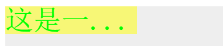
#### 换行
通过上面的方法，我们可以很容易找出需要换行的边界索引，但是想要分批绘制，还需要知道一个关键的信息，那就是行高。`canvas`里的行高是多少？上图的字体大小为`48px`，背景矩形的高度也为`48px`，看起来就和`line-height: 1`的效果相同，即行高等于字体大小。看起来似乎是这么回事。然而如果我们改变字体，`font-family: Arial`，那么结果如下：
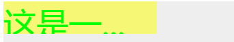

可以很明显地看出，它的行高要远远超出字体大小——当然，这可能是因为字体太大了，但是可以确定的是，它的行高和字体高度不同。

而`canvas`是没有提供检测行高的方法的，那么可不可以借助其它方式呢？比如借助`HTML`的`getComputedStyle`？这个想法很美好，然而一个残酷的点是，`HTML`中的行高并不会因为字体的改变而改变，这是因为行高的含义本来就不是文字所占有的高度，而我们要绘制多行文本，需要的恰好就是文字所占高度。

而这是可以计算出来的。如何计算？首先看两张图片：
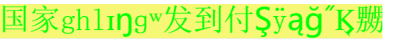

第一张图字体为`serif`，第二张图字体为`Arial`，可以看出最接近底部的字符不是`g(英文字母g, \u0067)`就是`ŋ(\u014B)`，虽然没有测试其它字体，但是想来都差不多。同样的道理，可以使用字符`家`来测量字体的最高点。也就是说，如果能计算出`g`和`ŋ`最底部所在的位置(`bottom`)，取其大者，再加个`1`到`2px`，和`家`最顶部的位置(`top`），那么当前字体设置下在`y`轴上最多占用多少个像素也就能够知道了。

上面的字都是以`textBaseline = top`为基准绘制的，同样的如果以`bottom`为基准来绘制，则可以获取最底部到空白分界线的位置(`bottomOffset`)。

那么怎么得出这些数据呢？我能想到的办法是，使用像素点来判断。首先用`clearRect`在画布左上角清空出一区域，在`(0, 0)`处绘制`g`，调用`getImageData`获取这片区域的像素点，假设当前的`fontSize`为`48`，查询第`48`行是否有像素点，如果没有，向前查找，直到找到有像素点的行为止。如果有，向后查找，找到没有像素点的行为止。`家`从`0`开始，同理。对于`bottomOffset`也是差不多的做法。

实际上，经过测试几种字体和文字，得出结果是，只要指定了字体和字体大小，大部分常用的文字（汉字、英文、标点）的`bottom + bottomOffset`的值都相同，且这个值基本等同于我们要找的`lineHeight`。而其它稀奇古怪的符号则会超出这个值，比如`႟ (\u109f)`和`ŋ`（对于`top`值同样如此，不过偏差并不多）。那么该如何抉择呢？计算每一个字的高度是否可行呢？答案是不行，即使是文字不多的情况，也会占用大量的时间。所以，为了大多数情况下的美观，我决定不考虑其它字符的情况。

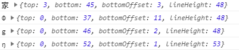


既然`bottom + bottomOffset`就可以确定行高，那么要`top`值做什么呢？如果以`top`为基准来绘制文本，那么顶部一般会留一定的空白，有时候又不想要这些空白，想让文本（指本行中最高的字，下同）紧贴顶部，在绘制文本时就需要减去`top`的值来决定纵坐标。虽然可能也会想让文本紧贴底部，但是一般来说当以`bottom`为基准绘制时，文本本身已经比较紧贴了，只有很短的距离。
- 需要留有空白。
  
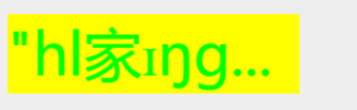
- 不需要留有空白。

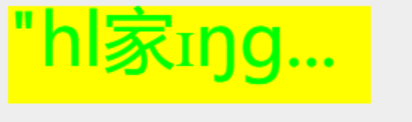

**但是**，本文并不打算给出可配置的选项，为了简单，采用不留空白的方式来绘制，空白可以通过添加行间距的配置来形成，不过这里就不做这一项了。

说了这么多，究竟该如何计算呢？

具体方法如下：
```typescript
// util/text.ts
let ctxForLineHeight: CanvasRenderingContext2D
let canvasForLineHeight: HTMLCanvasElement
function createCtx () {
  canvasForLineHeight = document.createElement('canvas')
  // 一般来说测量行高应该够用了
  canvasForLineHeight.width = 1000
  canvasForLineHeight.height = 1000
  // 是的，即使display为none，也能取到数据
  canvasForLineHeight.style.display = 'none'
  document.body.appendChild(canvasForLineHeight)
  ctxForLineHeight = canvasForLineHeight.getContext('2d')
}
/**
 * 用字体和比值计算
 */
const FontsData = {
  example: {
    fontSize: 12,
    lineHeight: 14,
    top: 0
  }
}
const chars = {
  // g
  g: '\u0067',
  // ŋ
  n: '\u014B',
  // 家
  q: '\u5bb6'
}
/**
 * 将imageData转为二维数组
 */
function sliceImageData (data: Uint8ClampedArray, width: number, height: number) {
  let result = []
  let len = 0
  for (let i = 0; i < height; i += 1) {
    let row = result[i] = []
    for (let j = 0; j < width; j += 1) {
      row.push([
        data[len++],
        data[len++],
        data[len++],
        data[len++]
      ])
    }
  }

  return result
}
/**
 * 查询某一行是否有像素 
 */
function hasPx (data: any[], row: number) {
  return data[row].filter(item => item[3]).length !== 0
}
/**
 * 获取单个字符的高度 
 */
function getCharRange (char: string, width: number) {
  // 可能会超出范围
  let clearWidth = 1.5 * width
  ctxForLineHeight.clearRect(0, 0, clearWidth, clearWidth)
  // 在顶部画字
  ctxForLineHeight.textBaseline = 'top'
  // 画一个字
  ctxForLineHeight.fillText(char, 0, 0)
  // 获取它该有的像素
  let imgData = sliceImageData(
    ctxForLineHeight.getImageData(0, 0, clearWidth, clearWidth).data,
    clearWidth,
    clearWidth
  )
  let top = 0
  let bottom = width - 1
  let rowHasPx = hasPx(imgData, bottom)
  if (rowHasPx) {
    // 向后取直到没有像素为止
    while ((bottom < clearWidth) && hasPx(imgData, bottom)) {
      bottom += 1
    }
  } else {
    // 向前取
    while ((bottom >= 0) && !hasPx(imgData, bottom)) {
      bottom -= 1
    }
  }
  while ((top < clearWidth) && !hasPx(imgData, top)) {
    top += 1
  }
  // 在底部画字
  ctxForLineHeight.clearRect(0, 0, clearWidth, clearWidth)
  ctxForLineHeight.textBaseline = 'bottom'
  ctxForLineHeight.fillText(char, 0, clearWidth)
  imgData = sliceImageData(
    ctxForLineHeight.getImageData(0, 0, clearWidth, clearWidth).data,
    clearWidth,
    clearWidth
  )
  let bottomOffset = clearWidth - 1
  while ((bottomOffset >= 0) && !hasPx(imgData, bottomOffset)) {
    bottomOffset -= 1
  }
  bottomOffset = clearWidth - bottomOffset
  return {
    top,
    bottom,
    bottomOffset,
    lineHeight: bottom + bottomOffset
  }
}
/**
 * 根据当前样式获取文本行高和偏移
 */
export function getFontData (style: XElementStyle) {
  if (!ctxForLineHeight) {
    createCtx()
  }
  let fontFamily = style.fontFamily
  let fontData = FontsData[fontFamily]
  if (fontData) {
    return {
      lineHeight: fontData.lineHeight / fontData.fontSize * style.fontSize,
      top: fontData.top / fontData.fontSize * style.fontSize
    }
  }
  let font = `${style.fontSize}px ${fontFamily}`

  ctxForLineHeight.save()
  ctxForLineHeight.font = font
  ctxForLineHeight.setTransform(1, 0, 0, 1, 0, 0)
  // 重置样式
  ctxForLineHeight.textBaseline = 'top'
  ctxForLineHeight.fillStyle = '#000'
  // 这是国字的高度
  let width = ctxForLineHeight.measureText('国').width
  let lineHeight = getCharRange(chars.g, width).lineHeight
  let top = getCharRange(chars.q, width).top
  lineHeight -= top
  // 再加1px以免超出
  lineHeight += 1
  ctxForLineHeight.restore()
  FontsData[fontFamily] = {
    fontSize: style.fontSize,
    lineHeight,
    top
  }

  return FontsData[fontFamily]
}
```
得出了行高，就可以开始写换行的代码了。事实上得出行高的数据之后，不仅可以使用`maxHeight`来限制，也可以使用行数来限制，二者其实是等同的。~~同样的，为`Text`设置的裁剪框也能更加精确了——为什么？因为`maxHeight`本身的含义就是最大高度，而不是指定它的高度，有了行高之后，如果设置了最大高度，我们可以得到更准确的高度数据。所以将这一步放到设置`clip`之前进行。~~
```typescript
class Text {
  fontData = {
    top: 0,
    lineHeight: 12
  }
  // 在设置裁剪路径前获取
  updateOptions(opt?: TextOptions) {
    super.updateOptions(opt)
    opt = opt || this.options
    const fontData = this.fontData = getFontData(this.style)
    const shape = opt.shape
    // 有时候就是想
    // 二者只能取一个
    if (shape.rows) {
      this.shape.maxHeight = this.shape.rows * fontData.lineHeight
    }
    this.updateClipRect()
  }
  // render时将数据传入即可
  // 需要注意的是y = y - this.fontData.top
}
```
然后是开启换行时如何获取数据：
```typescript
// util/text.ts
export function getWrapText(
  startX: number, startY: number, ctx: CanvasRenderingContext2D,
  text: string, shape: TextShape, style: XElementStyle, lineHeight: number
): LineText[] {
  // 没有指定宽度的话直接返回即可，没有指定宽度的话指定了高度也没用
  if (!shape.maxWidth) {
    return [createLineText(startX, startY, text), ctx.measureText(text).width]
  }
  let result = []
  let len = text.length
  let maxWidth = shape.maxWidth
  let maxHeight = shape.maxHeight
  // 省略号的长度
  let ellipsisLength = ctx.measureText(ellipsis).width
  // 首先，不换行
  if (!shape.wrap || (lineHeight * 2 > maxHeight)) {
    //...
  } else {
    let startIndex = 0
    let indexData = findTextIndex(ctx, text, maxWidth)
    let index = indexData.index
    result.push(createLineText(startX, startY, indexData.text, indexData.width))
    while (index < len) {
      startIndex = index + 1
      indexData = findTextIndex(ctx, text.slice(startIndex), maxWidth)
      if (!indexData) {
        break
      }
      index += (indexData.index + 1)
      startY += lineHeight
      let subText = text.slice(startIndex, index)
      // 最后一段超出高度，在后面加省略号，即多行超出省略
      if (startY + lineHeight * 2 > maxHeight && (shape.overflow === 'ellipsis')) {
        indexData = findTextIndex(ctx, subText, maxWidth)
        if (!indexData) {
          break
        }
        // 如果当前宽度不能满足需要，则添加省略号
        if (indexData.index < subText.length - 1 || (index < len - 1)) {
          indexData = findTextIndex(ctx, subText, maxWidth - ellipsisLength)
          indexData.text += ellipsis
          indexData.width += ellipsisLength
        }
        result.push(createLineText(startX, startY, indexData.text, indexData.width))
        break
      }
      result.push(createLineText(startX, startY, indexData.text, indexData.width))
    }
    }
    ctx.restore()

    return result
  }
}
```
设置`rows`为2，结果如图：

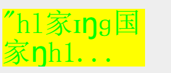 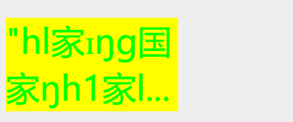

设置`maxHeight`为`2.9 * lineHeight`：

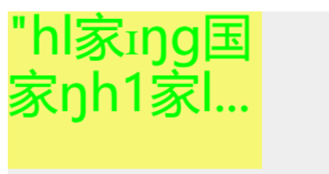

应该可以说是比较精准了。
### 修复动画的一个bug
使用动画的时候发现了一个`bug`，它会因为`XElment.shape`而影响到`XElement.options`，导致需要判断`options`时会出错。现修复如下：
```typescript
// util/index.ts
/**
 * 从原始属性中提取要使用动画的属性，返回一个新对象，否则可能对原来的opt造成污染
 */
export function getAnimationTarget (origin: Object, target: Object) {
  const animationTarget = {}
  for (let key in target) {
    if (isObject(target[key]) && isObject(origin[key])) {
      animationTarget[key] = getAnimationTarget(origin[key], target[key])
    } else {
      animationTarget[key] = origin[key]
    }
  }

  return animationTarget
}
class XElement {
  animateTo () {
    // ...
    this.animation = new Animation(getAnimationTarget(this, target))
    // ...
  }
}
```
### 内边距和填充
上图有一个问题，就是文本和边缘太过紧密（这是为了精确计算所不能少的），一般来说会需要它留有一定的间距。再考虑现在想实现一个非常简单的带文本的矩形按钮，应该怎么做？可以用`Group`组合`Rect`和`Text`，但其实容易想到的是，文本本身也是可以有边距和背景的——为它创建一个包围盒，就像`html`中的`p`标签等。也许这样会简单一些。这样的话`Text`也能响应事件了。为此需要计算文本的高度，并重新计算裁剪路径的数据——正好之前裁剪路径就设计得不够完整。如果一切顺利，那么结果应该如下图：

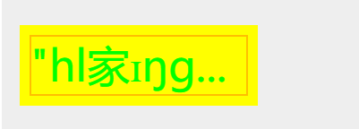

首先为文本创建一个包围盒`boungdingRect`，并在`shape`加入`padding`选项——为什么放在`shpae`而不是`style`中？因为，我也不知道。解析选项和绘制很简单，需要注意的是绘制的时机必须在绘制裁剪路径前绘制包围盒。代码如下：
```typescript
// util/text.ts
/**
 * 解析padding为标准格式
 */
export function parsePadding (padding: number[] | number) {
  let result = []
  if (Array.isArray(padding)) {
    switch (padding.length) {
      case 1:
        padding = padding[0]
        break
      case 2:
      case 3:
        result[0] = padding[0]
        result[1] = padding[1]
        result[2] = padding[0]
        result[3] = padding[1]
        break
      default:
        result = padding.slice(0, 4)
        break
    }
  }
  if (!result.length) {
    result = [padding, padding, padding, padding]
  }

  return result
}
// Text.ts
interface TextShape extends XElementShape {
  /**
   * 边距
   */
  padding?: number[] | number
}
interface TextOptions extends XElementOptions {
  shape?: TextShape
  /**
   * 为包围盒应用的样式
   */
  rectStyle?: XElementStyle
}
class Text {
  boundingRect: Rect
  lineTexts: LineText[] = []
  rectStyle: XElementStyle = {
    fill: 'none',
    stroke: 'none',
    lineWidth: 1,
    opacity: 1,
    cursor: 'pointer',
    fontSize: 12,
    fontFamily: 'serif',
    textAlign: 'left',
    textBaseline: 'top'
  }
  updateOptions(opt?: TextOptions) {
    super.updateOptions(opt)
    opt = opt || this.options
    if (opt.rectStyle) {
      merge(this.rectStyle, opt.rectStyle)
    }
    // ...
  }
  updateClipRect (x: number, y: number, width: number, height: number) {
    let opt = {
      scale: clone(this.scale),
      rotation: this.rotation,
      position: clone(this.position),
      origin: clone(this.origin),
      shape: {
        x,
        y,
        width,
        height
      }
    }
    let rect = this.clip
    if (!rect) {
      rect = new Rect(opt)
      this.setClip(rect)
    } else {
      rect.attr(opt)
    }
  }
  updateBoundingRect (x: number, y: number, textWidth: number, textHeight: number, padding: number[]) {
    let opt = {
      scale: clone(this.scale),
      rotation: this.rotation,
      position: clone(this.position),
      origin: clone(this.origin),
      shape: {
        x,
        y,
        width: textWidth + padding[1] + padding[3],
        height: textHeight + padding[0] + padding[2]
      },
      style: this.rectStyle,
      relativeGroup: this.relativeGroup
    }
    let rect = this.boundingRect
    if (!rect) {
      rect = new Rect(opt)
    } else {
      rect.attr(opt)
    }
    // 它和Text用相同的变换
    if (this.parent) {
      // 仅仅用于绘制时判断，所以不需要调用setParent
      rect.parent = this.parent
    }

    this.boundingRect = rect
  }
  beforeRender (ctx: CanvasRenderingContext2D) {
    super.beforeRender(ctx)
  }
  render (ctx: CanvasRenderingContext2D) {
    if (this.hasFill()) {
      renderText(ctx, this.lineTexts, 'fillText')
    }
    if (this.hasStroke()) {
      renderText(ctx, this.lineTexts, 'strokeText')
    }
  }
  beforeSetCtxClip (ctx: CanvasRenderingContext2D) {
    // 虽然放在这里不是很合适，但是目前只能想到这么做来避免被裁剪掉
    let shape = this.shape
    let x = shape.x
    let y = shape.y
    let padding = parsePadding(this.shape.padding)
    x += padding[3]
    y += padding[0]
    let lineHeight = this.fontData.lineHeight
    let lineTexts = getWrapText(
      // 这里就减去top
      x, y - this.fontData.top, ctx, shape.text,
      shape, this.style, lineHeight, padding
    )

    this.lineTexts = lineTexts
    this.updateClipRect(x, y, shape.maxWidth, lineTexts.length * lineHeight)
    x -= padding[3]
    y -= padding[0]
    this.updateBoundingRect(x, y, shape.maxWidth, lineTexts.length * lineHeight, padding)
    this.boundingRect.refresh(ctx)
    this.clip.refresh(ctx)
  }
  setCtxClip (ctx: CanvasRenderingContext2D) {
    this.beforeSetCtxClip(ctx)
    super.setCtxClip(ctx)
  }
  contain (x: number, y: number) {
    // 变换和描边等
    return this.boundingRect.contain(x, y)
  }
  getBoundingRect () {
    return this.boundingRect.getBoundingRect()
  }
}

// uilt/text.ts
function getWrapText () {
  // ...
  let maxWidth = shape.maxWidth - padding[1] - padding[3]
  let maxHeight = (shape.maxHeight || 100000000) - padding[0] - padding[2] + startY
}
```
现在代码可以跑起来了，但是还有两个问题。

第一个问题，现在裁剪路径的定位是`(x, y)`，在`textBaseLine = top, textAlign = left`时表现正常，然而更改这些定位方式后，包围盒就会变得很奇怪。解决办法也很简单，根据上面两个属性的值结合`lineHeight`来进行调整即可。为了方便计算，需要限定这两个属性的值。
```typescript
// XElement.ts
function bindStyle () {
  // ...
  let textBaseline = style.textBaseline
  if (['top', 'middle', 'bottom'].indexOf(textBaseline) === -1) {
    // 默认为顶部
    textBaseline = 'top'
    // 要更新style里的值
    style.textBaseline = textBaseline
  }
  ctx.textBaseline = 'top'
  let textAlign = style.textAlign
  if (['left', 'center', 'right'].indexOf(textAlign) === -1) {
    // 默认为左侧
    textAlign = 'left'
    style.textAlign = style.textAlign
  }
  ctx.textAlign = 'left'
}

```
然后根据之前的`getWrapText`中返回文本的长度，最后就可以根据这些来调整了。

与此同时，对于宽高限制，新增`width`和`height`属性，和`max*`的区别是：
- 认为在使用`maxHeight`和`maxWidth`时，`Text`的包围盒和裁剪路径将自动形成，只不过不会超过给定的限制，且它们已经包含了内边距。
- `width`和`height`同样具有限制的效果，但是它们会指定包围盒和裁剪路径的大小。

代码如下：
```typescript
class Text {
  beforeSetCtxClip (ctx: CanvasRenderingContext2D) {
    // 虽然放在这里不是很合适，但是目前只能想到这么做来避免被裁剪掉
    let shape = this.shape
    let x = shape.x
    let y = shape.y
    let clipX = x
    let clipY = y
    let padding = parsePadding(this.shape.padding)
    let lineHeight = this.fontData.lineHeight
    clipY += padding[0]
    clipX += padding[3]
    let lineTexts = getWrapText(
      // 这里就减去top
      clipX, clipY - this.fontData.top, ctx, shape.text,
      shape, this.style, lineHeight, padding
    )
    let textWidth = Math.max(...lineTexts.map(lineText => lineText.width))
    let textHeight = lineTexts.length * lineHeight

    let clipWidth = textWidth
    let clipHeight = textHeight
    let boundingRectWidth = textWidth + padding[1] + padding[3]
    let boundingRectHeight = textHeight + padding[0] + padding[2]
    if (shape.height) {
      clipHeight = shape.height - padding[0] - padding[2]
      boundingRectHeight = shape.height
    }
    if (shape.width) {
      clipWidth = shape.width - padding[1] - padding[3]
      boundingRectWidth = shape.width
    }

    let offsetX = 0
    let offsetY = 0
    switch (this.style.textAlign) {
      case 'right':
        offsetX = -boundingRectWidth
        break
      case 'center':
        offsetX = -boundingRectWidth / 2
        break
      case 'left':
      default:
        break
    }
    switch (this.style.textBaseline) {
      case 'bottom':
        offsetY = -boundingRectHeight
        break
      case 'middle':
        offsetY = -boundingRectHeight / 2
        break
      case 'top':
      default:
        break
    }

    clipX += offsetX
    clipY += offsetY
    x += offsetX
    y += offsetY
    this.lineTexts = lineTexts.map(lineText => {
      lineText.y += offsetY
      lineText.x += offsetX

      return lineText
    })
    this.updateClipRect(clipX, clipY, clipWidth, clipHeight)
    this.updateBoundingRect(x, y, boundingRectWidth, boundingRectHeight)
    this.boundingRect.refresh(ctx)
  }
}
```
效果如图：

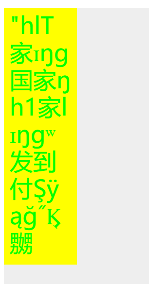 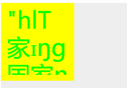 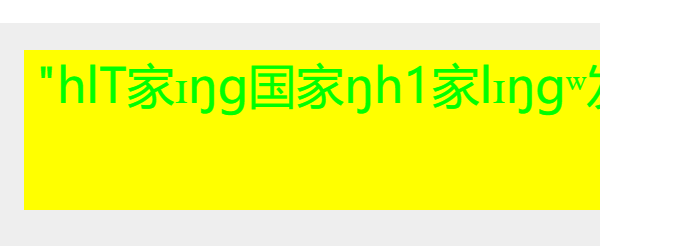 

虽然还有很多功能可以添加，不过这样的文本应该能满足一般的需求了，其它功能在此基础上简单添加即可，比如行间距，字间距。至此，`Text`，就已经创建完毕。

### 清理内存
在之前的内容中我们一直都是在添加元素后就没有增删过，而如果要增删，就要管理好内存，否则可能会造成内存泄漏导致应用崩溃。就和前面提到的一样，为类添加`dispose`方法即可。代码内已经添加完毕，这里就不贴出来占地方了。
## bug修复
最开始设计的渲染逻辑和加入`Layer`后的有较大变化，而在添加`Layer`的版本中只关注了**改**时是否能正常变动，忽略了增删，因此存在一些`bug`，现修复如下。
### delete
之前的设计中，更新的时候`Layer`要该层有元素标记为`drity`才会更新，而如果将一个元素删除，`Layer`根本获取不到这个元素，也就无法更新了。当然，可以删除元素时调用`dirty`方法，重新绘制之后再将元素从`Stage`移除，但是`dirty`过后我们并不知道需要多久才能完成重绘，所以这个方法行不通。

另一个思路是为`Layer`保留结束索引，如果有有删除的元素，那么遍历元素时得到的结束索引和原先的结束索引应该不一致，不过能够改变这个值的因素太多，所以也不太行。

那么我能想到的方法是，调用`Storage.delete`时并不删除元素，而将此元素标记为待删除，更新时进行判断即可。
```typescript
class XElement {
  /**
   * 自身所关联的stage
   */
  __stage: Stage
  /**
   * 是否正在被删除，`Layer`遇到此标记等同于`drity`，然后调用删除自身的方法
   * 而`Stage`删除元素时此标记为真会将此元素删除，否则标记为真，然后调用`dirty()`
   */
  deleteing = false
  removeSelf () {
    this.__stage.delete(this)
  }
}
class Stage {
  add (...xelements: XElement[]) {
    for (let i = 0; i < xelements.length; i += 1) {
      xelements[i].__stage = this
      this.xelements.push(xelements[i])
    }
  }
  delete (xel: XElement) {
    let index = this.xelements.indexOf(xel)
    if (index > -1) {
      if (xel.deleteing) {
        this.xelements.splice(index, 1)
      } else {
        xel.deleteing = true
        xel.dirty()
      }
    }
  }
}
class Painter {
  updateLayerList (xelList: XElement[]) {
    // ...
    for (let i = 0; i < xelList.length; i += 1) {
      let xel = xelList[i]
      let layer = layerList[xel.zIndex] || this.createLayer(xel.zIndex)
      if (xel.deleteing) {
        layer._dirty = true
        xel.removeSelf()
        xelList.splice(i, 1)
        i -= 1
        continue
      }
      // ...
    }
  }
}
```
### hide
同上一个问题，在设置`ignored`后无法获取到相关元素，也就无从判断是否需要重绘。所以更改这一部分为`Stage.getAll`能获取到所有元素，而在`XElement.refresh`中如果其`ignored`为`true`，则什么也不做。调用`hide`时设置`dirty`。

相应的，在事件检测阶段应该略过`ignored`为真的元素。
### Layer.dispose
在绘制阶段即使当前层没有元素关联了，也无需调用`Layer.dispose`。

## 小结

从`V1`至今，`XRender`，已经有了7个版本，虽然还有种种不完善的地方比如比如渐变，比如图案填充，比如高倍屏下的模糊处理，比如`XElement`类的代码太多，可以做适当拆分，再比如`zrender`更重磅的功能——`svg`渲染，都没有做。但是可以说一个`canvas`库该有的功能和结构，它都已经具备了，只是需要完善一些细节以便更好地使用。

一路走来对内容修修补补，有些地方遵循`xrender`的良好设计，有些地方因为懒或者水平所限，留下了不少的瑕疵。不管怎么说，收获了很多。而关于`XRender`，关于`canvas`，到此就已经结束了。而从零打造`Echarts`这一工程却才完成了一小部。接下来，让我们一起进入`Echarts`的全新篇章吧。

## V8预览
待续。