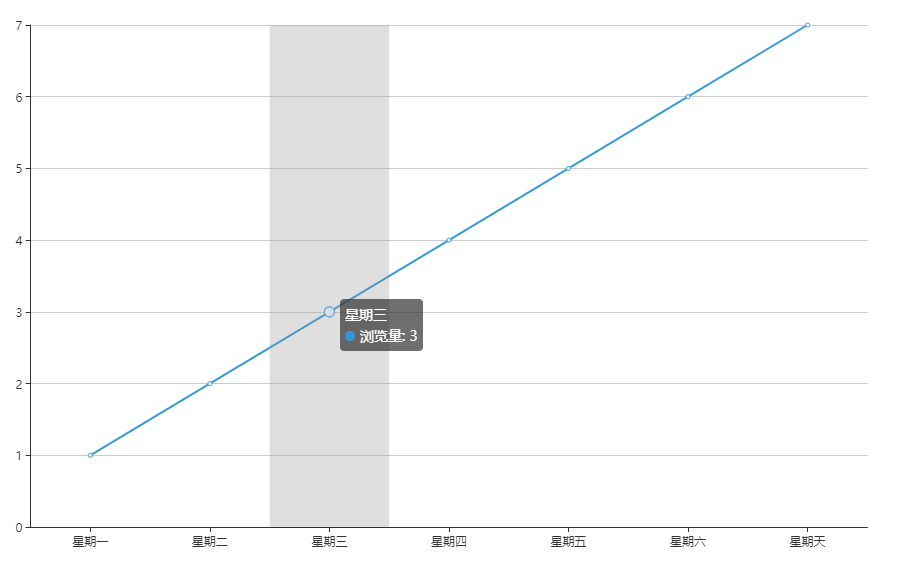

# 从零打造Echarts V8 可视化和MVC
> 本篇开始的内容需要你对`Echarts`的用法有基本的了解

如标题所示，我们要从零打造`Echarts`，然而`Echarts`是什么？官网上说：
> 一个使用 JavaScript 实现的开源可视化库。
什么是数据可视化？以下为个人理解：

数据可视化是将数据变为图表来展示，能够让使用者一目了然或者可以尽情探寻数据所要表达的含义。换句话说，数据可视化并不只是将数据绘制成图表那么简单，更重要的是，要能清晰地表达数据背后的规律和预兆。为什么这么说？让我们看一下图表的组成。
## 图表组成
### 坐标轴

如图框选出来的部分就是坐标轴，一般分为`x`轴和`y`轴，还分为类目轴、数值轴等，各有用处。但其实除了轴线，它其实还包括刻度线、刻度标签、轴标题，甚至还包括了坐标系。当然也有很多图表没有坐标轴，比如饼图。但是需要坐标轴的话就需要考虑以下几个问题：
- 使用什么坐标系？
- 使用多少坐标轴？
- 如何编排坐标轴的位置和方向，以及刻度标签？
- 刻度起始和刻度终点如何决定，其数量和间距采用多少合适？
### 数据

如图框选出来的部分是一个图标真正想要展示的数据，而如何去展示这些数据，同样需要多种考量。

- 使用什么图表类型？折线图、柱状图、饼图、还是散点图等等，大类型下还可以细分，都有其适用场景，且有各自的优势和劣势。根据表达的意图选择正确的图表类型，是无比重要的。
- 图形的颜色，特别是多个系列数据同时存在时，需要用不同的颜色去区分，至于如何选择颜色，应该说并不属于一个程序员考虑的范畴。

### 辅助信息
辅助信息包括图例、标题、其它文字说明或注释，而对于可操作的可视化图表来说，一般还包括悬浮提示的文本。

> 等等。。。

**总之**，可视化除了技术之外，还需要考虑很多东西。而这些，反正我是不太懂的，因此对于这些内容，将参考或者直接采用`Echarts`的[规范](https://vis.baidu.com/chartcolor/basis/)。

介绍了图表组成之后，下面可以开始梳理我们要做些什么工作了。
## 思路
### 视图
首先考虑想要达到什么效果，即在视图上我们要绘制些什么。
#### 通用类
即`Echarts`中的`Component`，主要包括：
- `axis` 坐标轴。
- `legend` 图例。
- `tooltip`  提示框。
#### 数据展示（暂定要做的）
即`Echarts`中的`Chart`：
- `bar` 柱状图。
- `line` 折线图。
- `pipe` 饼图。
- 更多...
#### 动画
- 新增时动画
- 移除时动画
- 更新时动画

可以说，有了`xrender`，要实现上述效果，并不难。关键点在于，如何将不同的数据映射为恰当的视图。
### 数据来源和映射
如何映射？考虑绘制一个折线图的例子。假定现在我们有本系列文章一周七天内浏览量的数据如下：
```typescript
const data = [1, 2，3, 4, 5, 6, 7]
```
想达到的效果为：



忽略掉坐标网格和图例，那么要考虑的问题有：
1. 图表区域的宽高，或者说占整个画布的比例是多少？
2. `x`轴是简单的类目轴，刻度线和刻度标签只需依次排列，而刻度间距按数量平分即可，然而如果放不下所有刻度，仍然需要取舍。
3. 而`y`轴是数值轴，如何根据数值来划分刻度？
4. ...先这样。
### 事件管理
事件管理。

---
## 框架
基于上述分析，可以暂定`XCharts`的框架如下：
- `M`层，管理数据、数据转换，比如上文提到的数据可以转换为如下的格式：
```typescript
// 数据图表
const data = [
  [20, 1],
  [60, 2],
  [100, 3]
  // ...
]
```
需要注意的是，由于图表的复杂性，每一个图表或者组件都可能需要不同的`Model`来管理数据。
- `V`层，绘制`M`层中的数据，包括但不限于图表、提示框等，比如：
```typescript
let line
let currentPoint
let nextPoint
for (let i = 0; i < data - 1; i += 1) {
  currentPoint = data[i]
  nextPoint = data[i + 1]
  line = new xrender.Line({
    shape: {
      x0: currentPoint[0],
      y0: currentPoint[1],
      x1: nextPoint[0],
      y1: nextPoint[1]
    }
  })
}
// ....
```
- `C`层，对事件作出响应，如悬浮高亮，提示框的移动和变化等。
## 流程
大概的流程也就清晰可见了：

1. 初始化(`init`)：
   1. 初始化渲染器（这里使用`z(x)render`）。
   2. 初始化一些全局事件。
2. 设置或更新(`setOption`)：
   1. 合并和规范选项。
   2. 为各选项创建对应的视图和模型。
   3. 事件监听。
   4. 渲染视图。
3. 渲染过程(`render`)：
   1. 从模型获取数据。
   2. 根据数据变化，修改、增加、删除，做出对应处理，如创建元素、更新元素、移除元素。
4. 事件触发(`dispatch`)后做出响应，如显示提示信息，或者重复2-3。
## 文件目录
基于此，可以得出基础的文件目录如下
```sh
│  index.ts # 入口文件，会暴露init方法以供使用
│  XCharts.ts # XCharts类
│
├─charts # 图表视图
│  │  index.ts # 用于导出所有图表视图类，被引用才会被打包
│  │
│  └─line # 折线图
│          LineView.ts # 折线图视图类，继承自图表的基础视图类
│
├─components # 组件视图
│  └─axis # 坐标轴
│          AxisView.ts # 坐标轴视图类，继承自组件的基础视图类
│
├─model # 模型
│      Model.ts # 模型基类
│
└─views # 视图
        BaseView.ts # 最基础的视图类
        ChartView.ts # 图表的基础视图类
        ComponentView.ts # 组件的基础视图类
```
接下来，让我们一点点填充这些内容。
## 内容填充