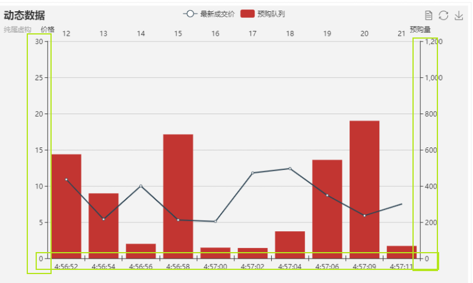
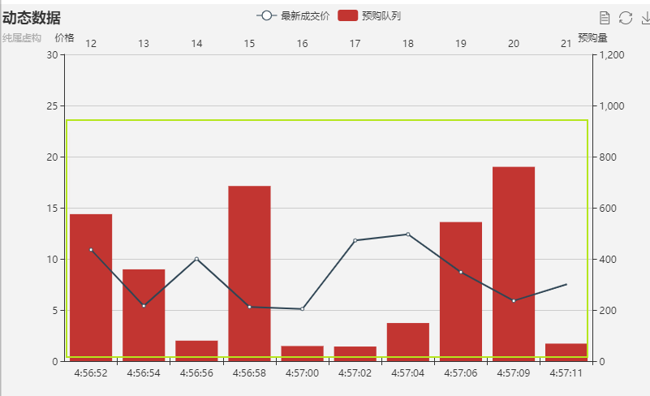

# 从零打造Echarts V8 图表和可视化入门
本篇可能非常无趣，不感兴趣也不能跳过哦。

什么是数据可视化？以下为个人理解：

数据可视化是将数据变为图表来展示，能够让使用者一目了然或者可以尽情探寻数据所要表达的含义。换句话说，数据可视化并不只是将数据绘制成图表那么简单，更重要的是，要能清晰地表达数据背后的规律和预兆。为什么这么说？让我们看一下图表的组成。
### 坐标轴

如图框选出来的部分就是坐标轴，一般分为`x`轴和`y`轴，各有用处。但其实除了轴线，它其实还包括刻度线、刻度标签、轴标题，甚至还包括了坐标系。当然也有很多图表没有坐标轴，比如饼图。但是需要坐标轴的话就需要考虑以下几个问题：
- 使用什么坐标系？
- 使用多少坐标轴？
- 如何编排坐标轴的位置和方向，以及刻度标签？
- 刻度起始和刻度终点如何决定，其数量和间距采用多少合适？
### 数据

如图框选出来的部分是一个图标真正想要展示的数据，而如何去展示这些数据，同样需要多种考量。

- 使用什么图表类型？折线图、柱状图、饼图、还是散点图等等，大类型下还可以细分，都有其适用场景，且有各自的优势和劣势。根据表达的意图选择正确的图表类型，是无比重要的。
- 图形的颜色，特别是多个系列数据同时存在时，需要用不同的颜色去区分，至于如何选择颜色，应该说并不属于一个程序员考虑的范畴。

### 辅助信息
辅助信息包括图例、标题、其它文字说明或注释，而对于可操作的可视化图表来说，一般还包括悬浮提示的文本。