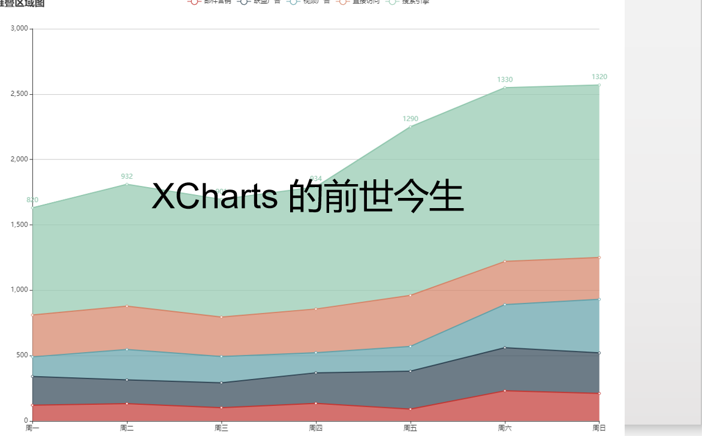
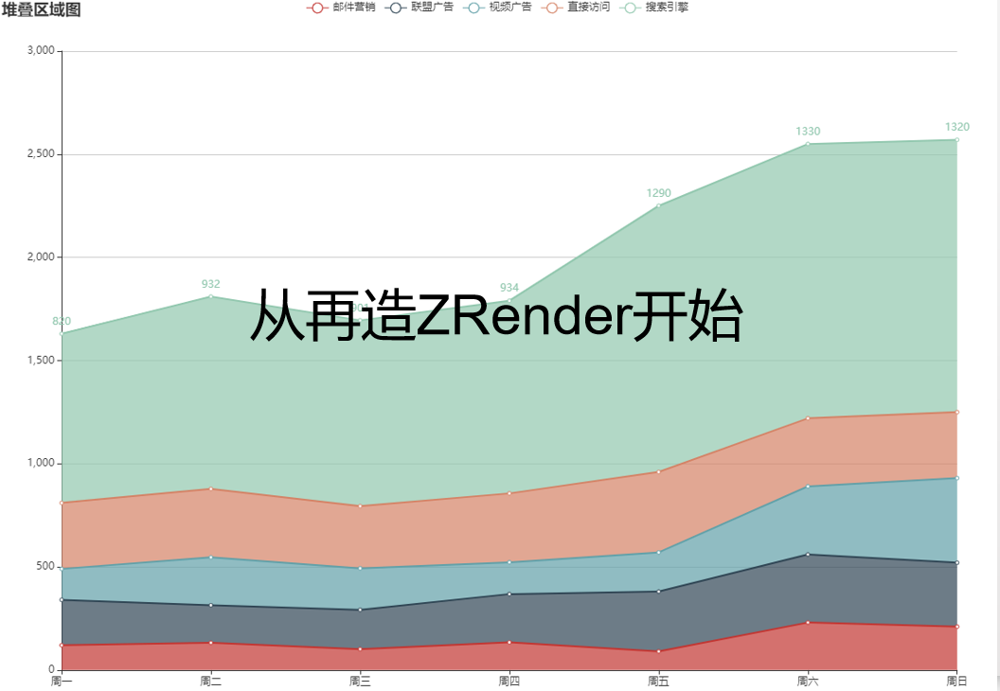

> **旁白**：上一集我们说到，自`canvas`推出以来几经更迭，功能逐渐完善，加上`flash`的没落和现代浏览器的普及，越来越多的游戏和可视化应用选择使用`canvas`来开发。因此诞生了很多相关的框架，各门各类不知凡几，优秀作品更是不在少数。那么在这种环境下，于小跃的``xcharts``系列作品，功能趋同且残缺，代码混乱，设计糟糕，连造轮子都算不上(离它模仿的`echarts`相差不可以道理计)，又凭什么从一众优秀作品中脱颖而出，成为后世楷模，人们争相拜读之作呢？``xcharts``究竟是什么，有什么作用？它有什么闪光点？它的作者于小跃又是怎样的人？而于小跃又为什么要写``xcharts``呢？欢迎易小天教授(划掉)做客本期一家讲坛，为大家带来从零打造`Echarts`系列讲座之``xcharts``的前世今生。

大家好，我是易小天。

接上回啊，``xcharts``这样糟糕的的半成品凭什么脱颖而出呢？这需要从当时的环境说起，什么环境啊，`canvas`框架的发展环境。彼时`canvas`已经推出多年了，无论游戏引擎还是可视化图表都有相当成熟且优秀的框架
了，而且还不只一两个。它们的使用者也是相当得多，可以说当时几乎所有的前端开发者都有耳闻。

但是我们说，任何一个合格，或者说想要提升自己的开发者，不能只会使用框架对不对？必然要对框架原理甚至源码做深入了解，才能有所成长。而于小跃就是这样一个想提升自己的人，他觉得虽然看了`canvas`的`api`，但是怎么能做到`echarts`这样酷炫，完全没有头绪，只能徒生艳羡。所以就想了解它的原理和设计。

怎么去了解原理啊？实力强的看源码目录就了然于胸，实力弱的就只能看教程和分析了。实力强的多还是实力弱的多啊，那显然是弱的多，那时很多人都不能叫程序员，只能叫码农！这个词诸位可能不太了解，是一个比较古老的名词，意思就是，反正就是很弱鸡啦。而于小跃这个人呢，当时……怎么说呢，只能说没有弱到无可救药吧。

他第一反应就是搜啊，百度搜完谷歌搜。面向搜索学习有什么不对吗。诸位就会想了，既然这些框架的群众基础如此广泛，贡献者也这么多，相关分析应该不在少数吧？

于小跃也是这么想的。

至于结果，大家应该都能猜到了，结果寥寥。只能搜到一些如何实现粒子效果，或者介绍某个`canvas`库和其使用方法的。于小跃当时就蒙了：你一直叫我进步我怎么进步啊，网上为什么没有教程啊？

不知道各位有没有这样的疑问，为什么没有啊？

> **旁白**：当时的`canvas`发展可谓百花齐放，而可视化图表领头羊的`echarts`则是其中佼佼者，作为百度系少有的广受好评的开源作品，其使用和研究者多不胜数，但是于小跃搜遍全网
也找不到好一点的分析教程，和当时其它领域，如`mvvm`框架`vue` `react`分析泛滥的情况截然不同。这究竟是为什么呢？这会不会是于小跃写``xcharts``的原因呢？

为什么没有？于小跃自己总结了三个原因。

1. 其数理艰涩，教人者疲，而学者无所获。
什么意思呢？就是说这些框架涉及到较多且艰难晦涩（笔者注：对非科班码农而言）的数学知识，也许你自己滚瓜烂熟，但是你要写出来让别人也能理解，不是一件简单的事，耗费心神，而且啊，别人看了还不一定懂。

2. `canvas`，小众也。
和`vue`，`react`等框架比起来，`echarts`的使用者还是较少的。或者说整个前端领域，经常使用`canvas`的开发者并不多。偶尔需要用到时，会用框架就行了，不需要多么了解。而就算是使用者，对框架原理感兴趣的也并不多。所以为此写分析的人自然也就少了。

3. 或存，觅而不得。
这什么意思呢？就是说也许是有的，但是他没有搜到而已。为什么可能没有搜到呢？这就要介绍一下于小跃这个人了。

于小跃是什么样的人？前面说了，是一个菜鸡。问题是有多菜呢？他在``xcharts``的序言中写到。

- 余学土木，途中至此。

就是说他本来是学土木工程的，学到一半才转了前端。就是说他是一个非科班的码农。计算机基础不好。当然他说的比较含蓄。虽然他这么说，但是也可能是他自谦对不对？非科班不代表能力不行啊。但是他接下来又说了。

- 离家半载，成事不足，虽璞非玉。

这意思是才毕业半年，做成的事情也不多，也就是项目经验少，知道的少又笨。这应该不是自谦了吧。诶，你这个样子还来写分析教程？我告诉诸位，这还不是最过分的，最过分的是什么？\

- 作此文时，探源起始。

哎呀，这不得了啊，他写这个文章的时候，他也才刚刚开始探究原理。就是这么一个人，他写的``xcharts``。

虽然上面没有明说，但是可以品味出来的一点是，他的英语可能不怎么样。所以，可能有英语的分析教程，但是他搜不到，或者搜到了也看不懂。

那么当时有没有英语的相关分析呢？应该是有的，不过时间过去太久了，很难考证。就此略过不提。

> **旁白**：易小天教授为我们分析了于小跃找不到相关教程的原因，同时介绍了于小跃在当时的情况。虽然原因找到了，但是如何解决呢？作为一个弱鸡，在没有教程的情况下，他如何去探源呢？

虽然找不到相关分析，但还是得看不是，不能就此停住学习的脚步啊。但是前面也说了，于小跃是个菜鸡啊，自己去看源码？诶，没错，就是自己看。各位就会想了，他看得懂吗？

他勉强能看懂。这和之前提到的`vue`有关系。前面也说了，`vue`源码相关的分析是很多的，于小跃呢，恰好看过一些，自己也完整阅读过`vue`的源码，还写了笔记。大家有兴趣的可以去[了解一下](https://github.com/webbillion/vue-note)。

虽然二者源码不同，但是于小跃有过阅读源码的经验了，应该说也具备一些从高度解耦的代码中抽丝剥茧并组合的能力了，所以，他磕磕绊绊，还是能看懂`echarts`的源码的。

有的人可能就有疑问了，他看就看呗，这和``xcharts``有什么关系呢？他的笔记也应该叫`echarts`阅读笔记啊。没错，一般来说是这样，看源码，写分析笔记，很常见的流程。

但是于小跃这个人呢，懒。要他讲解`echarts`源码的话，首先自己的理解不一定对，其次那么多东西如何做取舍，常言道，去取之从来，他自己也不知道如何而来。所以他想到了另一个方式，自己实现一遍`echarts`。既能帮助自己深入理解，也能造福大众。

这也是``xcharts``和其它库的不同，它们的目的和受众人群完全不同，可以说``xcharts``是为了于小跃自己这样的人量身打造的，而这样的人应该说并不在少数。所以，它才能脱颖而出。

这，就是``xcharts``的由来。

> **旁白**：本集中易小天教授为我们讲述了于小跃的情况和他所著``xcharts``诞生的由来，并简要分析了``xcharts``的特点。那么于小跃将会从何处着手，又以怎样的方式来创建``xcharts``，并做到通俗易懂，让和他自己一样水平的读者理解呢？欢迎收看下集，从零打造`Echarts`系列讲座之从再造`Zrender`开始。

